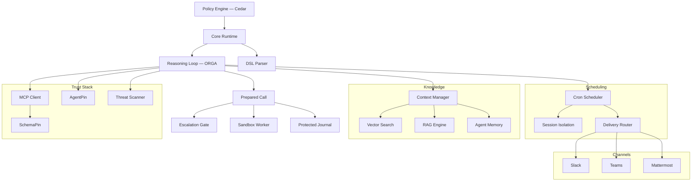

# Symbiont Dokumentation

Richtliniengesteuerte Plattform zum Bau agentischer Anwendungen. Fuehren Sie KI-Agenten und Tools unter expliziten Richtlinien-, Identitaets- und Audit-Kontrollen aus.

## Beginnen Sie dort, wo Ihre Aufgabe beginnt

Diese Dokumentation bedient drei verschiedene Aufgaben. Sie benoetigen unterschiedliche Seiten in unterschiedlicher Reihenfolge — waehlen Sie daher den Pfad, statt die Liste zu lesen.

**Beurteilen, ob das vertrauenswuerdig ist.** Sie muessen wissen, was tatsaechlich durchgesetzt und was lediglich aufgezeichnet wird und wo die Grenzen der Aussage liegen. Moeglicherweise schreiben Sie nie eine `.symbi`-Datei.

1. [Das Gate in 30 Sekunden beweisen](#zuerst-beweisen-offline-ohne-api-key) — weiter unten; offline, ohne Installationsverpflichtung
2. [Sicherheitsmodell](/security-model) — Vertrauensgrenzen, die drei Isolationsstufen, was vertraut statt verifiziert wird
3. [Vorbereitete Aufrufe](/prepared-calls) — was eine Autorisierung *ist* und warum sie nicht wiederholt werden kann
4. [Geschuetztes Lauf-Audit](/run-audit) — was das Journal belegt und was nicht
5. [Genehmigungszyklus](/approval-lifecycle) — pruefungsgebundene Freigabe, Fristen und die Grenzen der Genehmigeridentitaet
6. [Eindaemmungsleitfaden](/containment-branch-guide) — aktuelle Abdeckung und die Luecken klar benannt
7. Die veroeffentlichte Evaluation — [DOI 10.5281/zenodo.20043247](https://doi.org/10.5281/zenodo.20043247)

**Agenten bauen und betreiben.** Sie brauchen ein laufendes Projekt und danach einen Zaun darum, der auch haelt, wenn jemand anderes Bereitschaft hat.

1. [Das Gate beweisen](#zuerst-beweisen-offline-ohne-api-key) — beginnen Sie mit einer Ablehnung, nicht mit einem Erfolg
2. [Einstieg](/getting-started) — Installation, `symbi init`, erster Agent
3. [DSL-Leitfaden](/dsl-guide) — Agentendefinitionen, dazu [Inline-Effekt-Richtlinien](/inline-policies) fuer die durchgesetzte Regelteilmenge
4. [Kommando-Isolation](/toolclad-command-boundary) — konfigurieren Sie den Worker, in dem Ihre Tools tatsaechlich laufen
5. [ToolClad](/toolclad) — deklarative Tool-Kontrakte und Scope-Durchsetzung
6. [Genehmigungszyklus](/approval-lifecycle) — die richtige Antwort auf eine Ablehnung, bei der ein Mensch einbezogen werden sollte
7. [Runtime-Architektur](/runtime-architecture) und [API-Referenz](/api-reference) — fuer das Deployment
8. [Symbi Shell](/symbi-shell) (Beta) — interaktives Authoring und das Gate-Panel

**Die Spezifikation lesen.** Ihnen geht es um Konformitaet, Reproduzierbarkeit und darum, ob der Standard vom Anbieter trennbar ist.

1. [Open Agent Trust Stack](https://openagenttruststack.org) — die Spezifikation (CC BY 4.0), OATS Extended C1–C7 + E1–E8
2. [Reasoning-Schleife](/reasoning-loop) — der Typestate-ORGA-Zyklus in der Implementierung
3. [Vorbereitete Aufrufe](/prepared-calls) — das Autorisierungsobjekt und seine Regressionsabdeckung
4. [Sicherheitsmodell](/security-model) — Stufengarantien, einschliesslich Gast-Attestierung in Stufe 3
5. Veroeffentlichte Arbeiten — [Typestate ORGA Loops](https://doi.org/10.5281/zenodo.19896446), [ToolClad](https://doi.org/10.5281/zenodo.19957596), [Empirical Evaluation](https://doi.org/10.5281/zenodo.20043247)
6. [Mitwirken](/contributing) — die Reproduktions-Harnesses liegen im Repository

> **Setup mit einem KI-Coding-Agenten?** Verweisen Sie ihn auf <https://symbiont.dev/agent-guide.md>, bevor er irgendetwas anfasst. Es ist eine stabile Klartext-Anweisungsdatei mit aktueller Grammatik und aktuellen Flags sowie der festen Regel, einen Setup-Fehler niemals durch Aufweichen der Richtlinie zu beheben.

---

## Zuerst beweisen — offline, ohne API-Key

Beginnen Sie damit, Symbiont etwas verweigern zu lassen. Es ist dasselbe Cedar-Gate, das die Runtime in die laufende Reasoning-Schleife einbindet, nur eigenstaendig ausgewertet — eine Ablehnung hier ist also eine Ablehnung dort. Es braucht keinen Modellanbieter, kein Docker und kein Projekt.

**Installation:**

```bash
curl -fsSL https://symbiont.dev/install.sh | bash
```

**Zwei Richtlinien schreiben und dagegen auswerten:**

```bash
mkdir -p /tmp/p && cat > /tmp/p/policy.cedar <<'EOF'
forbid(principal, action == Symbi::Action::"tool_call::list_agents",   resource);
permit(principal, action == Symbi::Action::"tool_call::system_health", resource);
EOF

echo '{"tool_name":"list_agents"}'   | symbi policy evaluate --stdin --policies /tmp/p --json
echo '{"tool_name":"system_health"}' | symbi policy evaluate --stdin --policies /tmp/p --json
```

```json
{"decision":"deny","reason":"deny policies matched: policy_0","tool":"list_agents", ...}
{"decision":"allow","reason":"allow policies matched: policy_1","tool":"system_health", ...}
```

**Dann beobachten Sie, wie die Argumentvalidierung einen Aufruf vor der Ausfuehrung stoppt:**

```bash
symbi tools init greet
symbi tools validate
symbi tools test greet --arg target=example
```

```
greet                                    OK

  ✓ target (string): example → OK

  Command:   greet example
  Cedar:     Tool::Greet / execute_tool

  [dry run — command not executed]
```

Die Ablehnung ist der Beweis. Ein Schnellstart, der in einem erfolgreichen Lauf endet, belegt nur, dass ein Programm gelaufen ist — was der Schnellstart jedes Agenten-Frameworks ebenfalls belegt.

Das Ausfuehren eines *Agenten* erfordert einen Modellanbieter; weiter im [Einstiegsleitfaden](/getting-started).

---

## Was ist Symbiont?

Symbiont ist eine Rust-native Plattform zur Ausfuehrung von KI-Agenten und Tools unter expliziten Richtlinien-, Identitaets- und Audit-Kontrollen.

Die meisten Agenten-Frameworks konzentrieren sich auf Orchestrierung. Symbiont konzentriert sich darauf, was passiert, wenn Agenten in realen Umgebungen mit echtem Risiko laufen: nicht vertrauenswuerdige Tools, sensible Daten, Genehmigungsgrenzen, Audit-Anforderungen und wiederholbare Durchsetzung.

### Funktionsweise

Symbiont trennt die Absicht des Agenten von der Ausfuehrungsberechtigung:

1. **Agenten schlagen vor** — Aktionen werden ueber die Reasoning-Schleife (Observe-Reason-Gate-Act) vorgeschlagen
2. **Das Runtime bereitet vor** — jede Aktion wird normalisiert und Kontrakt, aufgeloester Effekt, ausgewaehlte Sandbox und Frist werden zu einem unveraenderlichen Aufruf eingefroren
3. **Die Richtlinie entscheidet** — Cedar und die unterstuetzten Inline-Regeln muessen *beide* zustimmen; abgelehnte Aktionen werden blockiert, und zur Genehmigung markierte Aktionen werden an einen Menschen weitergeleitet
4. **Der Eintrag kommt zuerst** — der erforderliche Journal-Schreibvorgang vor dem Effekt muss gelingen, bevor der Dispatch erfolgt
5. **Der Worker fuehrt aus** — innerhalb der ausgewaehlten Sandbox, niemals auf dem Host

Modellausgaben werden niemals als Ausfuehrungsberechtigung behandelt. Das Runtime kontrolliert, was tatsaechlich geschieht.

### Kernfaehigkeiten

| Faehigkeit | Beschreibung |
|-----------|-------------|
| **Richtlinien-Engine** | Feingranulare [Cedar](https://www.cedarpolicy.com/)-Autorisierung fuer Agentenaktionen, Tool-Aufrufe und Ressourcenzugriff |
| **Vorbereitete Aufrufe** | Autorisierung ueber einen eingefrorenen Aufruf — einmalig verwendbar, nicht klonbar, beim Dispatch erneut gegen Principal, Sitzung, Executor-Identitaet und Ablauf geprueft |
| **Ausfuehrungs-Eindaemmung** | Kommandos, Parser, MCP-Sitzungen, PTYs und verwaltete CLI-Kindprozesse laufen im ausgewaehlten Worker. Kein Host-Fallback: Ein nicht verfuegbares Backend laesst den Lauf fehlschlagen |
| **Genehmigung des exakten Aufrufs** | `human_approval = true` gibt nur einen geprueften Snapshot frei — Terminal-Relay, Gate-Panel der Shell oder Chat mit einem Befehl aus ID und Digest |
| **Tool-Verifikation** | [SchemaPin](https://schemapin.org) kryptographische Verifikation von MCP-Tool-Schemas vor der Ausfuehrung |
| **Agenten-Identitaet** | [AgentPin](https://agentpin.org) domainverankerte ES256-Identitaet fuer Agenten und geplante Aufgaben |
| **Reasoning-Schleife** | Typestate-erzwungener Observe-Reason-Gate-Act-Zyklus mit Richtlinien-Gates und Circuit Breakern |
| **Sandboxing** | Drei OSS-Stufen — Docker (Tier 1), gVisor (Tier 2), Firecracker microVM (Tier 3) — aus der DSL waehlbar, ohne Enterprise-Gating |
| **Geschuetztes Audit** | Private signierte Journale pro Lauf unter `.symbiont/governed/`; ein fehlgeschlagener erforderlicher Schreibvorgang stoppt den Dispatch |
| **Optionale gesteuerte Verbesserungen** | [Versionierte Workflow-Anweisungen](/governed-improvements), signierte Testauswertung, exakte Betreibergenehmigung, explizite Aktivierung und Versionsbindung pro Lauf; deaktiviert, bis sie explizit initialisiert und ausgewaehlt werden |
| **Geheimnismanagement** | Vault/OpenBao-Integration, AES-256-GCM-verschluesselter Speicher, pro Agent isoliert |
| **MCP-Integration** | Nativer Model Context Protocol-Support mit gesteuertem Tool-Zugriff |
| **Gesteuerte verwaltete CLI** | Eine externe KI-CLI als eingedaemmten Kindprozess ausfuehren — kein Quellcode-Mount, kein externes Netzwerk, keine Host-Anmeldedaten; der Quellzugriff erfolgt ueber registrierte ToolClad-Tools |

Weitere Faehigkeiten: Bedrohungsscan fuer Tool-/Skill-Inhalte, Cron-Scheduling, persistenter Agenten-Speicher, hybride RAG-Suche (LanceDB/Qdrant), Webhook-Verifikation, Zustellungsrouting, OTLP-Telemetrie, HTTP-Sicherheitshaertung, Channel-Adapter (Slack/Teams/Mattermost) sowie Governance-Plugins fuer [Claude Code](https://github.com/thirdkeyai/symbi-claude-code) und [Gemini CLI](https://github.com/thirdkeyai/symbi-gemini-cli).

---

## Projekt erstellen

```bash
symbi init        # Interaktiv: Profil, SchemaPin-Modus, Sandbox-Stufe.
                  # Schreibt symbiont.toml, agents/, policies/, docker-compose.yml
                  # und eine .env mit einem generierten SYMBIONT_MASTER_KEY.
symbi run <agent> # Einzelnen Agenten ausfuehren, ohne das volle Runtime zu starten
symbi up          # Volles Runtime mit Auto-Konfiguration starten
symbi shell       # Interaktive Shell zur Agenten-Orchestrierung (Beta)
```

Nicht-interaktiv, fuer CI:

```bash
symbi init --profile assistant --schemapin tofu --sandbox tier1 --no-interact
```

Mit Docker — uebergeben Sie `--dir`, denn das WORKDIR des Images ist nicht Ihr Mount:

```bash
docker run --rm -v $(pwd):/workspace ghcr.io/thirdkeyai/symbi:latest \
  init --profile assistant --no-interact --dir /workspace
docker compose up
```

Runtime-API auf `http://localhost:8080`, HTTP Input auf `http://localhost:8081`.

Weitere Installationswege — Homebrew (`brew tap thirdkeyai/tap && brew install symbi`), `cargo install symbi` (benoetigt Rust 1.89+ und `protobuf-compiler`) oder [GitHub Releases](https://github.com/thirdkeyai/symbiont/releases). Alle Details im [Einstiegsleitfaden](/getting-started).

### Ihr erster Agent

```symbiont
metadata {
    version = "1.0.0"
    author = "your-name"
    description = "Writes one reviewed file"
}

agent writer() {
    capabilities = ["write"]

    with sandbox = "docker", timeout = 20.seconds {}

    policy files {
        allow: "edit_file" if invocation.arguments.path == "result.txt"
        deny:  "edit_file" if invocation.arguments.content == ""
    }
}
```

Inline-`policy`-Bloecke werden kompiliert und zusammen mit Cedar durchgesetzt — **beide muessen zustimmen**. Die unterstuetzte Teilmenge ist bewusst klein, und eine Regel, die das Runtime nicht durchsetzen kann, laesst den Aufruf *vor* dem Modellaufruf fehlschlagen, statt stillschweigend ignoriert zu werden. Die genaue Grammatik finden Sie unter [Inline-Effekt-Richtlinien](/inline-policies) und die `metadata`-, `schedule`-, `webhook`- und `channel`-Bloecke im [DSL-Leitfaden](/dsl-guide).

### Interaktive Shell (Beta)

`symbi shell` ist eine auf ratatui basierende Terminal-UI zum Erstellen von Agenten, Tools und Richtlinien mit LLM-Unterstuetzung, zum Orchestrieren von Multi-Agent-Mustern (`/chain`, `/parallel`, `/race`, `/debate`), zum Verwalten von Schedules und Channels sowie zum Anhaengen an entfernte Runtimes. Mit `Ctrl+G` oeffnen Sie das Gate-Panel und pruefen zurueckgehaltene Aktionen. Status ist **Beta** — die Befehlsoberflaeche und Persistenzformate koennen sich zwischen Minor-Releases noch aendern. Siehe den [Symbi Shell-Leitfaden](/symbi-shell) und die [Konfiguration des Shell-Workspace](/shell-containment).

### Einzelne Agenten deployen (Beta)

Der `/deploy`-Befehl der Shell verpackt den aktiven Agenten und liefert ihn an Docker (`/deploy local`), Google Cloud Run (`/deploy cloudrun`) oder AWS App Runner (`/deploy aws`) aus. Der OSS-Stack ist Single-Agent; Multi-Agent-Topologien werden ueber instanzenuebergreifendes Messaging zusammengesetzt. Siehe [Symbi Shell — Deployment](/symbi-shell#deployment-beta).

---

## Architektur



---

## Sicherheitsmodell

Symbiont ist um ein einfaches Prinzip herum konzipiert: **Modellausgaben sollten niemals als Ausfuehrungsberechtigung vertraut werden.**

Aktionen durchlaufen Runtime-Kontrollen:

- **Zero Trust** — alle Agenteneingaben sind standardmaessig nicht vertrauenswuerdig
- **Vorbereitete Aufrufe** — der autorisierte Aufruf ist eingefroren, einmalig verwendbar und wird beim Dispatch erneut geprueft
- **Richtlinienpruefungen** — Cedar plus die unterstuetzten Inline-Regeln, beide fail-closed, vor jedem Tool-Aufruf
- **Tool-Verifikation** — SchemaPin kryptographische Verifikation von Tool-Schemas
- **Eindaemmung** — Docker-, gVisor- oder Firecracker-Worker, ohne Host-Fallback
- **Operator-Genehmigung** — menschliche Pruefung der vollstaendigen Anfrage, Freigabe per Digest statt per ID
- **Geheimnis-Kontrolle** — Vault/OpenBao-Backends, verschluesselter lokaler Speicher, Agenten-Namespaces
- **Audit-Protokollierung** — manipulationssichere Eintraege, geschrieben vor dem Effekt, nicht danach

Weitere Details finden Sie im Leitfaden zum [Sicherheitsmodell](/security-model) sowie im [Eindaemmungsleitfaden](/containment-branch-guide) zu aktueller Abdeckung und verbleibenden Luecken.

### Was nicht behauptet wird

Eine Sicherheitsseite, die nur Garantien auflistet, moechte geglaubt werden. Diese Grenzen stehen hier, statt spaeter entdeckt zu werden:

- Host-Konfiguration, Worker-Images, die Container-Runtime, vom Betreiber bereitgestellte Inferenz-Endpunkte und eingesetzte SDK-Implementierungen sind **vertrauenswuerdige** Komponenten, keine verifizierten.
- Die Eindaemmung ist nicht an jedem Einstiegspunkt vollstaendig. Oeffentliche Browser-Ausfuehrung, aggregierte Zulassungssteuerung sowie automatische Wiederholung oder Wiederherstellung sind nicht verfuegbar oder liegen ausserhalb dieser Kontrakte.
- Eine Reasoning-Schleife kann nach einem Tool-Fehler oder einer Richtlinienablehnung `Completed` erreichen — pruefen Sie die einzelnen Tool-Ergebnisse. Ein abschliessender Schreibvorgang kann fehlschlagen, *nachdem* ein Effekt eingetreten ist: **ein Fehler ist kein Rollback.** Ein fehlendes oder unvollstaendiges Journal ist das Fehlen von Nachweisen, nicht der Nachweis eines Erfolgs.
- Die Genehmigeridentitaet im Terminal ist die effektive UID des lokalen Betreibers — ein Betriebssystemkonto, keine unabhaengig verifizierte Person. Ein Pruef-Digest bindet die exakte Anfrage; er belegt nicht, dass ein Mensch sie gelesen hat.
- Deterministische, gematchte Laborversuche belegen ihre jeweiligen Szenarien. **Sie liefern keine Ausbruchsrate fuer Modelle.**
- SOC 2, HIPAA und ISO 27001 sind Ausrichtungsziele, fuer die der Audit-Trail ausgelegt ist. Es wird keine Zertifizierung gehalten oder impliziert.

---

## Alle Leitfaeden

**Eindaemmung und Governance**

- [Eindaemmungsleitfaden](/containment-branch-guide) — Betreiber-Workflows, Architektur, Migration, verbleibende Luecken
- [Vorbereitete Aufrufe](/prepared-calls) — Autorisierung des exakten Aufrufs und Form der Cedar-Anfrage
- [Genehmigungszyklus](/approval-lifecycle) — Pruefungen in Terminal, TUI und Chat
- [Geschuetztes Lauf-Audit](/run-audit) — Lauf-Identitaet, Journal-Verifikation, unvollstaendige Ergebnisse
- [Absturzuntersuchung](/crash-inspection) — unterbrochene Laeufe und ungeklaerte Effekte ohne Wiederholung pruefen
- [Inline-Effekt-Richtlinien](/inline-policies) — die durchgesetzte DSL-Regelteilmenge
- [Kommando-Isolation](/toolclad-command-boundary) — Worker-Konfiguration fuer Tools und Parser
- [Dateifreigaben pro Operation](/filesystem-grants) — deklarierte Eingaben, begrenzte neue Ausgaben, Parser-Isolation
- [Docker-Eigentuemerschaft](/docker-containment) — Lebensdauer, Bereinigung und Wiederherstellung
- [Interaktive Terminals](/interactive-terminal-boundary) — eingedaemmte PTY-Sitzungen
- [Shell-Workspace](/shell-containment) — gesteuerte Datei- und Kommando-Tools in der TUI
- [Managed CLI](/managed-cli-containment) — eine externe KI-CLI als eingedaemmten Kindprozess ausfuehren
- [Gesteuerter Broker](/governed-tool-broker) — die gebrokerte Tool-Aufruf-API
- [DSL-Aufrufkontext](/dsl-invocation-context) — Aufruferidentitaet und eingefrorene Projektwurzel
- [Geplante Ausfuehrung](/scheduled-execution) — Aufruf-IDs und abschliessende Ergebnisse
- [Aufruf-Idempotenz](/invocation-idempotency) — persistente CLI-Anfrageidentitaeten und sicherer Ergebnisabruf

**Kern**

- [Einstieg](/getting-started) — Installation, Konfiguration, erster Agent
- [Symbi Shell](/symbi-shell) (Beta) — interaktive TUI fuer Authoring, Orchestrierung, Remote-Attach
- [Sicherheitsmodell](/security-model) — Zero-Trust-Architektur, Richtliniendurchsetzung, Isolationsstufen
- [Runtime-Architektur](/runtime-architecture) — Runtime-Interna und Ausfuehrungsmodell
- [Reasoning-Schleife](/reasoning-loop) — ORGA-Zyklus, Richtlinien-Gates, Circuit Breaker
- [DSL-Leitfaden](/dsl-guide) — Referenz der Agenten-Definitionssprache
- [ToolClad](/toolclad) — deklarative Tool-Kontrakte, Argumentvalidierung, Scope-Durchsetzung
- [MCP-Tools](/mcp-tools) — gesteuerter Zugriff auf das Model Context Protocol
- [API-Referenz](/api-reference) — HTTP-API-Endpunkte und Konfiguration
- [Scheduling](/scheduling) — Cron-Engine, Zustellungsrouting, Dead-Letter-Warteschlangen
- [HTTP-Eingabe](/http-input) — Webhook-Server, Authentifizierung, Rate Limiting
- [Firecracker-Setup](/firecracker-setup) — Kernel, Rootfs und Gast-Transport fuer Stufe 3
- [Verwalteter Firecracker-Host-Dienst](/firecracker-host-service) — optionaler jailer, Host-Limits, Watchdog-Deployment
- [Session Types](/session-types) (Experimentell) — Konformitaetsueberwachung von Protokollen zwischen Agenten

---

## Community und Ressourcen

- **Agenten-Leitfaden**: [symbiont.dev/agent-guide.md](https://symbiont.dev/agent-guide.md) — Anweisungen fuer einen KI-Coding-Agenten, der Ihr Setup uebernimmt
- **Pakete**: [crates.io/crates/symbi](https://crates.io/crates/symbi) | [npm symbiont-sdk-js](https://www.npmjs.com/package/symbiont-sdk-js) | [PyPI symbiont-sdk](https://pypi.org/project/symbiont-sdk/)
- **SDKs**: [JavaScript/TypeScript](https://github.com/ThirdKeyAI/symbiont-sdk-js) | [Python](https://github.com/ThirdKeyAI/symbiont-sdk-python)
- **Plugins**: [Claude Code](https://github.com/thirdkeyai/symbi-claude-code) | [Gemini CLI](https://github.com/thirdkeyai/symbi-gemini-cli)
- **Issues**: [GitHub Issues](https://github.com/thirdkeyai/symbiont/issues)
- **Lizenz**: Apache 2.0 (Community Edition)

---

## Naechste Schritte

<div class="grid grid-cols-1 md:grid-cols-3 gap-6 mt-8">
  <div class="card">
    <h3>Das Gate beweisen</h3>
    <p>Lassen Sie Symbiont etwas verweigern, bevor Sie ein Projekt installieren.</p>
    <a href="#zuerst-beweisen-offline-ohne-api-key" class="btn btn-outline">30-Sekunden-Pruefung</a>
  </div>

  <div class="card">
    <h3>Sicherheitsmodell</h3>
    <p>Verstehen Sie die Vertrauensgrenzen und Richtliniendurchsetzung.</p>
    <a href="/security-model" class="btn btn-outline">Sicherheitsleitfaden</a>
  </div>

  <div class="card">
    <h3>Loslegen</h3>
    <p>Installieren Sie Symbiont und fuehren Sie Ihren ersten gesteuerten Agenten aus.</p>
    <a href="/getting-started" class="btn btn-outline">Schnellstart-Leitfaden</a>
  </div>
</div>
