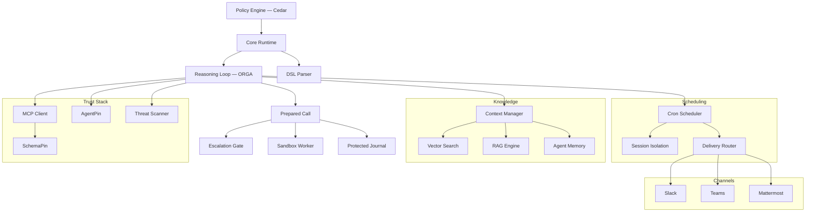

# Documentacion de Symbiont

Plataforma gobernada por politicas para construir aplicaciones agenticas. Ejecute agentes de IA y herramientas bajo controles explicitos de politicas, identidad y auditoria.

## Empiece por donde empieza su trabajo

Esta documentacion sirve a tres trabajos distintos. Cada uno necesita paginas distintas en un orden distinto, asi que elija la ruta en lugar de leer la lista.

**Evaluar si esto es de fiar.** Necesita saber que se aplica realmente, que solo se registra y donde estan los limites de la afirmacion. Puede que nunca escriba un archivo `.symbi`.

1. [Demuestre el gate en 30 segundos](#prove-it-first-offline-no-api-key) — mas abajo; sin conexion, sin compromiso de instalacion
2. [Modelo de seguridad](/security-model) — limites de confianza, los tres niveles de aislamiento, que es confiado en lugar de verificado
3. [Llamadas preparadas](/prepared-calls) — que *es* una autorizacion y por que no puede reproducirse
4. [Auditoria protegida de ejecuciones](/run-audit) — que demuestra el diario y que no
5. [Ciclo de vida de aprobaciones](/approval-lifecycle) — liberacion ligada a la revision, plazos y limites de la identidad del aprobador
6. [Guia de contencion](/containment-branch-guide) — cobertura actual y las carencias expuestas con claridad
7. La evaluacion publicada — [DOI 10.5281/zenodo.20043247](https://doi.org/10.5281/zenodo.20043247)

**Construir y operar agentes.** Necesita un proyecto en marcha y luego una valla a su alrededor que aguante cuando sea otra persona quien este de guardia.

1. [Demuestre el gate](#prove-it-first-offline-no-api-key) — empiece por un rechazo, no por un exito
2. [Guia de inicio](/getting-started) — instalacion, `symbi init`, primer agente
3. [Guia DSL](/dsl-guide) — definiciones de agentes, mas [Politicas de efecto en linea](/inline-policies) para el subconjunto de reglas que se aplica
4. [Aislamiento de comandos](/toolclad-command-boundary) — configure el worker en el que realmente se ejecutan sus herramientas
5. [ToolClad](/toolclad) — contratos declarativos de herramientas y aplicacion de alcances
6. [Ciclo de vida de aprobaciones](/approval-lifecycle) — la respuesta correcta a una denegacion que deberia implicar a una persona
7. [Arquitectura del runtime](/runtime-architecture) y [Referencia de API](/api-reference) — cuando lo despliegue
8. [Symbi Shell](/symbi-shell) (Beta) — autoria interactiva y el panel Gate

**Leer la especificacion.** Le importan la conformidad, la reproducibilidad y si el estandar es separable del proveedor.

1. [Open Agent Trust Stack](https://openagenttruststack.org) — la especificacion (CC BY 4.0), OATS Extended C1–C7 + E1–E8
2. [Bucle de razonamiento](/reasoning-loop) — el ciclo ORGA con typestate, tal como esta implementado
3. [Llamadas preparadas](/prepared-calls) — el objeto de autorizacion y su cobertura de regresion
4. [Modelo de seguridad](/security-model) — garantias por nivel, incluida la atestacion del invitado del Nivel 3
5. Trabajos publicados — [Typestate ORGA Loops](https://doi.org/10.5281/zenodo.19896446), [ToolClad](https://doi.org/10.5281/zenodo.19957596), [Empirical Evaluation](https://doi.org/10.5281/zenodo.20043247)
6. [Contribuir](/contributing) — los arneses de reproduccion estan en el repositorio

> **Va a configurarlo con un agente de programacion de IA?** Apuntelo a <https://symbiont.dev/agent-guide.md> antes de que toque nada. Es un archivo de instrucciones en texto plano y estable, con la gramatica y las banderas actuales, y una regla permanente: nunca resolver un error de configuracion ampliando la politica.

---

<a id="prove-it-first-offline-no-api-key"></a>

## Demuestrelo primero — sin conexion, sin clave de API

Empiece haciendo que Symbiont rechace algo. Este es el mismo gate de Cedar que el runtime conecta al bucle de razonamiento en vivo, evaluado de forma independiente, de modo que una denegacion aqui es una denegacion alli. No necesita proveedor de modelos, ni Docker, ni proyecto.

**Instalacion:**

```bash
curl -fsSL https://symbiont.dev/install.sh | bash
```

**Escriba dos politicas y evalue contra ellas:**

```bash
mkdir -p /tmp/p && cat > /tmp/p/policy.cedar <<'EOF'
forbid(principal, action == Symbi::Action::"tool_call::list_agents",   resource);
permit(principal, action == Symbi::Action::"tool_call::system_health", resource);
EOF

echo '{"tool_name":"list_agents"}'   | symbi policy evaluate --stdin --policies /tmp/p --json
echo '{"tool_name":"system_health"}' | symbi policy evaluate --stdin --policies /tmp/p --json
```

```json
{"decision":"deny","reason":"deny policies matched: policy_0","tool":"list_agents", ...}
{"decision":"allow","reason":"allow policies matched: policy_1","tool":"system_health", ...}
```

**Despues observe como la validacion de argumentos detiene una llamada antes de que se ejecute:**

```bash
symbi tools init greet
symbi tools validate
symbi tools test greet --arg target=example
```

```
greet                                    OK

  ✓ target (string): example → OK

  Command:   greet example
  Cedar:     Tool::Greet / execute_tool

  [dry run — command not executed]
```

La denegacion es la demostracion. Un inicio rapido que termina en una ejecucion correcta solo demuestra que un programa se ejecuto — algo que tambien demuestra el inicio rapido de cualquier framework de agentes.

Ejecutar un *agente* requiere un proveedor de modelos; continue en la [Guia de inicio](/getting-started).

---

## Que es Symbiont?

Symbiont es una plataforma nativa en Rust para ejecutar agentes de IA y herramientas bajo controles explicitos de politicas, identidad y auditoria.

La mayoria de los frameworks de agentes se centran en la orquestacion. Symbiont se centra en lo que sucede cuando los agentes se ejecutan en entornos reales con riesgo real: herramientas no confiables, datos sensibles, limites de aprobacion, requisitos de auditoria y aplicacion repetible.

### Como funciona

Symbiont separa la intencion del agente de la autoridad de ejecucion:

1. **Los agentes proponen** acciones a traves del bucle de razonamiento (Observe-Reason-Gate-Act)
2. **El runtime prepara** cada accion — normaliza los argumentos y congela el contrato, el efecto resuelto, el sandbox seleccionado y el plazo en una unica llamada inmutable
3. **La politica decide** — Cedar y las reglas en linea soportadas deben permitirlo *ambas*; las acciones denegadas se bloquean, y las marcadas para aprobacion se derivan a una persona
4. **El registro aterriza primero** — la escritura obligatoria en el diario previa al efecto debe completarse antes del despacho
5. **El worker ejecuta** — dentro del sandbox seleccionado, nunca en el host

La salida del modelo nunca se trata como autoridad de ejecucion. El runtime controla lo que realmente sucede.

### Capacidades principales

| Capacidad | Que hace |
|-----------|-------------|
| **Motor de politicas** | Autorizacion granular con [Cedar](https://www.cedarpolicy.com/) para acciones de agentes, llamadas a herramientas y acceso a recursos |
| **Llamadas preparadas** | Autorizacion emitida sobre una invocacion congelada — de un solo uso, no clonable, revisada de nuevo en el despacho contra el principal, la sesion, la identidad del ejecutor y la expiracion |
| **Contencion de la ejecucion** | Los comandos, los parsers, las sesiones MCP, los PTY y los procesos hijo de CLI administrada se ejecutan en el worker seleccionado. Sin recurso al host: un backend no disponible hace fallar la ejecucion |
| **Aprobacion de llamada exacta** | `human_approval = true` libera unicamente una instantanea revisada — relevo en la terminal, panel Gate de la shell o chat con un comando de ID mas digest |
| **Verificacion de herramientas** | Verificacion criptografica [SchemaPin](https://schemapin.org) de esquemas de herramientas MCP antes de la ejecucion |
| **Identidad de agentes** | Identidad ES256 anclada al dominio con [AgentPin](https://agentpin.org) para agentes y tareas programadas |
| **Bucle de razonamiento** | Ciclo Observe-Reason-Gate-Act con aplicacion de typestate, compuertas de politicas y circuit breakers |
| **Sandboxing** | Tres niveles OSS — Docker (Nivel 1), gVisor (Nivel 2), microVM Firecracker (Nivel 3) — seleccionables desde el DSL sin restricciones Enterprise |
| **Auditoria protegida** | Diarios privados firmados por ejecucion bajo `.symbiont/governed/`; el fallo de una escritura obligatoria detiene el despacho |
| **Mejoras gobernadas opcionales** | [Instrucciones de flujo de trabajo versionadas](/governed-improvements), evaluacion de pruebas firmada, aprobacion exacta del operador, activacion explicita y fijacion de version por ejecucion; desactivadas hasta que se inicializan y seleccionan explicitamente |
| **Gestion de secretos** | Integracion con Vault/OpenBao, almacenamiento cifrado AES-256-GCM, con alcance por agente |
| **Integracion MCP** | Soporte nativo de Model Context Protocol con acceso gobernado a herramientas |
| **CLI administrada gobernada** | Ejecute una CLI de IA externa como proceso hijo contenido — sin montaje del codigo fuente, sin red externa, sin credenciales del host; el acceso al codigo fuente son herramientas ToolClad registradas |

Capacidades adicionales: escaneo de amenazas para contenido de herramientas/habilidades, programacion cron, memoria persistente de agentes, busqueda RAG hibrida (LanceDB/Qdrant), verificacion de webhooks, enrutamiento de entregas, telemetria OTLP, endurecimiento de seguridad HTTP, adaptadores de canal (Slack/Teams/Mattermost), y plugins de gobernanza para [Claude Code](https://github.com/thirdkeyai/symbi-claude-code) y [Gemini CLI](https://github.com/thirdkeyai/symbi-gemini-cli).

---

## Crear un proyecto

```bash
symbi init        # Interactive: profile, SchemaPin mode, sandbox tier.
                  # Writes symbiont.toml, agents/, policies/, docker-compose.yml,
                  # and a .env with a generated SYMBIONT_MASTER_KEY.
symbi run <agent> # Run a single agent without starting the full runtime
symbi up          # Start the full runtime with auto-configuration
symbi shell       # Interactive agent orchestration shell (Beta)
```

No interactivo, para CI:

```bash
symbi init --profile assistant --schemapin tofu --sandbox tier1 --no-interact
```

Con Docker — pase `--dir`, porque el WORKDIR de la imagen no es su montaje:

```bash
docker run --rm -v $(pwd):/workspace ghcr.io/thirdkeyai/symbi:latest \
  init --profile assistant --no-interact --dir /workspace
docker compose up
```

La API del runtime queda en `http://localhost:8080` y HTTP Input en `http://localhost:8081`.

Otras vias de instalacion — Homebrew (`brew tap thirdkeyai/tap && brew install symbi`), `cargo install symbi` (requiere Rust 1.89+ y `protobuf-compiler`) o [GitHub Releases](https://github.com/thirdkeyai/symbiont/releases). Todos los detalles en la [Guia de inicio](/getting-started).

### Su primer agente

```symbiont
metadata {
    version = "1.0.0"
    author = "your-name"
    description = "Writes one reviewed file"
}

agent writer() {
    capabilities = ["write"]

    with sandbox = "docker", timeout = 20.seconds {}

    policy files {
        allow: "edit_file" if invocation.arguments.path == "result.txt"
        deny:  "edit_file" if invocation.arguments.content == ""
    }
}
```

Los bloques `policy` en linea se compilan y se aplican junto con Cedar — **ambos deben permitirlo**. El subconjunto soportado es deliberadamente pequeno, y una regla que el runtime no puede aplicar hace fallar la invocacion *antes* de llamar al modelo, en lugar de ignorarse en silencio. Consulte [Politicas de efecto en linea](/inline-policies) para la gramatica exacta, y la [Guia DSL](/dsl-guide) para los bloques `metadata`, `schedule`, `webhook` y `channel`.

### Shell interactiva (Beta)

`symbi shell` es una interfaz de usuario de terminal basada en ratatui para autoria de agentes, herramientas y politicas con asistencia de LLM, orquestacion de patrones multi-agente (`/chain`, `/parallel`, `/race`, `/debate`), gestion de programaciones y canales, y conexion a runtimes remotos. Pulse `Ctrl+G` para abrir el panel Gate y revisar las acciones retenidas. El estado es **beta** — la superficie de comandos y los formatos de persistencia aun pueden cambiar entre versiones menores. Consulte la [guia de Symbi Shell](/symbi-shell) y la [configuracion del workspace de la shell](/shell-containment).

### Despliegue de agentes individuales (Beta)

El comando `/deploy` de la shell empaqueta el agente activo y lo envia a Docker (`/deploy local`), Google Cloud Run (`/deploy cloudrun`) o AWS App Runner (`/deploy aws`). El stack OSS es de un solo agente; las topologias multi-agente se componen mediante mensajeria entre instancias. Consulte [Symbi Shell — Despliegue](/symbi-shell#deployment-beta).

---

## Arquitectura



---

## Modelo de seguridad

Symbiont esta disenado en torno a un principio simple: **la salida del modelo nunca debe ser confiada como autoridad de ejecucion.**

Las acciones fluyen a traves de controles del runtime:

- **Confianza cero** — todas las entradas de agentes son no confiables por defecto
- **Llamadas preparadas** — la invocacion autorizada queda congelada, es de un solo uso y se revisa de nuevo en el despacho
- **Verificaciones de politica** — Cedar mas las reglas en linea soportadas, ambas de fallo cerrado, antes de cada llamada a herramienta
- **Verificacion de herramientas** — verificacion criptografica SchemaPin de esquemas de herramientas
- **Contencion** — workers de Docker, gVisor o Firecracker, sin recurso al host
- **Aprobacion del operador** — revision humana de la peticion completa, liberada por digest y no por ID
- **Control de secretos** — backends Vault/OpenBao, almacenamiento local cifrado, namespaces de agentes
- **Registro de auditoria** — registros a prueba de manipulacion escritos antes del efecto, no despues

Consulte la guia del [Modelo de seguridad](/security-model) para mas detalles, y la [Guia de contencion](/containment-branch-guide) para la cobertura actual y las carencias restantes.

### Que no se afirma

Una pagina de seguridad que solo enumera garantias esta pidiendo que se la crea. Estos limites se declaran aqui en lugar de descubrirse mas tarde:

- La configuracion del host, las imagenes de los workers, el runtime de contenedores, los endpoints de inferencia proporcionados por el operador y las implementaciones inyectadas desde el SDK son componentes **confiados**, no verificados.
- La contencion no es completa en todos los puntos de entrada. La ejecucion publica de navegador, el control agregado de admision y la reproduccion o recuperacion automaticas no estan disponibles o quedan fuera de estos contratos.
- Un bucle de razonamiento puede alcanzar `Completed` tras un error de herramienta o una denegacion de politica — inspeccione los desenlaces individuales de las herramientas. Una escritura terminal puede fallar *despues* de que se haya producido un efecto: **un error no es una reversion.** Un diario ausente o incompleto es ausencia de evidencia, no evidencia de exito.
- La identidad del aprobador en la terminal es el UID efectivo del operador local — una cuenta del sistema operativo, no una persona verificada de forma independiente. Un digest de revision vincula la peticion exacta; no demuestra que alguien la haya leido.
- Las pruebas de laboratorio deterministas y emparejadas establecen sus escenarios individuales. **No proporcionan una tasa de escape del modelo.**
- SOC 2, HIPAA e ISO 27001 son objetivos de alineacion para los que se ha disenado el rastro de auditoria. No se posee ni se da a entender ninguna certificacion.

---

## Todas las guias

**Contencion y gobernanza**

- [Guia de contencion](/containment-branch-guide) — flujos del operador, arquitectura, migracion, carencias restantes
- [Llamadas preparadas](/prepared-calls) — autorizacion de llamada exacta y forma de la peticion Cedar
- [Ciclo de vida de aprobaciones](/approval-lifecycle) — revisiones en terminal, TUI y chat
- [Auditoria protegida de ejecuciones](/run-audit) — identidad de la ejecucion, verificacion del diario, desenlaces incompletos
- [Inspeccion de caidas](/crash-inspection) — verificar ejecuciones interrumpidas y efectos sin resolver sin reproducirlos
- [Politicas de efecto en linea](/inline-policies) — el subconjunto de reglas del DSL que se aplica
- [Aislamiento de comandos](/toolclad-command-boundary) — configuracion del worker para herramientas y parsers
- [Concesiones de archivos por operacion](/filesystem-grants) — entradas declaradas, salidas nuevas acotadas, aislamiento de parsers
- [Propiedad en Docker](/docker-containment) — vida util, limpieza y recuperacion
- [Terminales interactivas](/interactive-terminal-boundary) — sesiones PTY contenidas
- [Workspace de la shell](/shell-containment) — herramientas gobernadas de archivos y comandos en la TUI
- [CLI administrada](/managed-cli-containment) — ejecutar una CLI de IA externa como proceso hijo contenido
- [Intermediario gobernado](/governed-tool-broker) — la API de llamadas a herramientas intermediadas
- [Contexto de invocacion del DSL](/dsl-invocation-context) — identidad del llamante y raiz de proyecto congelada
- [Ejecucion programada](/scheduled-execution) — IDs de invocacion y resultados terminales
- [Idempotencia de invocaciones](/invocation-idempotency) — identidades persistentes de peticiones de CLI y recuperacion segura de resultados

**Nucleo**

- [Inicio](/getting-started) — instalacion, configuracion, primer agente
- [Symbi Shell](/symbi-shell) (Beta) — TUI interactiva para autoria, orquestacion y conexion remota
- [Modelo de seguridad](/security-model) — arquitectura de confianza cero, aplicacion de politicas, niveles de aislamiento
- [Arquitectura del runtime](/runtime-architecture) — internos del runtime y modelo de ejecucion
- [Bucle de razonamiento](/reasoning-loop) — ciclo ORGA, compuertas de politicas, circuit breakers
- [Guia DSL](/dsl-guide) — referencia del lenguaje de definicion de agentes
- [ToolClad](/toolclad) — contratos declarativos de herramientas, validacion de argumentos, aplicacion de alcances
- [Herramientas MCP](/mcp-tools) — acceso gobernado a Model Context Protocol
- [Referencia de API](/api-reference) — endpoints HTTP API y configuracion
- [Programacion](/scheduling) — motor cron, enrutamiento de entregas, colas de mensajes muertos
- [Entrada HTTP](/http-input) — servidor de webhooks, autenticacion, limitacion de velocidad
- [Configuracion de Firecracker](/firecracker-setup) — kernel, rootfs y transporte de invitado del Nivel 3
- [Servicio de host administrado de Firecracker](/firecracker-host-service) — jailer opcional, limites del host, despliegue del watchdog
- [Tipos de sesion](/session-types) (Experimental) — monitoreo de conformidad de protocolos entre agentes

---

## Comunidad y recursos

- **Guia para agentes**: [symbiont.dev/agent-guide.md](https://symbiont.dev/agent-guide.md) — instrucciones para un agente de programacion de IA que haga su configuracion
- **Paquetes**: [crates.io/crates/symbi](https://crates.io/crates/symbi) | [npm symbiont-sdk-js](https://www.npmjs.com/package/symbiont-sdk-js) | [PyPI symbiont-sdk](https://pypi.org/project/symbiont-sdk/)
- **SDKs**: [JavaScript/TypeScript](https://github.com/ThirdKeyAI/symbiont-sdk-js) | [Python](https://github.com/ThirdKeyAI/symbiont-sdk-python)
- **Plugins**: [Claude Code](https://github.com/thirdkeyai/symbi-claude-code) | [Gemini CLI](https://github.com/thirdkeyai/symbi-gemini-cli)
- **Issues**: [GitHub Issues](https://github.com/thirdkeyai/symbiont/issues)
- **Licencia**: Apache 2.0 (Community Edition)

---

## Proximos pasos

<div class="grid grid-cols-1 md:grid-cols-3 gap-6 mt-8">
  <div class="card">
    <h3>Demuestre el gate</h3>
    <p>Haga que Symbiont rechace algo antes de instalar un proyecto.</p>
    <a href="#prove-it-first-offline-no-api-key" class="btn btn-outline">Comprobacion de 30 segundos</a>
  </div>

  <div class="card">
    <h3>Modelo de seguridad</h3>
    <p>Comprenda los limites de confianza y la aplicacion de politicas.</p>
    <a href="/security-model" class="btn btn-outline">Guia de seguridad</a>
  </div>

  <div class="card">
    <h3>Comenzar</h3>
    <p>Instale Symbiont y ejecute su primer agente gobernado.</p>
    <a href="/getting-started" class="btn btn-outline">Guia de inicio rapido</a>
  </div>
</div>
