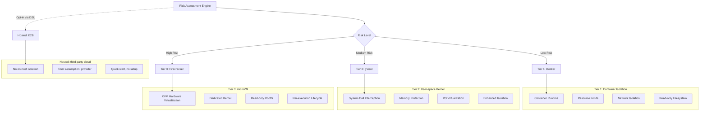
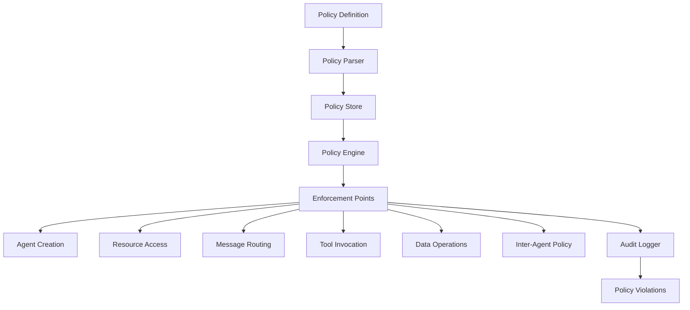
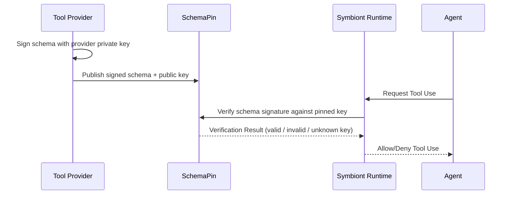
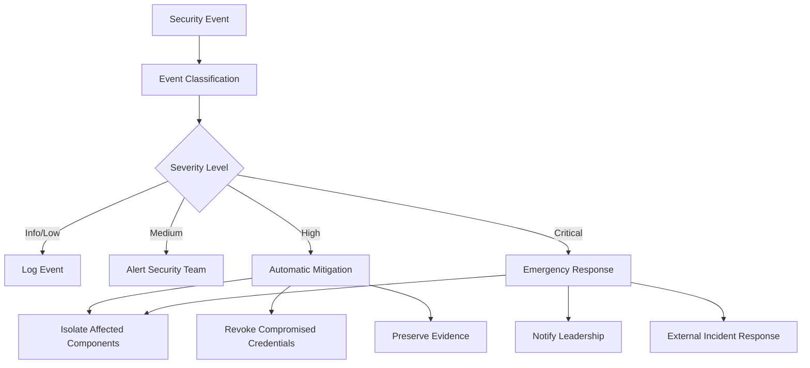

# Modelo de Seguridad

Arquitectura de seguridad integral que garantiza proteccion de confianza cero e impulsada por politicas para agentes de IA.

## Otros idiomas


---

## Descripcion General

**Cobertura de contencion:** la version 1.21.0 anade limites de efecto Docker/gVisor
seleccionados, aprobaciones exactas de llamadas preparadas, diarios protegidos en los
puntos de entrada cubiertos y propiedad independiente de los workers. Consulte la
[guia de contencion](/containment-branch-guide) para conocer las rutas implementadas y
los supuestos de despliegue. La arquitectura y la configuracion de niveles que se
describen a continuacion no son evidencia de una aplicacion completa en todas las
rutas. Los comandos oneshot de Firecracker, los parsers, MCP stdio, las sesiones PTY y
los workers de CLI administrada usan un transporte de invitado versionado y propiedad
independiente del VMM. Las VM administradas solo reciben las capacidades de
herramientas e inferencia emitidas por el runtime. La ejecucion aislada de navegador
sigue sin estar disponible. La [configuracion de Firecracker](/firecracker-setup)
describe los requisitos de despliegue del invitado y del host; las pruebas con Docker
no validan un despliegue en VM.

Symbiont implementa una arquitectura de seguridad primero disenada para entornos regulados y de alta seguridad. El modelo de seguridad se basa en principios de confianza cero con cumplimiento integral de politicas, sandboxing de multiples niveles y auditabilidad criptografica.

### Principios de Seguridad

- **Confianza Cero**: Todos los componentes y comunicaciones son verificados
- **Defensa en Profundidad**: Multiples capas de seguridad sin un unico punto de falla
- **Impulsado por Politicas**: Politicas de seguridad declarativas aplicadas en tiempo de ejecucion
- **Auditabilidad Completa**: Cada operacion registrada con integridad criptografica
- **Privilegio Minimo**: Permisos minimos requeridos para la operacion

---

## Sandboxing de Multiples Niveles

El runtime ofrece tres niveles de aislamiento del host (Nivel 1 → Nivel 3) mas un backend de ejecucion alojada (E2B). Los niveles forman una escalera de aislamiento monotonicamente creciente; E2B **no** es un par en esa escalera — se ejecuta sobre infraestructura de terceros y se documenta por separado mas abajo.



> **Todos los niveles de aislamiento del host — landlock, Docker, gVisor y Firecracker — vienen incluidos en el runtime OSS.** Los operadores eligen el nivel por agente mediante el bloque DSL `with { sandbox = ... }`, o establecen un valor predeterminado del proyecto via `[sandbox] tier = "..."` en `symbiont.toml`. E2B es habilitable unicamente via DSL (`with { sandbox = "e2b" }`) y deliberadamente no se expone como valor de `[sandbox] tier`.
>
> El aislamiento fuerte es una base, no una venta adicional. Los niveles permanecen
> en el runtime de codigo abierto para que la comunidad pueda leer, auditar y
> reproducir la frontera de la que depende. La atestacion del invitado es el caso mas
> claro: una huella sobre fuentes que no se pueden leer no atestigua nada, por lo que
> el servicio invitado es de codigo abierto precisamente porque es un control de
> seguridad.

<a id="landlock-daemon-free"></a>

### Landlock (workers nativos)

Se llama `landlock`, no lleva numero. Este backend opcional de Linux usa procesos
nativos y un supervisor delegado gestionado externamente. No necesita imagen de
contenedor ni demonio de contenedores. Docker sigue siendo el valor predeterminado.
Consulte [configuracion del servicio y migracion](/landlock-supervision).

**Configuracion:** `[sandbox] tier = "landlock"` en `symbiont.toml`. Los techos de
solo lectura y de escritura provienen de `[sandbox.roots]`, compartido con los demas
backends. `[sandbox.landlock]` contiene `abi_floor`, `require_network`, los limites de
memoria, CPU, PID, vida util y salida, ademas de su configuracion de `supervisor`. La
ABI predeterminada y minima soportada ahora es la 6, aunque una configuracion antigua
fije un minimo inferior. Un minimo configurado mas alto sigue aplicandose. Se
requieren arquitecturas nativas little-endian x86_64 o aarch64 y un filtrado seccomp
operativo.

**Casos de uso:**
- Una estacion de trabajo o un escritorio donde ejecutar un demonio de contenedores
  por agente no es razonable
- Confinar el alcance en el sistema de archivos, los sockets y las senales salientes
  de un proceso local sin aprovisionar una imagen

**Caracteristicas de seguridad:**
- Confinamiento del sistema de archivos a las raices declaradas, aplicado por el kernel
- Los scopes de la ABI 6 de Landlock impiden enviar senales y conectar con sockets Unix
  abstractos de procesos fuera del dominio del worker. Las senales dentro del dominio
  siguen siendo utilizables.
- Con el valor predeterminado `require_network = true`, seccomp deniega los sockets
  nuevos, lo que cubre TCP, UDP y los sockets Unix con ruta. Los pares privados de
  sockets Unix de tipo **stream** siguen siendo utilizables. Los pares de datagramas se
  deniegan porque pueden enviar a sockets con ruta no relacionados. Las operaciones
  `io_uring` y las ABI de llamadas al sistema alternativas se rechazan para que no
  puedan eludir esta restriccion.
- `require_network = false` permite explicitamente sockets IPv4/IPv6 nuevos. No permite
  sockets Unix del host, otras familias de sockets, pares de datagramas ni `io_uring`.
  Esta opcion concede acceso a la red IP, incluido loopback; no es una lista de salida
  permitida.
- Una concesion base de lectura y ejecucion para los directorios de ejecutables y
  bibliotecas del sistema, necesaria antes de que pueda arrancar cualquier programa
  enlazado dinamicamente. No incluye ninguna ruta de escritura, nada bajo un directorio
  personal ni una concesion amplia sobre `/etc`.
- Los rulesets exigen aplicacion completa. El valor predeterminado del crate es de mejor
  esfuerzo, que ignora en silencio lo que el kernel no soporta; ese valor no se usa.
- Las reglas y el filtro de llamadas al sistema se construyen en el proceso padre sobre
  objetos del sistema de archivos ya abiertos. Reemplazar una raiz despues de la
  preparacion no puede redirigir su concesion. El proceso hijo instala las restricciones
  y marca los descriptores por encima de stderr como close-on-exec mediante llamadas al
  sistema en bruto. Las raices declaradas que falten hacen fallar la preparacion; las
  rutas opcionales del sistema que no existan pueden omitirse. Una instalacion fallida
  aborta el lanzamiento.
- Los descriptores adicionales heredados de archivos, sockets y rings se cierran en el
  exec. Stdin, stdout y stderr siguen siendo capacidades explicitas: quien use el SDK
  debe proporcionar unicamente los canales previstos. La ruta MCP que se distribuye usa
  pipes. Esto no revoca las capacidades que un operador pasa deliberadamente por stdio
  o concede mediante raices legibles.

**Migracion.** Los hosts con ABI 4 o 5 ahora fallan de forma cerrada; bajar `abi_floor`
no puede restaurar la frontera mas debil. Las cargas de trabajo que requieran servicios
Unix, pares de datagramas, `io_uring` o ejecutables de compatibilidad deben usar un
backend supervisado adecuado. Los descriptores de auditoria incluyen la version 3 de la
frontera, la admision compartida y la supervision por cgroup, el requisito de ABI
efectivo, los scopes de senales y sockets, la politica de sockets, el rechazo de rings y
la politica de descriptores heredados.

**Cobertura actual.** MCP stdio sin archivos declarados y la ruta de lanzamiento de bajo
nivel `CliExecutor` del SDK usan este backend. Los comandos oneshot publicos, los parsers
de salida personalizados, los PTY interactivos, la preparacion de archivos declarados y
la configuracion de CLI administrada que se distribuye todavia no lo soportan.
Seleccionar Landlock en esas rutas falla en lugar de cambiar a una ejecucion sin
restricciones.

**Vida util de las concesiones.** Un dominio no puede relajarse una vez aplicado. El
proceso hijo de la CLI del SDK recibe su dominio una sola vez al lanzarse, incluido el
acceso de escritura a su directorio de trabajo. Las raices directas autorizan la
jerarquia configurada durante esa vida util; no capturan una instantanea del contenido
de los archivos ni restringen las escrituras a la publicacion de archivos nuevos. El
descubrimiento y las llamadas MCP sin archivos declarados limpian las raices del host
configuradas. Los workers MCP gobernados y los de CLI de bajo nivel del SDK conservan
reservas compartidas y duraderas de CPU, memoria y workers hasta que se elimina el
cgroup. Los cgroups delegados aplican los limites de recursos y detienen a los
descendientes incluso cuando salen del grupo de procesos. El gestor de servicios
independiente se encarga del fallo del supervisor y de la expiracion del watchdog. La
primitiva `PreparedDomain` en bruto solo aplica los controles de acceso del kernel y no
adquiere una concesion.

**Fallo cerrado.** La ABI de Landlock requerida y la arquitectura nativa se comprueban
antes de la autorizacion. Los fallos al construir o instalar el ruleset, incluido un
filtrado seccomp no disponible, abortan el lanzamiento antes de que arranque el
ejecutable del worker. No hay aplicacion parcial ni recurso a una ejecucion sin
restricciones en el host.

**No disponible para agentes registrados.** Ningun `SecurityTier` se llama landlock, de
modo que un agente programado o registrado por HTTP no puede declararlo; esas rutas lo
rechazan en lugar de asignarlo a un nivel vecino y reportar mal el aislamiento en uso.
Seleccionelo en `[sandbox]` para ejecuciones directas.

**Validacion.** `crates/runtime/tests/landlock_sandbox.rs` ejercita procesos hijo
realmente restringidos, incluidas raices de lectura y escritura reemplazadas y el acceso
legitimo a traves de los objetos originales, las restricciones de sockets y senales, los
descriptores heredados, la IPC privada de tipo stream, el acceso IP explicito y el
rechazo de ABI de llamadas al sistema alternativas.
`scripts/test-landlock-boundary.py --binary /path/to/symbi
--report /path/to/report.json` ejercita el despacho MCP firmado que se distribuye, la
salida util, las denegaciones de sistema de archivos, TCP, UDP, sockets Unix y senales,
la auditoria obligatoria y el rechazo en kernels no soportados con fixtures sinteticos
locales. Observadores protegidos comprueban de forma independiente los mensajes y las
senales entregados. Estas comprobaciones no establecen resistencia adaptativa al escape.
El script aparte `scripts/test-landlock-supervision.py` ejercita fallos reales del ciclo
de vida de los cgroups. Consulte el
[contrato de Landlock del kernel](https://docs.kernel.org/userspace-api/landlock.html).

### Nivel 1: Aislamiento Docker

**Casos de Uso:**
- Tareas de desarrollo confiables
- Procesamiento de datos de baja sensibilidad
- Operaciones de herramientas internas

**Caracteristicas de Seguridad:**
```yaml
docker_security:
  memory_limit: "512MB"
  cpu_limit: "0.5"
  network_mode: "none"
  read_only_root: true
  security_opts:
    - "no-new-privileges:true"
    - "seccomp:default"
  capabilities:
    drop: ["ALL"]
    add: ["SETUID", "SETGID"]
```

**Proteccion contra Amenazas:**
- Aislamiento de procesos del host
- Prevencion de agotamiento de recursos
- Control de acceso a la red
- Proteccion del sistema de archivos

### Nivel 2: Aislamiento gVisor

**Casos de Uso:**
- Cargas de trabajo de produccion estandar
- Procesamiento de datos sensibles
- Integracion de herramientas externas

**Caracteristicas de Seguridad:**
- Implementacion de kernel en espacio de usuario
- Filtrado y traduccion de llamadas del sistema
- Limites de proteccion de memoria
- Validacion de solicitudes de E/S

**Configuracion:**
```yaml
gvisor_security:
  runtime: "runsc"
  platform: "ptrace"
  network: "sandbox"
  file_access: "exclusive"
  debug: false
  strace: false
```

**Proteccion Avanzada:**
- Aislamiento de vulnerabilidades del kernel
- Interceptacion de llamadas del sistema
- Prevencion de corrupcion de memoria
- Mitigacion de ataques de canal lateral

**Prerrequisitos:** Instale [`runsc`](https://gvisor.dev/docs/user_guide/install/) y registrelo como runtime de Docker en `/etc/docker/daemon.json`. `symbi doctor` reporta si `runsc` es alcanzable.

### Nivel 3: microVM Firecracker

**Casos de Uso:**
- Cargas de trabajo de maximo aislamiento (codigo no confiable, multi-inquilino, datos regulados)
- Cuando la granularidad del filtro de syscalls (gVisor) es insuficiente y se requiere una frontera de kernel real
- Ciclo de vida de VM por ejecucion para una contencion mas fuerte del radio de impacto

**Caracteristicas de Seguridad:**
- Virtualizacion por hardware via KVM
- microVM por ejecucion con kernel + rootfs proporcionados por el operador
- Sistema de archivos raiz de solo lectura por defecto
- Sin superficie de kernel compartida con el host
- **Atestacion del invitado:** el handshake verifica la version del protocolo y una
  huella de las fuentes del servicio invitado, y rechaza una imagen obsoleta o que no
  coincide antes de enviar cualquier comando
- **Propiedad independiente del VMM:** un supervisor externo al bucle de razonamiento
  posee el ciclo de vida de la VM, por lo que una VM no puede sobrevivir a su
  supervisor, y una VM huerfana se recupera contra una identidad de proceso
  verificada en lugar de un PID reutilizable
- **Carga de trabajo invitada sin privilegios:** los comandos se ejecutan como
  usuario invitado no root con `no_new_privs` y limites explicitos de procesos y
  descriptores de archivo

**Configuracion:** `[sandbox.firecracker]` en `symbiont.toml`:

```toml
[sandbox]
tier = "tier3"

[sandbox.firecracker]
kernel_image_path = "/var/lib/firecracker/vmlinux"
rootfs_path       = "/var/lib/firecracker/rootfs.ext4"
vcpus             = 1
mem_mib           = 512
rootfs_read_only  = true
```

**Prerrequisitos:** El operador debe proporcionar (a) una imagen de kernel compatible con Firecracker y (b) una imagen de sistema de archivos raiz con el servicio invitado compilado correspondiente. **Consulte [`docs/firecracker-setup.md`](firecracker-setup.md) para una guia rapida paso a paso, el contrato de init dentro de la VM y una lista de verificacion de endurecimiento.** `symbi doctor` reporta si el binario `firecracker` es alcanzable.

Una vez que tenga ambos artefactos, genere el esqueleto de un proyecto tier3 con:

```bash
symbi init --profile assistant --sandbox tier3 \
  --firecracker-kernel /var/lib/firecracker/vmlinux \
  --firecracker-rootfs /var/lib/firecracker/rootfs.ext4
```

`symbi init` valida que ambos archivos existan antes de escribir `symbiont.toml`, de modo que las configuraciones erroneas afloran en tiempo de scaffolding y no en la primera ejecucion del agente.

### Ejecucion alojada: E2B

**E2B es un backend de sandbox alojado en la nube, no un nivel de aislamiento del host.** Se ubica fuera de la escalera Nivel 1 → Nivel 3 y se documenta aqui por completitud.

**Que es:** El codigo se ejecuta en la infraestructura de E2B via su API HTTPS; el runtime solo distribuye un cliente HTTP. Configure `E2B_API_KEY` y selecciones por agente con `with { sandbox = "e2b" }`. No hay flag `--sandbox e2b` en `symbi init` — E2B es deliberadamente opt-in unicamente via DSL, dado que representa un modelo de confianza distinto al de los niveles en el host.

**Casos de uso:**
- Demos rapidas y evaluacion sin instalar Docker, gVisor ni Firecracker.
- Entornos de desarrollo donde el operador no puede ejecutar un host de sandbox (CI sin modo privilegiado, laptops bloqueadas, maquinas de desarrollo ARM).

**Lo que no es:**
- No sustituye al aislamiento en el host. El codigo, los prompts y las salidas de las herramientas atraviesan la infraestructura de E2B. No lo use para cargas de trabajo con requisitos de privacidad, residencia o cumplimiento.
- No es comparable a los Niveles 1/2/3 en una revision de seguridad. El runtime mapea `E2B → SecurityTier::Hosted`, que ordena **por debajo** de `Tier1` — las politicas que requieran aislamiento del host (`tier >= Tier1`) rechazaran la ejecucion alojada.

**Configuracion:** Sin configuracion a nivel de proyecto; configure `E2B_API_KEY` en el entorno y use `with { sandbox = "e2b" }` por agente.

---

## Motor de Politicas

### Arquitectura de Politicas

El motor de politicas proporciona controles de seguridad declarativos con aplicacion en tiempo de ejecucion:



### Tipos de Politicas

#### Politicas de Control de Acceso

Definen quien puede acceder a que recursos bajo que condiciones:

```rust
policy secure_data_access {
    allow: read(sensitive_data) if (
        user.clearance >= "secret" &&
        user.need_to_know.contains(data.classification) &&
        session.mfa_verified == true
    )

    deny: export(data) if data.contains_pii == true

    require: [
        user.background_check.current,
        session.secure_connection,
        audit_trail = "detailed"
    ]
}
```

#### Politicas de Flujo de Datos

Controlan como se mueven los datos a traves del sistema:

```rust
policy data_flow_control {
    allow: transform(data) if (
        source.classification <= target.classification &&
        user.transform_permissions.contains(operation.type)
    )

    deny: aggregate(datasets) if (
        any(datasets, |d| d.privacy_level > operation.privacy_budget)
    )

    require: differential_privacy for statistical_operations
}
```

#### Politicas de Uso de Recursos

Gestionan la asignacion de recursos computacionales:

```rust
policy resource_governance {
    allow: allocate(resources) if (
        user.resource_quota.remaining >= resources.total &&
        operation.priority <= user.max_priority
    )

    deny: long_running_operations if system.maintenance_mode

    require: supervisor_approval for high_memory_operations
}
```

### Motor de Evaluacion de Politicas

```rust
pub trait PolicyEngine {
    async fn evaluate_policy(
        &self,
        context: PolicyContext,
        action: Action
    ) -> PolicyDecision;

    async fn register_policy(&self, policy: Policy) -> Result<PolicyId>;
    async fn update_policy(&self, policy_id: PolicyId, policy: Policy) -> Result<()>;
}

pub enum PolicyDecision {
    Allow,
    Deny { reason: String },
    AllowWithConditions { conditions: Vec<PolicyCondition> },
    RequireApproval { approver: String },
}
```

### Optimizacion de Rendimiento

**Cache de Politicas:**
- Evaluacion de politicas compiladas para rendimiento
- Cache LRU para decisiones frecuentes
- Evaluacion por lotes para operaciones masivas
- Tiempos de evaluacion de sub-milisegundos

**Actualizaciones Incrementales:**
- Actualizaciones de politicas en tiempo real sin reinicio
- Implementacion de politicas versionadas
- Capacidades de rollback para errores de politicas

### Motor de Politicas Cedar (Feature `cedar`)

Symbiont integra el [lenguaje de politicas Cedar](https://www.cedarpolicy.com/) para autorizacion formal. Cedar permite politicas de control de acceso granulares y auditables que se evaluan en la compuerta de politicas del bucle de razonamiento.

**Activado por defecto desde v1.14.x:** Cedar viene incluido en el conjunto de features por defecto de `symbi-runtime` y se incluye en cada binario publicado (crates.io, Docker, tarballs de GitHub Release). `symbi up` y `symbi run` autocablean `CedarPolicyGate` desde los archivos `policies/*.cedar` al arranque; cuando al menos un archivo de politica esta presente, la compuerta se construye con `deny_by_default()` y cada archivo `.cedar` se carga como una politica nombrada. Cuando no hay archivos de politica presentes, el runtime recae en el `DefaultPolicyGate::new()` fail-closed (que deniega cada accion `ToolCall` y `Delegate`). Para deshabilitar Cedar por completo — para builds que fijan `OpaPolicyGateBridge` o un `ReasoningPolicyGate` personalizado — construye con `cargo build --no-default-features --features "keychain,vector-lancedb"`.

```bash
cargo build --features cedar
```

**Capacidades clave:**
- **Verificacion formal**: Las politicas Cedar pueden ser analizadas estaticamente para verificar su correccion
- **Autorizacion granular**: Control de acceso basado en entidades con permisos jerarquicos
- **Integracion con el bucle de razonamiento**: `CedarPolicyGate` implementa el trait `ReasoningPolicyGate`, evaluando cada accion propuesta contra las politicas Cedar antes de la ejecucion
- **Rastro de auditoria**: Todas las decisiones de politicas Cedar se registran con contexto completo

```rust
use symbi_runtime::reasoning::cedar_gate::CedarPolicyGate;

// Create a Cedar policy gate with deny-by-default stance
let cedar_gate = CedarPolicyGate::deny_by_default();
let agent_id = symbi_runtime::types::AgentId::new();
let (journal, audit) = symbi_runtime::reasoning::run_audit::open_run_journal(
    trusted_project, agent_id,
).await?;
println!("Audit: {}", serde_json::to_string(&audit)?);
let runner = ReasoningLoopRunner::builder()
    .provider(provider)
    .executor(executor)
    .policy_gate(Arc::new(cedar_gate))
    .journal(journal)
    .build();
```

### Compuerta de Politicas del Bucle de Razonamiento por Defecto (auditoria posterior a v1.13.0)

El bucle de razonamiento en `symbi up` y `symbi run` es **fail-closed** por defecto. `DefaultPolicyGate::new()` devuelve `LoopDecision::Deny` para cada accion `ToolCall` y `Delegate`, con el motivo `"No policy gate configured (DefaultPolicyGate::new is fail-closed; wire OpaPolicyGateBridge or pass --insecure-allow-all)"`. Las acciones `Respond` siguen permitidas para que el agente aun pueda producir salida de texto.

Este cambio cierra la brecha donde el binario de produccion antes codificaba `DefaultPolicyGate::permissive()` y permitia silenciosamente toda accion — consulta `SECURITY_AUDIT.md` C2 para el rastro de auditoria.

Los operadores tienen dos rutas:

1. **Conectar un backend de politicas real** (recomendado): construye `CedarPolicyGate`, `OpaPolicyGateBridge` o tu propia implementacion del trait `ReasoningPolicyGate` y pasala al runner.
2. **Optar por el modo permisivo para desarrollo local**: pasa `--insecure-allow-all` a `symbi up` / `symbi run`, o establece `SYMBI_INSECURE_ALLOW_ALL=1`. Se imprime un banner de multiples lineas en stderr cada vez que el runtime arranca en este modo, y `tracing::warn!` se dispara en cada accion evaluada.

El constructor heredado `permissive()` fue renombrado a `permissive_for_dev_only()` y marcado como `#[doc(hidden)]` para desalentar el uso incidental en rutas de codigo de produccion.

#### Alcance de politicas por superficie (desde v1.19.0)

Antes, todos los puntos de entrada cargaban el mismo conjunto plano de `policies/*.cedar`, de modo que un `permit` escrito para uno se aplicaba silenciosamente a todos. Los puntos de entrada no comparten modelo de amenazas: `symbi run` y el servidor de entrada HTTP despachan llamadas reales a herramientas, `symbi shell` expone su propio conjunto de herramientas de edicion de archivos, y el coordinador de chat de `symbi up` no ejecuta herramienta alguna.

Ahora las politicas se aplican en capas:

- `policies/*.cedar` — **compartidas**, cargadas por el gate de todas las superficies.
- `policies/<surface>/*.cedar` — cargadas **solo** por la superficie que nombran.

Los nombres de superficie son `run`, `coordinator`, `http-input`, `managed-cli`, `eval` y `shell`. `symbi up` construye un gate por superficie (`coordinator` y `http-input`) en lugar de uno compartido, de modo que un permiso pensado para agentes de webhook no supervisados no alcanza la ruta de chat del operador, ni viceversa. Ambos siguen compartiendo una unica cola de escalado, para que las acciones retenidas lleguen a los mismos aprobadores.

Los archivos planos siguen siendo globales, asi que ningun despliegue existente cambia de comportamiento hasta que cree un subdirectorio. Reserva el directorio plano para reglas que apliquen realmente en todas partes y coloca lo especifico de herramientas bajo su superficie. Ten en cuenta que Mode B lee `policies/managed-cli/`, no `policies/run/`: lanzar un subproceso gestionado tiene un radio de impacto distinto al del bucle de razonamiento en proceso, y una politica dejada en el directorio equivocado no la carga nadie aunque se vea igual que no haber escrito ninguna.

Cuando un gate cae a fail-closed, el log nombra ambos directorios que busco.

#### Endurecimiento del transporte del backend OPA

Al usar `OpaPolicyGateBridge` con `SYMBIONT_OPA_URL`, el cliente **rechaza HTTP en texto plano hacia un host no-loopback** y falla en cerrado (deniega) — de lo contrario un atacante en la ruta podria falsificar una decision `allow`. El texto plano solo se permite para loopback (un sidecar OPA local) o cuando `SYMBIONT_OPA_ALLOW_INSECURE=1` esta establecido (solo pruebas locales). Establece `SYMBIONT_OPA_AUTH_TOKEN` para enviar un token bearer con cada consulta de autorizacion. Usa `https://` para cualquier endpoint OPA remoto.

### Politica de Comunicacion Inter-Agente

El `CommunicationPolicyGate` aplica reglas de autorizacion para toda la comunicacion inter-agente. Cada llamada a traves de `ask`, `delegate`, `send_to`, `parallel` o `race` se evalua contra las reglas de politica antes de su ejecucion.

**Estructura de reglas:**
- **Condiciones**: `SenderIs(agent)`, `RecipientIs(agent)`, `Always`, compuestas `All`/`Any`
- **Efectos**: `Allow` o `Deny { reason }`
- **Prioridad**: Las reglas se evaluan de mayor a menor prioridad; la primera coincidencia gana
- **Por defecto**: Allow (compatible con versiones anteriores — los proyectos existentes funcionan sin cambios)

**La denegacion de politica es un fallo estricto** — el agente que llama recibe un error a traves del bucle ORGA y puede razonar sobre el. Todos los mensajes inter-agente se firman criptograficamente via Ed25519 y se cifran con AES-256-GCM.

Ejemplo de politica: impedir que un agente worker delegue a otros agentes:
```cedar
forbid(
    principal == Agent::"worker",
    action == Action::"delegate",
    resource
);
```

---

## Seguridad Criptografica

### Firmas Digitales

Todas las operaciones relevantes para la seguridad estan firmadas criptograficamente:

**Algoritmo de Firma:** Ed25519 (RFC 8032)
- **Tamano de Clave:** Claves privadas de 256 bits, claves publicas de 256 bits
- **Tamano de Firma:** 512 bits (64 bytes)
- **Rendimiento:** 70,000+ firmas/segundo, 25,000+ verificaciones/segundo

```rust
pub struct MessageSignature {
    pub signature: Vec<u8>,
    pub algorithm: SignatureAlgorithm,
    pub public_key: Vec<u8>,
}

impl AuditEvent {
    pub fn sign(&mut self, private_key: &PrivateKey) -> Result<()> {
        let message = self.serialize_for_signing()?;
        self.signature = private_key.sign(&message);
        Ok(())
    }

    pub fn verify(&self, public_key: &PublicKey) -> bool {
        let message = self.serialize_for_signing().unwrap();
        public_key.verify(&message, &self.signature)
    }
}
```

### Gestion de Claves

**Almacenamiento de Claves:**
- Integracion de Modulo de Seguridad de Hardware (HSM)
- Soporte de enclave seguro para proteccion de claves
- Rotacion de claves con intervalos configurables
- Copia de seguridad y recuperacion de claves distribuidas

**Jerarquia de Claves:**
- Claves de firma raiz para operaciones del sistema
- Claves por agente para firma de operaciones
- Claves efimeras para cifrado de sesion
- Claves externas para verificacion de herramientas

> **Caracteristica planificada** — La API `KeyManager` mostrada a continuacion es parte de la hoja de ruta de seguridad y aun no esta disponible en la version actual. La implementacion actual proporciona utilidades de claves via `KeyUtils` en `crypto.rs`.

```rust
pub struct KeyManager {
    hsm: HardwareSecurityModule,
    key_store: SecureKeyStore,
    rotation_policy: KeyRotationPolicy,
}

impl KeyManager {
    pub async fn generate_agent_keys(&self, agent_id: AgentId) -> Result<KeyPair>;
    pub async fn rotate_keys(&self, key_id: KeyId) -> Result<KeyPair>;
    pub async fn revoke_key(&self, key_id: KeyId) -> Result<()>;
}
```

### Estandares de Cifrado

**Cifrado Simetrico:** AES-256-GCM
- Claves de 256 bits con cifrado autenticado
- Nonces unicos para cada operacion de cifrado
- Datos asociados para vinculacion de contexto

**Cifrado Asimetrico:** X25519 + ChaCha20-Poly1305
- Intercambio de claves de curva eliptica
- Cifrado de flujo con cifrado autenticado
- Secreto perfecto hacia adelante

**Cifrado de Mensajes:**
```rust
pub fn encrypt_message(
    plaintext: &[u8],
    recipient_public_key: &PublicKey,
    sender_private_key: &PrivateKey
) -> Result<EncryptedMessage> {
    let shared_secret = sender_private_key.diffie_hellman(recipient_public_key);
    let nonce = generate_random_nonce();
    let ciphertext = ChaCha20Poly1305::new(&shared_secret)
        .encrypt(&nonce, plaintext)?;

    Ok(EncryptedMessage {
        nonce,
        ciphertext,
        sender_public_key: sender_private_key.public_key(),
    })
}
```

---

## Auditoria y Cumplimiento

### Rastro de Auditoria Criptografica

Dos subsistemas mantienen un registro firmado y encadenado por hash: la cadena de
auditoria del critico (`crates/runtime/src/reasoning/critic_audit.rs`, verificada con
`verify_chain` / `verify_chain_anchored`) y las transcripciones de sesion
(`crates/runtime/src/session/transcript.rs`). La estructura siguiente describe esas
cadenas.

Esta rama anade ademas diarios de ejecucion protegidos obligatorios para la CLI
ordinaria y administrada, HTTP, el ORGA programado y la ejecucion predeterminada de
`reason()` / `tool_call()` del DSL. Son privados, se anexan de forma duradera, se firman
con Ed25519 y se encadenan por hash; los registros vinculados a una invocacion incluyen
el ID de la ejecucion. Consulte [auditoria de ejecuciones](/run-audit) para conocer el
formato real, la custodia de claves, la verificacion y los desenlaces terminales
incompletos.

Esto sigue estando por debajo de un registro de auditoria de todo el sistema. La
interfaz subyacente `JournalWriter` todavia permite un escritor en memoria con bufer en
otras rutas o la inyeccion explicita desde el SDK; no todos los diarios internos
delegados se exponen al operador. Las llamadas directas al LLM y de composicion, y otras
rutas de razonamiento de la shell, aun deben migrarse. La estructura de eventos
ilustrativa que sigue describe las cadenas del critico y de las transcripciones, no el
formato de transmision del diario de ejecucion protegido.

Un evento de esas cadenas tiene este aspecto:

```rust
pub struct AuditEvent {
    pub event_id: Uuid,
    pub timestamp: SystemTime,
    pub agent_id: AgentId,
    pub event_type: AuditEventType,
    pub details: serde_json::Value,
    pub signature: Ed25519Signature,
    pub previous_hash: Hash,
    pub event_hash: Hash,
}
```

**Tipos de Eventos de Auditoria:**
- Eventos del ciclo de vida del agente (creacion, terminacion)
- Decisiones de evaluacion de politicas
- Asignacion y uso de recursos
- Envio y enrutamiento de mensajes
- Invocaciones de herramientas externas
- Violaciones de seguridad y alertas

### Encadenamiento de Hash

Los eventos estan vinculados en una cadena inmutable:

```rust
impl AuditChain {
    pub fn append_event(&mut self, mut event: AuditEvent) -> Result<()> {
        event.previous_hash = self.last_hash;
        event.event_hash = self.calculate_event_hash(&event);
        event.sign(&self.signing_key)?;

        self.events.push(event.clone());
        self.last_hash = event.event_hash;

        self.verify_chain_integrity()?;
        Ok(())
    }

    pub fn verify_integrity(&self) -> Result<bool> {
        for (i, event) in self.events.iter().enumerate() {
            // Verify signature
            if !event.verify(&self.public_key) {
                return Ok(false);
            }

            // Verify hash chain
            if i > 0 && event.previous_hash != self.events[i-1].event_hash {
                return Ok(false);
            }
        }
        Ok(true)
    }
}
```

---

## Relay de Aprobacion Humana (`symbi-approval-relay`)

Cuando una decision de politica devuelve `require: approval`, la accion se bloquea hasta que un revisor humano la aprueba o la deniega. `symbi-approval-relay` es el crate que lleva esas solicitudes a un humano y la decision de vuelta, manteniendo ambos tramos auditables.

### Diseno de canal dual

El relay es **de canal dual** por diseno: cada aprobacion hace un viaje de ida y vuelta por dos rutas independientes, y ambas deben coincidir antes de que el runtime desbloquee la accion.

- **Canal primario** — una superficie interactiva para el revisor (adaptador de chat, interfaz web, prompt de CLI). Aqui es donde el revisor lee la solicitud y decide.
- **Canal de atestacion** — una ruta de verificacion independiente (por ejemplo, una devolucion de llamada firmada, un segundo operador o una confirmacion fuera de banda). El runtime no desbloqueara una aprobacion basada solo en el canal primario.

Esta estructura derrota el caso de compromiso de canal unico — un atacante que tome el canal primario aun no puede otorgar aprobaciones, porque el canal de atestacion no comparte confianza con el.

### Que transporta el relay

Cada solicitud de aprobacion en transito transporta:
- La identidad del agente (anclada con AgentPin) y la decision de politica que desencadeno la solicitud
- El contexto completo de la accion — invocacion de la herramienta, recurso, argumentos — con hash para que los revisores puedan confirmar que aprobaron *esta* accion y no una sustituida
- Un plazo limite tras el cual la solicitud se deniega automaticamente
- IDs de correlacion para que el rastro de auditoria vincule las decisiones de ambos canales a una unica accion

Las aprobaciones y denegaciones se registran en la misma cadena de auditoria criptograficamente a prueba de manipulaciones que cualquier otra decision del runtime. Un humano diciendo "si" es una decision en el registro, no un bypass de el.

### Donde se usa

- Politicas Cedar que emiten veredictos `RequireApproval { approver: "..." }`
- Llamadas a herramientas destructivas o de alto privilegio controladas por hooks `approval` de ToolClad
- Trabajos programados configurados con `one_shot = true` mas una politica de aprobacion
- Cualquier bloque `policy` de DSL que nombre `require: <role>_approval`

Si no hay un relay configurado, las acciones con aprobacion requerida fallan cerradas — se deniegan, no se permiten silenciosamente.

---

## Seguridad de Herramientas con SchemaPin

### Proceso de Verificacion de Herramientas

Las herramientas externas se verifican usando firmas criptograficas:



> **La verificacion de SchemaPin es puramente criptografica** — validacion de firmas y fijacion de claves (TOFU). No realiza ninguna revision de IA ni humana del comportamiento de la herramienta; esa es una capacidad separada y planificada descrita en la seccion *Revision de Herramientas Impulsada por IA* mas abajo.

### Confianza en Primer Uso (TOFU)

**Proceso de Fijacion de Claves:**
1. Primer encuentro con un proveedor de herramientas
2. Verificar la clave publica del proveedor a traves de canales externos
3. Fijar la clave publica en el almacen de confianza local
4. Usar la clave fijada para todas las verificaciones futuras

> **Caracteristica planificada** — La API `TOFUKeyStore` mostrada a continuacion es parte de la hoja de ruta de seguridad y aun no esta disponible en la version actual.

```rust
pub struct TOFUKeyStore {
    pinned_keys: HashMap<ProviderId, PinnedKey>,
    trust_policies: Vec<TrustPolicy>,
}

impl TOFUKeyStore {
    pub async fn pin_key(&mut self, provider: ProviderId, key: PublicKey) -> Result<()> {
        if self.pinned_keys.contains_key(&provider) {
            return Err("Key already pinned for provider");
        }

        self.pinned_keys.insert(provider, PinnedKey {
            public_key: key,
            pinned_at: SystemTime::now(),
            trust_level: TrustLevel::Unverified,
        });

        Ok(())
    }

    pub fn verify_tool(&self, tool: &MCPTool) -> VerificationResult {
        if let Some(pinned_key) = self.pinned_keys.get(&tool.provider_id) {
            if pinned_key.public_key.verify(&tool.schema_hash, &tool.signature) {
                VerificationResult::Trusted
            } else {
                VerificationResult::SignatureInvalid
            }
        } else {
            VerificationResult::UnknownProvider
        }
    }
}
```

### Revision de Herramientas Impulsada por IA

Analisis de seguridad automatizado antes de la aprobacion de herramientas:

**Componentes de Analisis:**
- **Deteccion de Vulnerabilidades**: Coincidencia de patrones contra firmas de vulnerabilidades conocidas
- **Deteccion de Codigo Malicioso**: Identificacion de comportamientos maliciosos basada en ML
- **Analisis de Uso de Recursos**: Evaluacion de requisitos de recursos computacionales
- **Evaluacion de Impacto en Privacidad**: Manejo de datos e implicaciones de privacidad

> **Caracteristica planificada** — La API `SecurityAnalyzer` mostrada a continuacion es parte de la hoja de ruta de seguridad y aun no esta disponible en la version actual.

```rust
pub struct SecurityAnalyzer {
    vulnerability_patterns: VulnerabilityDatabase,
    ml_detector: MaliciousCodeDetector,
    resource_analyzer: ResourceAnalyzer,
    privacy_assessor: PrivacyAssessor,
}

impl SecurityAnalyzer {
    pub async fn analyze_tool(&self, tool: &MCPTool) -> SecurityAnalysis {
        let mut findings = Vec::new();

        // Vulnerability pattern matching
        findings.extend(self.vulnerability_patterns.scan(&tool.schema));

        // ML-based detection
        let ml_result = self.ml_detector.analyze(&tool.schema).await?;
        findings.extend(ml_result.findings);

        // Resource usage analysis
        let resource_risk = self.resource_analyzer.assess(&tool.schema);

        // Privacy impact assessment
        let privacy_impact = self.privacy_assessor.evaluate(&tool.schema);

        SecurityAnalysis {
            tool_id: tool.id.clone(),
            risk_score: calculate_risk_score(&findings),
            findings,
            resource_requirements: resource_risk,
            privacy_impact,
            recommendation: self.generate_recommendation(&findings),
        }
    }
}
```

---

## Escaner de Habilidades ClawHavoc

El escaner ClawHavoc proporciona defensa a nivel de contenido para habilidades de agentes. Cada archivo de habilidad se escanea linea por linea antes de cargarse, y los hallazgos de severidad Critica o Alta bloquean la ejecucion de la habilidad.

### Modelo de Severidad

| Nivel | Accion | Descripcion |
|-------|--------|-------------|
| **Critico** | Fallar escaneo | Patrones de explotacion activa (shells inversos, inyeccion de codigo) |
| **Alto** | Fallar escaneo | Robo de credenciales, escalada de privilegios, inyeccion de procesos |
| **Medio** | Advertir | Sospechoso pero potencialmente legitimo (descargadores, symlinks) |
| **Advertencia** | Advertir | Indicadores de bajo riesgo (referencias a archivos env, chmod) |
| **Info** | Registrar | Hallazgos informativos |

### Categorias de Deteccion (40 Reglas)

**Reglas de Defensa Originales (10)**
- `pipe-to-shell`, `wget-pipe-to-shell` — Ejecucion remota de codigo via descargas canalizadas
- `eval-with-fetch`, `fetch-with-eval` — Inyeccion de codigo via eval + red
- `base64-decode-exec` — Ejecucion ofuscada via decodificacion base64
- `soul-md-modification`, `memory-md-modification` — Manipulacion de identidad
- `rm-rf-pattern` — Operaciones destructivas del sistema de archivos
- `env-file-reference`, `chmod-777` — Acceso a archivos sensibles, permisos de escritura mundial

**Shells Inversos (7)** — Severidad critica
- `reverse-shell-bash`, `reverse-shell-nc`, `reverse-shell-ncat`, `reverse-shell-mkfifo`, `reverse-shell-python`, `reverse-shell-perl`, `reverse-shell-ruby`

**Recoleccion de Credenciales (6)** — Severidad alta
- `credential-ssh-keys`, `credential-aws`, `credential-cloud-config`, `credential-browser-cookies`, `credential-keychain`, `credential-etc-shadow`

**Exfiltracion de Red (3)** — Severidad alta
- `exfil-dns-tunnel`, `exfil-dev-tcp`, `exfil-nc-outbound`

**Inyeccion de Procesos (4)** — Severidad critica
- `injection-ptrace`, `injection-ld-preload`, `injection-proc-mem`, `injection-gdb-attach`

**Escalada de Privilegios (5)** — Severidad alta
- `privesc-sudo`, `privesc-setuid`, `privesc-setcap`, `privesc-chown-root`, `privesc-nsenter`

**Symlink / Travesia de Ruta (2)** — Severidad media
- `symlink-escape`, `path-traversal-deep`

**Cadenas de Descarga (3)** — Severidad media
- `downloader-curl-save`, `downloader-wget-save`, `downloader-chmod-exec`

### Lista Blanca de Ejecutables

El tipo de regla `AllowedExecutablesOnly` restringe que ejecutables puede invocar una habilidad de agente:

```rust
// Only allow these executables — everything else is blocked
ScanRule::AllowedExecutablesOnly(vec![
    "python3".into(),
    "node".into(),
    "cargo".into(),
])
```

### Reglas Personalizadas

Se pueden agregar patrones especificos del dominio junto con los predeterminados de ClawHavoc:

```rust
let mut scanner = SkillScanner::new();
scanner.add_custom_rule(
    "block-internal-api",
    r"internal\.corp\.example\.com",
    ScanSeverity::High,
    "References to internal API endpoints are not allowed in skills",
);
```

---

## Sanitizacion de Caracteres Invisibles (`symbi-invis-strip`)

`symbi-invis-strip` es un crate utilitario sin dependencias usado en todo el runtime para eliminar caracteres que se renderizan como nada pero cambian el significado — la carga util clasica para ataques de inyeccion de prompts y evasion de politicas.

### Que elimina

- ASCII C0 (0x00–0x1F) y DEL (0x7F), excepto `\t` `\n` `\r`
- ASCII C1 (0x80–0x9F)
- Caracteres de ancho cero (ZWSP, ZWNJ, ZWJ)
- Overrides bidireccionales (LRO, RLO, PDF, LRE, RLE, LRI, RLI, FSI, PDI)
- Word joiner y el bloque de operadores invisibles
- Marcas de orden de bytes (BOM)
- Selectores de variacion (VS1–VS16 y VS17–VS256 suplementarios)
- Caracteres del bloque Unicode Tag (U+E0000–U+E007F)

### Donde se ejecuta

- Cargas utiles entrantes de chat y webhook — antes de que lleguen al orquestador
- Argumentos de llamadas a herramientas — antes de que lleguen a la evaluacion Cedar
- Contenido de skills y DSL de agentes — antes del escaner y el parser

### Eliminacion opcional de markup

La variante opcional `sanitize_field_with_markup` adicionalmente elimina:
- Comentarios HTML `<!-- ... -->`
- Bloques de codigo delimitados por triples comillas invertidas

La eliminacion de markup es apropiada para superficies donde el markup oculto al renderizador no tiene uso legitimo — por ejemplo, campos breves de justificacion de politicas o metadatos solo de visualizacion. **No** se aplica a campos que legitimamente llevan markdown o codigo (como fuente de agente, cuerpos de politica o salidas de herramientas).

---

## Linter de Politicas Cedar

`.github/scripts/lint-cedar-policies.py` es un pase de analisis estatico que se ejecuta sobre cada archivo `.cedar` del repositorio. Detecta una clase de ataque en la que un flujo de autoria malicioso (o comprometido) escribe una politica que *parece* correcta pero contiene caracteres que producen una decision de autorizacion diferente a la que el revisor espera.

### Que detecta

- **Identificadores homoglifo** — `а` cirilica (U+0430) haciendose pasar por `a` latina, `ο` griega (U+03BF) como `o` latina y similares imitaciones en nombres de principal/accion/recurso.
- **Caracteres de control invisibles** dentro de identificadores, literales de cadena o entre tokens.

### Donde se ejecuta

- **Hook pre-commit** — bloquea commits que introducen cualquiera de las dos clases de problema.
- **CI** — la misma verificacion es un job de prueba obligatorio, de modo que los commits que eluden el hook (via `--no-verify`) aun fallan en CI.

Combinado con `symbi-invis-strip` en la ruta de datos, el linter cierra el vector de la ruta de autoria: los trucos invisibles no pueden entrar al repo, y cualquiera que se cuele en tiempo de ejecucion se elimina antes de la evaluacion de politicas.

---

## Seguridad de Red

### Comunicacion Segura

**Seguridad de Capa de Transporte:**
- TLS 1.3 para todas las comunicaciones externas
- TLS mutuo (mTLS) para comunicacion servicio a servicio
- Fijacion de certificados para servicios conocidos
- Secreto perfecto hacia adelante

**Seguridad a Nivel de Mensaje:**
- Cifrado de extremo a extremo para mensajes de agentes
- Codigos de autenticacion de mensajes (MAC)
- Prevencion de ataques de repeticion con marcas de tiempo
- Garantias de ordenamiento de mensajes

```rust
pub struct SecureChannel {
    encryption_key: [u8; 32],
    mac_key: [u8; 32],
    send_counter: AtomicU64,
    recv_counter: AtomicU64,
}

impl SecureChannel {
    pub fn encrypt_message(&self, plaintext: &[u8]) -> Result<Vec<u8>> {
        let counter = self.send_counter.fetch_add(1, Ordering::SeqCst);
        let nonce = self.generate_nonce(counter);

        let ciphertext = ChaCha20Poly1305::new(&self.encryption_key)
            .encrypt(&nonce, plaintext)?;

        let mac = Hmac::<Sha256>::new_from_slice(&self.mac_key)?
            .chain_update(&ciphertext)
            .chain_update(&counter.to_le_bytes())
            .finalize()
            .into_bytes();

        Ok([ciphertext, mac.to_vec()].concat())
    }
}
```

### Aislamiento de Red

**Control de Red del Sandbox:**
- Sin acceso a red por defecto
- Lista de permitidos explicita para conexiones externas
- Monitoreo de trafico y deteccion de anomalias
- Filtrado y validacion de DNS

**Politicas de Red:**
```yaml
network_policy:
  default_action: "deny"
  allowed_destinations:
    - domain: "api.openai.com"
      ports: [443]
      protocol: "https"
    - ip_range: "10.0.0.0/8"
      ports: [6333]  # Qdrant (only needed if using optional Qdrant backend)
      protocol: "http"

  monitoring:
    log_all_connections: true
    detect_anomalies: true
    rate_limiting: true
```

---

## Respuesta a Incidentes

### Deteccion de Eventos de Seguridad

**Deteccion Automatizada:**
- Monitoreo de violaciones de politicas
- Deteccion de comportamiento anomalo
- Anomalias de uso de recursos
- Seguimiento de autenticacion fallida

**Clasificacion de Alertas:**
```rust
pub enum ViolationSeverity {
    Info,       // Normal security events
    Warning,    // Minor policy violations
    Error,      // Confirmed security issues
    Critical,   // Active security breaches
}

pub struct SecurityEvent {
    pub id: Uuid,
    pub timestamp: SystemTime,
    pub severity: ViolationSeverity,
    pub category: SecurityEventCategory,
    pub description: String,
    pub affected_components: Vec<ComponentId>,
    pub recommended_actions: Vec<String>,
}
```

### Flujo de Trabajo de Respuesta a Incidentes



### Procedimientos de Recuperacion

**Recuperacion Automatizada:**
- Reinicio de agente con estado limpio
- Rotacion de claves para credenciales comprometidas
- Actualizaciones de politicas para prevenir recurrencia
- Verificacion de salud del sistema

**Recuperacion Manual:**
- Analisis forense de eventos de seguridad
- Analisis de causa raiz y remediacion
- Actualizaciones de controles de seguridad
- Documentacion de incidentes y lecciones aprendidas

---

## Mejores Practicas de Seguridad

### Directrices de Desarrollo

1. **Seguro por Defecto**: Todas las caracteristicas de seguridad habilitadas por defecto
2. **Principio de Privilegio Minimo**: Permisos minimos para todas las operaciones
3. **Defensa en Profundidad**: Multiples capas de seguridad con redundancia
4. **Fallar de Forma Segura**: Las fallas de seguridad deben denegar el acceso, no otorgarlo
5. **Auditar Todo**: Registro completo de operaciones relevantes para la seguridad

### Seguridad de Implementacion

**Endurecimiento del Entorno:**
```bash
# Disable unnecessary services
systemctl disable cups bluetooth

# Kernel hardening
echo "kernel.dmesg_restrict=1" >> /etc/sysctl.conf
echo "kernel.kptr_restrict=2" >> /etc/sysctl.conf

# File system security
mount -o remount,nodev,nosuid,noexec /tmp
```

**Seguridad de Contenedores:**
```dockerfile
# Use minimal base image
FROM scratch
COPY --from=builder /app/symbiont /bin/symbiont

# Run as non-root user
USER 1000:1000

# Set security options
LABEL security.no-new-privileges=true
```

### Seguridad Operacional

**Lista de Verificacion de Monitoreo:**
- [ ] Monitoreo de eventos de seguridad en tiempo real
- [ ] Seguimiento de violaciones de politicas
- [ ] Deteccion de anomalias de uso de recursos
- [ ] Monitoreo de autenticacion fallida
- [ ] Seguimiento de expiracion de certificados

**Procedimientos de Mantenimiento:**
- Actualizaciones y parches de seguridad regulares
- Rotacion de claves programada
- Revision y actualizaciones de politicas
- Auditoria de seguridad y pruebas de penetracion
- Pruebas del plan de respuesta a incidentes

---

## Configuracion de Seguridad

### Variables de Entorno

```bash
# Cryptographic settings
export SYMBIONT_CRYPTO_PROVIDER=ring
export SYMBIONT_KEY_STORE_TYPE=hsm
export SYMBIONT_HSM_CONFIG_PATH=/etc/symbiont/hsm.conf

# Audit settings
export SYMBIONT_AUDIT_ENABLED=true
export SYMBIONT_AUDIT_STORAGE=/var/audit/symbiont
export SYMBIONT_AUDIT_RETENTION_DAYS=2555  # 7 years

# Security policies
export SYMBIONT_POLICY_ENFORCEMENT=strict
export SYMBIONT_DEFAULT_SANDBOX_TIER=gvisor
export SYMBIONT_TOFU_ENABLED=true
```

### Archivo de Configuracion de Seguridad

```toml
[security]
# Cryptographic settings
crypto_provider = "ring"
signature_algorithm = "ed25519"
encryption_algorithm = "chacha20_poly1305"

# Key management
key_rotation_interval_days = 90
hsm_enabled = true
hsm_config_path = "/etc/symbiont/hsm.conf"

# Audit settings
audit_enabled = true
audit_storage_path = "/var/audit/symbiont"
audit_retention_days = 2555
audit_compression = true

# Sandbox security
default_sandbox_tier = "gvisor"
sandbox_escape_detection = true
resource_limit_enforcement = "strict"

# Network security
tls_min_version = "1.3"
certificate_pinning = true
network_isolation = true

# Policy enforcement
policy_enforcement_mode = "strict"
policy_violation_action = "deny_and_alert"
emergency_override_enabled = false

[tofu]
enabled = true
key_verification_required = true
trust_on_first_use_timeout_hours = 24
automatic_key_pinning = false
```

---

## Metricas de Seguridad

### Indicadores Clave de Rendimiento

**Operaciones de Seguridad:**
- Latencia de evaluacion de politicas: promedio <1ms
- Tasa de generacion de eventos de auditoria: 10,000+ eventos/segundo
- Tiempo de respuesta a incidentes de seguridad: <5 minutos
- Rendimiento de operaciones criptograficas: 70,000+ ops/segundo

**Metricas de Cumplimiento:**
- Tasa de cumplimiento de politicas: >99.9%
- Integridad del rastro de auditoria: 100%
- Tasa de falsos positivos de eventos de seguridad: <1%
- Tiempo de resolucion de incidentes: <24 horas

**Evaluacion de Riesgo:**
- Tiempo de parcheo de vulnerabilidades: <48 horas
- Efectividad de controles de seguridad: >95%
- Precision de deteccion de amenazas: >99%
- Objetivo de tiempo de recuperacion: <1 hora

---

## Mejoras Futuras

### Criptografia Avanzada

**Criptografia Post-Cuantica:**
- Algoritmos post-cuanticos aprobados por NIST
- Esquemas hibridos clasicos/post-cuanticos
- Planificacion de migracion para amenazas cuanticas

**Cifrado Homomorfico:**
- Computacion que preserva la privacidad en datos cifrados
- Esquema CKKS para aritmetica aproximada
- Integracion con flujos de trabajo de aprendizaje automatico

**Pruebas de Conocimiento Cero:**
- zk-SNARKs para verificacion de computacion
- Autenticacion que preserva la privacidad
- Generacion de pruebas de cumplimiento

### Seguridad Mejorada por IA

**Analisis de Comportamiento:**
- Aprendizaje automatico para deteccion de anomalias
- Analisis de seguridad predictiva
- Respuesta adaptativa a amenazas

**Respuesta Automatizada:**
- Controles de seguridad auto-curativos
- Generacion dinamica de politicas
- Clasificacion inteligente de incidentes

---

## Proximos Pasos

- **[Contribuir](/contributing)** - Directrices de desarrollo de seguridad
- **[Arquitectura del Runtime](/runtime-architecture)** - Detalles de implementacion tecnica
- **[Referencia de API](/api-reference)** - Documentacion de API de seguridad

El modelo de seguridad de Symbiont proporciona proteccion de grado empresarial adecuada para industrias reguladas y entornos de alta seguridad. Su enfoque en capas asegura una proteccion robusta contra amenazas en evolucion mientras mantiene la eficiencia operacional.
