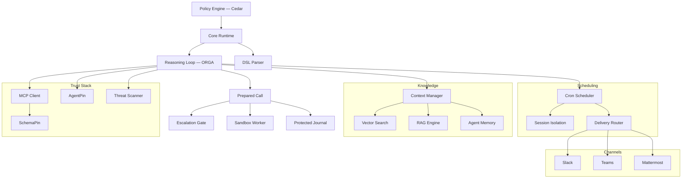

# Symbiont Documentation

Policy-governed platform for building agentic applications. Execute AI agents and tools under explicit policy, identity, and audit controls.

## Start where your job starts

These docs serve three different jobs. They need different pages in a different order, so pick the path rather than reading the list.

**Evaluating whether this is trustworthy.** You need to know what is actually enforced, what is merely recorded, and where the boundaries of the claim are. You may never write a `.symbi` file.

1. [Prove the gate in 30 seconds](#prove-it-first-offline-no-api-key) — below; offline, no install commitment
2. [Security Model](security-model.md) — trust boundaries, the three isolation tiers, what is trusted rather than verified
3. [Prepared Calls](prepared-calls.md) — what an authorization *is*, and why it cannot be replayed
4. [Protected Run Audit](run-audit.md) — what the journal proves, and what it does not
5. [Approval Lifecycle](approval-lifecycle.md) — review-bound release, deadlines, and the limits of approver identity
6. [Containment Guide](containment-branch-guide.md) — current coverage and the gaps stated plainly
7. The published evaluation — [DOI 10.5281/zenodo.20043247](https://doi.org/10.5281/zenodo.20043247)

**Building and operating agents.** You need a running project, then a fence around it that holds when someone else is on call.

1. [Prove the gate](#prove-it-first-offline-no-api-key) — start with a refusal, not a success
2. [Getting Started](getting-started.md) — install, `symbi init`, first agent
3. [DSL Guide](dsl-guide.md) — agent definitions, plus [Inline Effect Policies](inline-policies.md) for the enforced rule subset
4. [Command Isolation](toolclad-command-boundary.md) — configure the worker your tools actually run in
5. [ToolClad](toolclad.md) — declarative tool contracts and scope enforcement
6. [Approval Lifecycle](approval-lifecycle.md) — the correct answer to a denial that should involve a person
7. [Runtime Architecture](runtime-architecture.md) and [API Reference](api-reference.md) — when you deploy it
8. [Symbi Shell](symbi-shell.md) (Beta) — interactive authoring and the Gate panel

**Reading the specification.** You care about conformance, reproducibility, and whether the standard is separable from the vendor.

1. [Open Agent Trust Stack](https://openagenttruststack.org) — the specification (CC BY 4.0), OATS Extended C1–C7 + E1–E8
2. [Reasoning Loop](reasoning-loop.md) — the typestate ORGA cycle as implemented
3. [Prepared Calls](prepared-calls.md) — the authorization object and its regression coverage
4. [Security Model](security-model.md) — tier guarantees, including Tier 3 guest attestation
5. Published work — [Typestate ORGA Loops](https://doi.org/10.5281/zenodo.19896446), [ToolClad](https://doi.org/10.5281/zenodo.19957596), [Empirical Evaluation](https://doi.org/10.5281/zenodo.20043247)
6. [Contributing](contributing.md) — the reproduction harnesses live in the repository

> **Setting up with an AI coding agent?** Point it at <https://symbiont.dev/agent-guide.md> before it touches anything. It is a stable plain-text instruction file with current grammar and flags, and a standing rule never to resolve a setup error by broadening policy.

---

## Prove it first — offline, no API key

Start by making Symbiont refuse something. This is the same Cedar gate the runtime wires into the live reasoning loop, evaluated standalone, so a denial here is a denial there. It needs no model provider, no Docker, and no project.

**Install:**

```bash
curl -fsSL https://symbiont.dev/install.sh | bash
```

**Write two policies and evaluate against them:**

```bash
mkdir -p /tmp/p && cat > /tmp/p/policy.cedar <<'EOF'
forbid(principal, action == Symbi::Action::"tool_call::list_agents",   resource);
permit(principal, action == Symbi::Action::"tool_call::system_health", resource);
EOF

echo '{"tool_name":"list_agents"}'   | symbi policy evaluate --stdin --policies /tmp/p --json
echo '{"tool_name":"system_health"}' | symbi policy evaluate --stdin --policies /tmp/p --json
```

```json
{"decision":"deny","reason":"deny policies matched: policy_0","tool":"list_agents", ...}
{"decision":"allow","reason":"allow policies matched: policy_1","tool":"system_health", ...}
```

**Then watch argument validation stop a call before it executes:**

```bash
symbi tools init greet
symbi tools validate
symbi tools test greet --arg target=example
```

```
greet                                    OK

  ✓ target (string): example → OK

  Command:   greet example
  Cedar:     Tool::Greet / execute_tool

  [dry run — command not executed]
```

The denial is the demonstration. A quick start that ends in a successful run proves only that a program ran — which every agent framework's quick start also proves.

Running an *agent* needs a model provider; continue in [Getting Started](getting-started.md).

---

## What is Symbiont?

Symbiont is a Rust-native platform for executing AI agents and tools under explicit policy, identity, and audit controls.

Most agent frameworks focus on orchestration. Symbiont focuses on what happens when agents run in real environments with real risk: untrusted tools, sensitive data, approval boundaries, audit requirements, and repeatable enforcement.

### How it works

Symbiont separates agent intent from execution authority:

1. **Agents propose** actions through the reasoning loop (Observe-Reason-Gate-Act)
2. **The runtime prepares** each action — normalizing arguments and freezing the contract, resolved effect, selected sandbox and deadline into one immutable call
3. **Policy decides** — Cedar and the supported inline rules must *both* permit; denied actions are blocked, and actions marked for approval are routed to a human
4. **The record lands first** — the required pre-effect journal write must succeed before dispatch
5. **The worker executes** — inside the selected sandbox, never on the host

Model output is never treated as execution authority. The runtime controls what actually happens.

### Core capabilities

| Capability | What it does |
|-----------|-------------|
| **Policy engine** | Fine-grained [Cedar](https://www.cedarpolicy.com/) authorization for agent actions, tool calls, and resource access |
| **Prepared calls** | Authorization issued over a frozen invocation — single-use, uncloneable, re-checked at dispatch against principal, session, executor identity and expiry |
| **Execution containment** | Commands, parsers, MCP sessions, PTYs and managed CLI children run in the selected worker. No host fallback: an unavailable backend fails the run |
| **Exact-call approval** | `human_approval = true` releases only a reviewed snapshot — terminal relay, shell Gate panel, or chat with an ID-plus-digest command |
| **Tool verification** | [SchemaPin](https://schemapin.org) cryptographic verification of MCP tool schemas before execution |
| **Agent identity** | [AgentPin](https://agentpin.org) domain-anchored ES256 identity for agents and scheduled tasks |
| **Reasoning loop** | Typestate-enforced Observe-Reason-Gate-Act cycle with policy gates and circuit breakers |
| **Sandboxing** | Three OSS tiers — Docker (Tier 1), gVisor (Tier 2), Firecracker microVM (Tier 3) — selectable from the DSL with no Enterprise gating |
| **Protected audit** | Private signed per-run journals under `.symbiont/governed/`; a required write failure stops dispatch |
| **Optional governed improvements** | [Versioned workflow instructions](governed-improvements.md), signed trial evaluation, exact operator approval, explicit activation and per-run version pinning; disabled until explicitly initialized and selected |
| **Secrets management** | Vault/OpenBao integration, AES-256-GCM encrypted storage, scoped per agent |
| **MCP integration** | Native Model Context Protocol support with governed tool access |
| **Governed managed CLI** | Run an external AI CLI as a contained child — no source mount, no external network, no host credentials; source access is registered ToolClad tools |

Additional capabilities: threat scanning for tool/skill content, cron scheduling, persistent agent memory, hybrid RAG search (LanceDB/Qdrant), webhook verification, delivery routing, OTLP telemetry, HTTP security hardening, channel adapters (Slack/Teams/Mattermost), and governance plugins for [Claude Code](https://github.com/thirdkeyai/symbi-claude-code) and [Gemini CLI](https://github.com/thirdkeyai/symbi-gemini-cli).

---

## Scaffold a project

```bash
symbi init        # Interactive: profile, SchemaPin mode, sandbox tier.
                  # Writes symbiont.toml, agents/, policies/, docker-compose.yml,
                  # and a .env with a generated SYMBIONT_MASTER_KEY.
symbi run <agent> # Run a single agent without starting the full runtime
symbi up          # Start the full runtime with auto-configuration
symbi shell       # Interactive agent orchestration shell (Beta)
```

Non-interactive, for CI:

```bash
symbi init --profile assistant --schemapin tofu --sandbox tier1 --no-interact
```

With Docker — pass `--dir`, because the image WORKDIR is not your mount:

```bash
docker run --rm -v $(pwd):/workspace ghcr.io/thirdkeyai/symbi:latest \
  init --profile assistant --no-interact --dir /workspace
docker compose up
```

Runtime API on `http://localhost:8080`, HTTP Input on `http://localhost:8081`.

Other installation routes — Homebrew (`brew tap thirdkeyai/tap && brew install symbi`), `cargo install symbi` (needs Rust 1.89+ and `protobuf-compiler`), or [GitHub Releases](https://github.com/thirdkeyai/symbiont/releases). Full detail in [Getting Started](getting-started.md).

### Your first agent

```symbiont
metadata {
    version = "1.0.0"
    author = "your-name"
    description = "Writes one reviewed file"
}

agent writer() {
    capabilities = ["write"]

    with sandbox = "docker", timeout = 20.seconds {}

    policy files {
        allow: "edit_file" if invocation.arguments.path == "result.txt"
        deny:  "edit_file" if invocation.arguments.content == ""
    }
}
```

Inline `policy` blocks are compiled and enforced alongside Cedar — **both must permit**. The supported subset is deliberately small, and a rule the runtime cannot enforce fails the invocation *before* the model is called rather than being silently ignored. See [Inline Effect Policies](inline-policies.md) for the exact grammar, and the [DSL Guide](dsl-guide.md) for `metadata`, `schedule`, `webhook`, and `channel` blocks.

### Interactive shell (Beta)

`symbi shell` is a ratatui-based terminal UI for authoring agents, tools, and policies with LLM assistance, orchestrating multi-agent patterns (`/chain`, `/parallel`, `/race`, `/debate`), managing schedules and channels, and attaching to remote runtimes. Press `Ctrl+G` to open the Gate panel and review held actions. Status is **beta** — the command surface and persistence formats may still shift between minor releases. See the [Symbi Shell guide](symbi-shell.md) and [shell workspace configuration](shell-containment.md).

### Deploying single agents (Beta)

The shell's `/deploy` command packages the active agent and ships it to Docker (`/deploy local`), Google Cloud Run (`/deploy cloudrun`), or AWS App Runner (`/deploy aws`). The OSS stack is single-agent; multi-agent topologies compose via cross-instance messaging. See [Symbi Shell — Deployment](symbi-shell.md#deployment-beta).

---

## Architecture



---

## Security model

Symbiont is designed around a simple principle: **model output should never be trusted as execution authority.**

Actions flow through runtime controls:

- **Zero trust** — all agent inputs are untrusted by default
- **Prepared calls** — the authorized invocation is frozen, single-use, and re-checked at dispatch
- **Policy checks** — Cedar plus the supported inline rules, both fail-closed, before every tool call
- **Tool verification** — SchemaPin cryptographic verification of tool schemas
- **Containment** — Docker, gVisor or Firecracker workers, with no host fallback
- **Operator approval** — human review of the complete request, released by digest rather than by ID
- **Secrets control** — Vault/OpenBao backends, encrypted local storage, agent namespaces
- **Audit logging** — tamper-evident records written before the effect, not after

See the [Security Model](security-model.md) guide for full details, and the [Containment Guide](containment-branch-guide.md) for current coverage and remaining gaps.

### What is not claimed

A security page that lists only guarantees is asking to be believed. These limits are stated here rather than discovered later:

- Host configuration, worker images, the container runtime, operator-supplied inference endpoints and injected SDK implementations are **trusted** components, not verified ones.
- Containment is not complete across every entry point. Public browser execution, aggregate admission control, and automatic replay or recovery are unavailable or outside these contracts.
- A reasoning loop can reach `Completed` after a tool error or policy denial — inspect individual tool outcomes. A terminal write can fail *after* an effect occurred: **an error is not a rollback.** A missing or incomplete journal is absence of evidence, not evidence of success.
- Terminal approver identity is the local operator's effective UID — an OS account, not an independently verified individual. A review digest binds the exact request; it does not prove a person read it.
- Deterministic matched laboratory trials establish their individual scenarios. **They do not supply a model escape rate.**
- SOC 2, HIPAA and ISO 27001 are alignment targets the audit trail is designed for. No certification is held or implied.

---

## All guides

**Containment and governance**

- [Containment Guide](containment-branch-guide.md) — operator workflows, architecture, migration, remaining gaps
- [Prepared Calls](prepared-calls.md) — exact-call authorization and Cedar request shape
- [Approval Lifecycle](approval-lifecycle.md) — terminal, TUI and chat reviews
- [Protected Run Audit](run-audit.md) — run identity, journal verification, incomplete outcomes
- [Crash Inspection](crash-inspection.md) — verify interrupted runs and unresolved effects without replay
- [Inline Effect Policies](inline-policies.md) — the enforced DSL rule subset
- [Command Isolation](toolclad-command-boundary.md) — worker configuration for tools and parsers
- [Per-operation File Grants](filesystem-grants.md) — declared inputs, bounded new outputs, parser isolation
- [Docker Ownership](docker-containment.md) — lifetime, cleanup and recovery
- [Interactive Terminals](interactive-terminal-boundary.md) — contained PTY sessions
- [Shell Workspace](shell-containment.md) — governed file and command tools in the TUI
- [Managed CLI](managed-cli-containment.md) — running an external AI CLI as a contained child
- [Governed Broker](governed-tool-broker.md) — the brokered tool-call API
- [DSL Invocation Context](dsl-invocation-context.md) — caller identity and frozen project root
- [Scheduled Execution](scheduled-execution.md) — invocation IDs and terminal results
- [Invocation Idempotency](invocation-idempotency.md) — persistent CLI request identities and safe result retrieval

**Core**

- [Getting Started](getting-started.md) — installation, configuration, first agent
- [Symbi Shell](symbi-shell.md) (Beta) — interactive TUI for authoring, orchestration, remote attach
- [Security Model](security-model.md) — zero-trust architecture, policy enforcement, isolation tiers
- [Runtime Architecture](runtime-architecture.md) — runtime internals and execution model
- [Reasoning Loop](reasoning-loop.md) — ORGA cycle, policy gates, circuit breakers
- [DSL Guide](dsl-guide.md) — agent definition language reference
- [ToolClad](toolclad.md) — declarative tool contracts, argument validation, scope enforcement
- [MCP Tools](mcp-tools.md) — governed Model Context Protocol access
- [API Reference](api-reference.md) — HTTP API endpoints and configuration
- [Scheduling](scheduling.md) — cron engine, delivery routing, dead-letter queues
- [HTTP Input](http-input.md) — webhook server, auth, rate limiting
- [Firecracker Setup](firecracker-setup.md) — Tier 3 kernel, rootfs and guest transport
- [Managed Firecracker Host Service](firecracker-host-service.md) — optional jailer, host limits, watchdog deployment
- [Session Types](session-types.md) (Experimental) — inter-agent protocol conformance monitoring

---

## Community and resources

- **Agent guide**: [symbiont.dev/agent-guide.md](https://symbiont.dev/agent-guide.md) — instructions for an AI coding agent doing your setup
- **Packages**: [crates.io/crates/symbi](https://crates.io/crates/symbi) | [npm symbiont-sdk-js](https://www.npmjs.com/package/symbiont-sdk-js) | [PyPI symbiont-sdk](https://pypi.org/project/symbiont-sdk/)
- **SDKs**: [JavaScript/TypeScript](https://github.com/ThirdKeyAI/symbiont-sdk-js) | [Python](https://github.com/ThirdKeyAI/symbiont-sdk-python)
- **Plugins**: [Claude Code](https://github.com/thirdkeyai/symbi-claude-code) | [Gemini CLI](https://github.com/thirdkeyai/symbi-gemini-cli)
- **Issues**: [GitHub Issues](https://github.com/thirdkeyai/symbiont/issues)
- **License**: Apache 2.0 (Community Edition)

---

## Next steps

<div class="grid grid-cols-1 md:grid-cols-3 gap-6 mt-8">
  <div class="card">
    <h3>Prove the Gate</h3>
    <p>Make Symbiont refuse something before you install a project.</p>
    <a href="#prove-it-first-offline-no-api-key" class="btn btn-outline">30-second check</a>
  </div>

  <div class="card">
    <h3>Security Model</h3>
    <p>Understand the trust boundaries and policy enforcement.</p>
    <a href="security-model.md" class="btn btn-outline">Security Guide</a>
  </div>

  <div class="card">
    <h3>Get Started</h3>
    <p>Install Symbiont and run your first governed agent.</p>
    <a href="getting-started.md" class="btn btn-outline">Quick Start Guide</a>
  </div>
</div>
