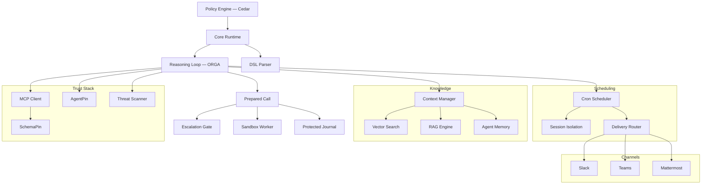

# Symbiont ドキュメント

エージェント型アプリケーションを構築するための、ポリシー制御プラットフォーム。明示的なポリシー、アイデンティティ、監査制御の下で AI エージェントとツールを実行します。

## 目的に応じた読み進め方

本ドキュメントは 3 つの異なる目的に向けて書かれています。目的ごとに必要なページも読む順序も異なるため、一覧を順に読むのではなく、自分に合った経路を選んでください。

**信頼できるかどうかを評価する。** 実際に強制されているのは何か、単に記録されているだけなのは何か、そして主張の境界はどこにあるのかを知る必要があります。`.symbi` ファイルを一度も書かないかもしれません。

1. [30 秒でゲートを確かめる](#prove-it-first-offline-no-api-key) — 後述。オフラインで、インストールを前提としません
2. [セキュリティモデル](/security-model) — 信頼境界、3 つの分離ティア、検証ではなく信頼している対象
3. [準備済み呼び出し](/prepared-calls) — 認可とは*何か*、そしてなぜ再生できないのか
4. [保護された実行監査](/run-audit) — ジャーナルが証明すること、しないこと
5. [承認のライフサイクル](/approval-lifecycle) — レビューに束縛された解放、期限、承認者の識別の限界
6. [封じ込めガイド](/containment-branch-guide) — 現在のカバー範囲と、率直に述べた未対応箇所
7. 公開された評価 — [DOI 10.5281/zenodo.20043247](https://doi.org/10.5281/zenodo.20043247)

**エージェントを構築し運用する。** まず動くプロジェクトが必要で、次に、別の担当者が当番のときにも保たれる囲いが必要です。

1. [ゲートを確かめる](#prove-it-first-offline-no-api-key) — 成功ではなく拒否から始める
2. [はじめに](/getting-started) — インストール、`symbi init`、最初のエージェント
3. [DSL ガイド](/dsl-guide) — エージェント定義。強制されるルールの部分集合については[インライン作用ポリシー](/inline-policies)も参照
4. [コマンドの分離](/toolclad-command-boundary) — ツールが実際に動作するワーカーを設定する
5. [ToolClad](/toolclad) — 宣言的なツールコントラクトとスコープの強制
6. [承認のライフサイクル](/approval-lifecycle) — 人の判断を要する拒否に対する正しい答え
7. [ランタイムアーキテクチャ](/runtime-architecture)と [API リファレンス](/api-reference) — 配備する段階で
8. [Symbi Shell](/symbi-shell)（Beta） — 対話的なオーサリングと Gate パネル

**仕様を読む。** 適合性、再現性、そして標準がベンダーから切り離せるかどうかを重視しています。

1. [Open Agent Trust Stack](https://openagenttruststack.org) — 仕様（CC BY 4.0）、OATS Extended C1–C7 + E1–E8
2. [推論ループ](/reasoning-loop) — 実装された型状態の ORGA サイクル
3. [準備済み呼び出し](/prepared-calls) — 認可オブジェクトとその回帰テストのカバー範囲
4. [セキュリティモデル](/security-model) — Tier 3 のゲスト認証を含む、各ティアの保証
5. 発表済みの研究 — [Typestate ORGA Loops](https://doi.org/10.5281/zenodo.19896446)、[ToolClad](https://doi.org/10.5281/zenodo.19957596)、[Empirical Evaluation](https://doi.org/10.5281/zenodo.20043247)
6. [コントリビューション](/contributing) — 再現用のハーネスはリポジトリに含まれています

> **AI コーディングエージェントにセットアップさせますか？** 何かに手を付ける前に <https://symbiont.dev/agent-guide.md> を読ませてください。最新の文法とフラグ、そして「セットアップのエラーをポリシーの緩和で解決してはならない」という恒久的なルールを記した、安定したプレーンテキストの指示ファイルです。

---

<a id="prove-it-first-offline-no-api-key"></a>

## まず確かめる — オフライン、API キー不要

まずは Symbiont に何かを拒否させてみてください。ここで使うのは、ランタイムが実際の推論ループに組み込むのと同じ Cedar ゲートを単体で評価したものです。したがって、ここでの拒否は実行時の拒否と同じです。モデルプロバイダーも Docker もプロジェクトも不要です。

**インストール：**

```bash
curl -fsSL https://symbiont.dev/install.sh | bash
```

**2 つのポリシーを書き、それに照らして評価する：**

```bash
mkdir -p /tmp/p && cat > /tmp/p/policy.cedar <<'EOF'
forbid(principal, action == Symbi::Action::"tool_call::list_agents",   resource);
permit(principal, action == Symbi::Action::"tool_call::system_health", resource);
EOF

echo '{"tool_name":"list_agents"}'   | symbi policy evaluate --stdin --policies /tmp/p --json
echo '{"tool_name":"system_health"}' | symbi policy evaluate --stdin --policies /tmp/p --json
```

```json
{"decision":"deny","reason":"deny policies matched: policy_0","tool":"list_agents", ...}
{"decision":"allow","reason":"allow policies matched: policy_1","tool":"system_health", ...}
```

**次に、引数の検証が実行前に呼び出しを止める様子を確認する：**

```bash
symbi tools init greet
symbi tools validate
symbi tools test greet --arg target=example
```

```
greet                                    OK

  ✓ target (string): example → OK

  Command:   greet example
  Cedar:     Tool::Greet / execute_tool

  [dry run — command not executed]
```

拒否されることこそがデモンストレーションです。成功した実行で終わるクイックスタートが証明するのは、プログラムが動いたということだけであり、それはどのエージェントフレームワークのクイックスタートでも証明できます。

*エージェント*を実行するにはモデルプロバイダーが必要です。[はじめに](/getting-started)に進んでください。

---

## Symbiont とは？

Symbiont は、明示的なポリシー、アイデンティティ、監査制御の下で AI エージェントとツールを実行するための Rust ネイティブプラットフォームです。

ほとんどのエージェントフレームワークはオーケストレーションに焦点を当てています。Symbiont は、エージェントが実際のリスクを伴う実環境で実行される場合に何が起こるかに焦点を当てています：信頼されないツール、機密データ、承認境界、監査要件、再現可能な実施。

### 仕組み

Symbiont はエージェントの意図と実行権限を分離します：

1. **エージェントが提案** — 推論ループ（Observe-Reason-Gate-Act）を通じてアクションを提案
2. **ランタイムが準備** — 引数を正規化し、コントラクト、解決された作用、選択されたサンドボックス、期限を 1 つの不変な呼び出しとして固定
3. **ポリシーが決定** — Cedar とサポートされるインラインルールの*両方*が許可する必要があります。拒否されたアクションはブロックされ、承認が指定されたアクションは人間に回送されます
4. **記録が先に残る** — 作用の前に必須となるジャーナル書き込みが、ディスパッチより先に成功する必要があります
5. **ワーカーが実行** — 選択されたサンドボックスの内部で実行され、ホスト上で実行されることはありません

モデル出力は実行権限として扱われることはありません。ランタイムが実際に何が起こるかを制御します。

### コア機能

| 機能 | 説明 |
|-----------|-------------|
| **ポリシーエンジン** | エージェントのアクション、ツール呼び出し、リソースアクセスに対する [Cedar](https://www.cedarpolicy.com/) によるきめ細かな認可 |
| **準備済み呼び出し** | 固定された呼び出しに対して発行される認可。単回限りで複製不可、ディスパッチ時にプリンシパル、セッション、エグゼキューターの識別情報、有効期限に対して再検査されます |
| **実行の封じ込め** | コマンド、パーサー、MCP セッション、PTY、管理 CLI の子プロセスは選択されたワーカー内で実行されます。ホストへのフォールバックはなく、バックエンドが利用できない場合は実行が失敗します |
| **厳密な呼び出し単位の承認** | `human_approval = true` では、レビュー済みのスナップショットのみが解放されます。端末のリレー、シェルの Gate パネル、または ID とダイジェストを指定するチャットコマンドを使用します |
| **ツール検証** | 実行前に [SchemaPin](https://schemapin.org) による MCP ツールスキーマの暗号学的検証 |
| **エージェントアイデンティティ** | [AgentPin](https://agentpin.org) によるエージェントとスケジュールタスクのドメイン固定 ES256 アイデンティティ |
| **推論ループ** | ポリシーゲートとサーキットブレーカーを備えた型状態強制の Observe-Reason-Gate-Act サイクル |
| **サンドボックス** | 3つの OSS ティア — Docker（Tier 1）、gVisor（Tier 2）、Firecracker microVM（Tier 3） — Enterprise ゲーティングなしで DSL から選択可能 |
| **保護された監査** | `.symbiont/governed/` 配下の、実行ごとの非公開な署名付きジャーナル。必須の書き込みが失敗した場合はディスパッチを停止します |
| **オプションのガバナンス下の改善** | [バージョン管理されたワークフロー指示](/governed-improvements)、署名付きの試行評価、運用者による厳密な承認、明示的な有効化、実行ごとのバージョン固定。明示的に初期化して選択するまでは無効です |
| **シークレット管理** | Vault/OpenBao 統合、AES-256-GCM 暗号化ストレージ、エージェントごとのスコープ |
| **MCP 統合** | 制御されたツールアクセスを備えたネイティブ Model Context Protocol サポート |
| **ガバナンス下の管理 CLI** | 外部の AI CLI を封じ込められた子プロセスとして実行します。ソースのマウント、外部ネットワーク、ホストの資格情報はなく、ソースへのアクセスは登録済みの ToolClad ツールを通じて行います |

追加機能：ツール/スキルコンテンツの脅威スキャン、cron スケジューリング、永続エージェントメモリ、ハイブリッド RAG 検索（LanceDB/Qdrant）、webhook 検証、配信ルーティング、OTLP テレメトリ、HTTP セキュリティ強化、チャネルアダプター（Slack/Teams/Mattermost）、および [Claude Code](https://github.com/thirdkeyai/symbi-claude-code) と [Gemini CLI](https://github.com/thirdkeyai/symbi-gemini-cli) のガバナンスプラグイン。

---

## プロジェクトをスキャフォールドする

```bash
symbi init        # インタラクティブ：プロファイル、SchemaPin モード、サンドボックスティア。
                  # symbiont.toml、agents/、policies/、docker-compose.yml、および
                  # 生成された SYMBIONT_MASTER_KEY を含む .env を書き込みます。
symbi run <agent> # フルランタイムを起動せずに単一エージェントを実行
symbi up          # 自動設定でフルランタイムを起動
symbi shell       # インタラクティブなエージェントオーケストレーションシェル（Beta）
```

CI 向けの非インタラクティブ実行：

```bash
symbi init --profile assistant --schemapin tofu --sandbox tier1 --no-interact
```

Docker を使う場合 — イメージの WORKDIR はマウント先とは異なるため、`--dir` を渡します：

```bash
docker run --rm -v $(pwd):/workspace ghcr.io/thirdkeyai/symbi:latest \
  init --profile assistant --no-interact --dir /workspace
docker compose up
```

ランタイム API は `http://localhost:8080`、HTTP 入力は `http://localhost:8081` で公開されます。

その他のインストール方法 — Homebrew（`brew tap thirdkeyai/tap && brew install symbi`）、`cargo install symbi`（Rust 1.89 以降と `protobuf-compiler` が必要）、または [GitHub Releases](https://github.com/thirdkeyai/symbiont/releases)。詳細は[はじめに](/getting-started)をご覧ください。

### 最初のエージェント

```symbiont
metadata {
    version = "1.0.0"
    author = "your-name"
    description = "Writes one reviewed file"
}

agent writer() {
    capabilities = ["write"]

    with sandbox = "docker", timeout = 20.seconds {}

    policy files {
        allow: "edit_file" if invocation.arguments.path == "result.txt"
        deny:  "edit_file" if invocation.arguments.content == ""
    }
}
```

インラインの `policy` ブロックはコンパイルされ、Cedar と並んで強制されます — **両方が許可する必要があります**。サポートされる部分集合は意図的に小さく、ランタイムが強制できないルールは、黙って無視されるのではなく、モデルが呼び出される*前*に呼び出しを失敗させます。正確な文法については[インライン作用ポリシー](/inline-policies)を、`metadata`、`schedule`、`webhook`、`channel` ブロックについては [DSL ガイド](/dsl-guide)をご覧ください。

### インタラクティブシェル (Beta)

`symbi shell` は、LLM 支援によるエージェント、ツール、ポリシーのオーサリング、マルチエージェントパターン（`/chain`、`/parallel`、`/race`、`/debate`）のオーケストレーション、スケジュールとチャネルの管理、リモートランタイムへのアタッチを行うための ratatui ベースのターミナル UI です。`Ctrl+G` を押すと Gate パネルが開き、保留中のアクションをレビューできます。ステータスは **beta** であり、コマンドサーフェスと永続化フォーマットはマイナーリリース間で変更される可能性があります。[Symbi Shell ガイド](/symbi-shell)および[シェルのワークスペース設定](/shell-containment)を参照してください。

### シングルエージェントのデプロイ (Beta)

シェルの `/deploy` コマンドは、アクティブなエージェントをパッケージ化し、Docker（`/deploy local`）、Google Cloud Run（`/deploy cloudrun`）、または AWS App Runner（`/deploy aws`）にデプロイします。OSS スタックはシングルエージェント構成です。マルチエージェントトポロジーはクロスインスタンスメッセージングで構成します。[Symbi Shell — デプロイ](/symbi-shell#deployment-beta) を参照してください。

---

## アーキテクチャ



---

## セキュリティモデル

Symbiont はシンプルな原則に基づいて設計されています：**モデル出力を実行権限として信頼すべきではありません。**

アクションはランタイム制御を通じて流れます：

- **ゼロトラスト** — すべてのエージェント入力はデフォルトで信頼されない
- **準備済み呼び出し** — 認可された呼び出しは固定され、単回限りで、ディスパッチ時に再検査される
- **ポリシーチェック** — すべてのツール呼び出しの前に、Cedar とサポートされるインラインルールの両方がフェイルクローズで評価される
- **ツール検証** — ツールスキーマの SchemaPin 暗号学的検証
- **封じ込め** — Docker、gVisor、Firecracker のワーカーを使用し、ホストへのフォールバックはない
- **オペレーター承認** — リクエスト全体を人間がレビューし、ID ではなくダイジェストによって解放する
- **シークレット制御** — Vault/OpenBao バックエンド、暗号化ローカルストレージ、エージェント名前空間
- **監査ログ** — 作用のあとではなく、その前に書き込まれる改ざん防止レコード

詳細については[セキュリティモデル](/security-model)ガイドを、現在のカバー範囲と残された未対応箇所については[封じ込めガイド](/containment-branch-guide)をご覧ください。

### 主張していないこと

保証だけを並べたセキュリティのページは、ただ信じてほしいと言っているにすぎません。以下の限界は、後から発見されるのではなく、ここで明示しておきます：

- ホストの設定、ワーカーのイメージ、コンテナランタイム、運用者が用意した推論エンドポイント、注入された SDK 実装は、検証された構成要素ではなく**信頼された**構成要素です。
- 封じ込めはすべてのエントリーポイントで完全ではありません。公開のブラウザ実行、全体の受付制御、自動的なリプレイや復旧は、利用できないか、これらの契約の対象外です。
- 推論ループは、ツールのエラーやポリシーによる拒否のあとでも `Completed` に到達し得ます。個々のツールの結果を確認してください。終端の書き込みは、作用が発生した*あとで*失敗することがあります。**エラーはロールバックではありません。** ジャーナルの欠落や不完全さは証拠の不在であって、成功の証拠ではありません。
- 端末での承認者の識別情報は、ローカル運用者の実効 UID です。これは OS のアカウントであり、独立に検証された個人ではありません。レビューのダイジェストは厳密なリクエストを束縛しますが、人がそれを読んだことを証明するものではありません。
- 決定論的に条件を揃えた実験室での試行は、それぞれのシナリオを立証します。**モデルの脱出率を示すものではありません。**
- SOC 2、HIPAA、ISO 27001 は、監査証跡が適合を目指している対象です。認証を取得しているわけでも、取得を示唆するものでもありません。

---

## すべてのガイド

**封じ込めとガバナンス**

- [封じ込めガイド](/containment-branch-guide) — 運用ワークフロー、アーキテクチャ、移行、残された未対応箇所
- [準備済み呼び出し](/prepared-calls) — 厳密な呼び出し単位の認可と Cedar のリクエスト形状
- [承認のライフサイクル](/approval-lifecycle) — 端末、TUI、チャットでのレビュー
- [保護された実行監査](/run-audit) — 実行の識別、ジャーナルの検証、不完全な結果
- [クラッシュの調査](/crash-inspection) — 再実行せずに、中断された実行と未解決の作用を検証
- [インライン作用ポリシー](/inline-policies) — 強制される DSL ルールの部分集合
- [コマンドの分離](/toolclad-command-boundary) — ツールとパーサー向けのワーカー設定
- [操作単位のファイル権限](/filesystem-grants) — 宣言された入力、上限付きの新規出力、パーサーの分離
- [Docker の所有権](/docker-containment) — ライフタイム、クリーンアップ、復旧
- [対話型ターミナル](/interactive-terminal-boundary) — 封じ込められた PTY セッション
- [シェルのワークスペース](/shell-containment) — TUI におけるガバナンス下のファイルツールとコマンドツール
- [管理 CLI](/managed-cli-containment) — 外部の AI CLI を封じ込められた子プロセスとして実行する
- [ガバナンス下のブローカー](/governed-tool-broker) — 仲介されるツール呼び出し API
- [DSL 呼び出しコンテキスト](/dsl-invocation-context) — 呼び出し元の識別情報と固定されたプロジェクトルート
- [スケジュールされた実行](/scheduled-execution) — 呼び出し ID と終端の結果
- [呼び出しの冪等性](/invocation-idempotency) — 永続的な CLI リクエストの識別と安全な結果取得

**コア**

- [はじめに](/getting-started) — インストール、設定、最初のエージェント
- [Symbi Shell](/symbi-shell)（Beta） — オーサリング、オーケストレーション、リモートアタッチのためのインタラクティブ TUI
- [セキュリティモデル](/security-model) — ゼロトラストアーキテクチャ、ポリシー実施、分離ティア
- [ランタイムアーキテクチャ](/runtime-architecture) — ランタイム内部と実行モデル
- [推論ループ](/reasoning-loop) — ORGA サイクル、ポリシーゲート、サーキットブレーカー
- [DSL ガイド](/dsl-guide) — エージェント定義言語リファレンス
- [ToolClad](/toolclad) — 宣言的なツールコントラクト、引数の検証、スコープの強制
- [MCP ツール](/mcp-tools) — ガバナンス下の Model Context Protocol アクセス
- [API リファレンス](/api-reference) — HTTP API エンドポイントと設定
- [スケジューリング](/scheduling) — Cron エンジン、配信ルーティング、デッドレターキュー
- [HTTP 入力](/http-input) — Webhook サーバー、認証、レート制限
- [Firecracker セットアップ](/firecracker-setup) — Tier 3 のカーネル、rootfs、ゲストトランスポート
- [Firecracker 管理ホストサービス](/firecracker-host-service) — オプションの jailer、ホスト側の制限、watchdog の配備
- [セッション型](/session-types)（実験的） — エージェント間プロトコルの適合性監視

---

## コミュニティとリソース

- **エージェント向けガイド**: [symbiont.dev/agent-guide.md](https://symbiont.dev/agent-guide.md) — セットアップを行う AI コーディングエージェントへの指示
- **パッケージ**: [crates.io/crates/symbi](https://crates.io/crates/symbi) | [npm symbiont-sdk-js](https://www.npmjs.com/package/symbiont-sdk-js) | [PyPI symbiont-sdk](https://pypi.org/project/symbiont-sdk/)
- **SDK**: [JavaScript/TypeScript](https://github.com/ThirdKeyAI/symbiont-sdk-js) | [Python](https://github.com/ThirdKeyAI/symbiont-sdk-python)
- **プラグイン**: [Claude Code](https://github.com/thirdkeyai/symbi-claude-code) | [Gemini CLI](https://github.com/thirdkeyai/symbi-gemini-cli)
- **課題**: [GitHub Issues](https://github.com/thirdkeyai/symbiont/issues)
- **ライセンス**: Apache 2.0 (Community Edition)

---

## 次のステップ

<div class="grid grid-cols-1 md:grid-cols-3 gap-6 mt-8">
  <div class="card">
    <h3>ゲートを確かめる</h3>
    <p>プロジェクトをインストールする前に、Symbiont に何かを拒否させてみましょう。</p>
    <a href="#prove-it-first-offline-no-api-key" class="btn btn-outline">30 秒で確認</a>
  </div>

  <div class="card">
    <h3>セキュリティモデル</h3>
    <p>信頼境界とポリシー実施を理解しましょう。</p>
    <a href="/security-model" class="btn btn-outline">セキュリティガイド</a>
  </div>

  <div class="card">
    <h3>はじめる</h3>
    <p>Symbiont をインストールして、最初のガバナンスエージェントを実行しましょう。</p>
    <a href="/getting-started" class="btn btn-outline">クイックスタートガイド</a>
  </div>
</div>
