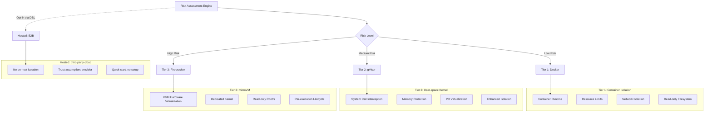
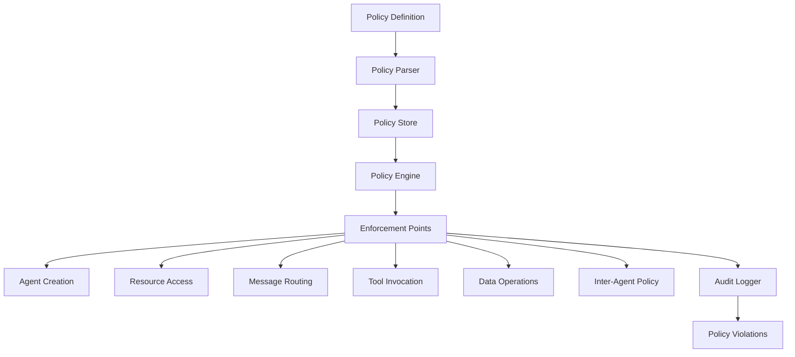
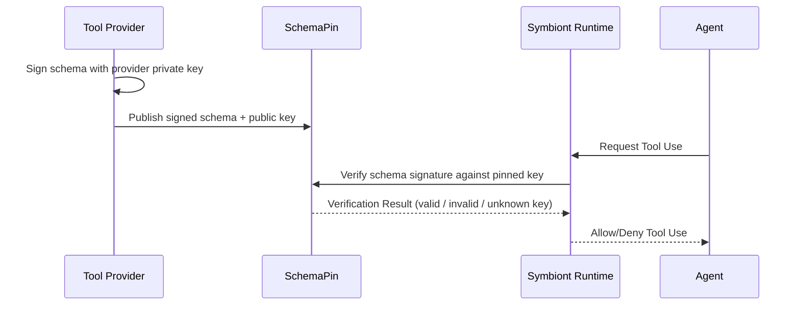
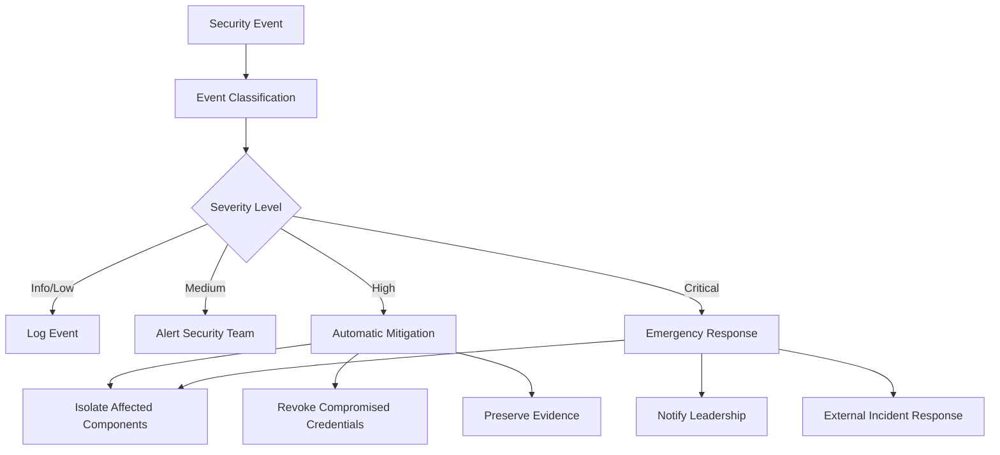

# セキュリティモデル

AIエージェントに対してゼロトラスト、ポリシー駆動型保護を確保する包括的なセキュリティアーキテクチャ。

## 目次


---

## 概要

**封じ込めのカバー範囲：** 1.21.0 では、対象となる Docker / gVisor の作用境界、準備済み呼び出しに対する厳密な承認、対象のエントリーポイントにおける保護されたジャーナル、そして独立したワーカー所有権が追加されました。実装済みの経路と配備時の前提については[封じ込めガイド](/containment-branch-guide)を参照してください。以下に述べるアーキテクチャとティア設定は、すべての経路にわたって完全に強制されていることの証拠ではありません。Firecracker のワンショットコマンド、パーサー、MCP stdio、PTY セッション、管理 CLI のワーカーは、バージョン管理されたゲストトランスポートと独立した VMM 所有権を使用します。管理された VM は、ランタイムが発行したツール／推論の権限のみを受け取ります。分離されたブラウザ実行は引き続き利用できません。ゲストとホストの配備要件については [Firecracker セットアップ](/firecracker-setup)を参照してください。Docker のテストは VM 配備を検証するものではありません。

Symbiontは、規制された高保証環境向けに設計されたセキュリティファーストアーキテクチャを実装しています。セキュリティモデルは、包括的なポリシー実行、マルチティアサンドボックス、暗号学的監査可能性を備えたゼロトラスト原則に基づいて構築されています。

### セキュリティ原則

- **ゼロトラスト**: すべてのコンポーネントと通信が検証される
- **多層防御**: 単一障害点のない複数のセキュリティ層
- **ポリシー駆動型**: 実行時に適用される宣言的セキュリティポリシー
- **完全監査可能性**: 暗号学的整合性を持つすべての操作ログ
- **最小権限**: 操作に必要な最小限の権限

---

## マルチティアサンドボックス

ランタイムは、3つのホスト分離ティア（Tier 1 → Tier 3）と、1つのホスト型実行バックエンド（E2B）を提供します。これらのティアは単調増加する分離のはしごを形成しており、E2B はそのはしご上の **対等な存在ではありません** — E2B はサードパーティのインフラ上で実行され、後述で別途説明します。



> **すべてのホスト分離ティア — landlock、Docker、gVisor、Firecracker — は OSS ランタイムに同梱されています。** 運用者は DSL の `with { sandbox = ... }` ブロックでエージェントごとにティアを選択するか、`symbiont.toml` の `[sandbox] tier = "..."` でプロジェクト全体のデフォルトを設定します。E2B は DSL 経由（`with { sandbox = "e2b" }`）でのみオプトインで利用可能であり、`[sandbox] tier` の値としては意図的に公開していません。
>
> 強力な分離は基盤であり、追加販売の対象ではありません。コミュニティが依存する境界を自ら読み、監査し、再現できるように、各ティアはオープンソースのランタイムに留まります。ゲスト認証はその最も明快な例です。読むことのできないソースに対するフィンガープリントは何も証明しないため、ゲストサービスはまさにセキュリティ制御であるからこそオープンソースになっています。

<a id="landlock-daemon-free"></a>

### Landlock（ネイティブワーカー）

番号ではなく `landlock` という名前で指定します。このオプションの Linux バックエンドは、ネイティブプロセスと外部で管理される委譲スーパーバイザーを使用します。コンテナイメージもコンテナデーモンも不要です。既定は引き続き Docker です。[サービスのセットアップと移行](/landlock-supervision)を参照してください。

**設定：** `symbiont.toml` の `[sandbox] tier = "landlock"`。読み取り専用および書き込み可能な上限は、他のバックエンドと共通の `[sandbox.roots]` から取得されます。`[sandbox.landlock]` には `abi_floor`、`require_network`、メモリ、CPU、PID、ライフタイム、出力の各上限と、その `supervisor` 設定が含まれます。既定かつ最小のサポート ABI は 6 になりました。これは古い設定がより低い下限を指定している場合も同様です。設定でより高い下限を指定した場合はそちらが適用されます。ネイティブのリトルエンディアン x86_64 または aarch64 と、動作する seccomp フィルタリングが必要です。

**使用例：**
- エージェントごとにコンテナデーモンを動かすのが現実的でないワークステーションやデスクトップ
- イメージを用意せずに、ローカルプロセスのファイルシステム到達範囲、ソケット、送出されるシグナルを制限したい場合

**セキュリティ機能：**
- 宣言されたルートへのファイルシステム制限をカーネルが強制
- Landlock ABI 6 のスコープにより、ワーカーのドメイン外のプロセスに対するシグナル送信と抽象 Unix ソケットへの接続を防止。ドメイン内のシグナルは引き続き使用可能
- 既定の `require_network = true` では、seccomp が新規ソケットを拒否し、TCP、UDP、パス名付き Unix ソケットを対象とします。プライベートな Unix **ストリーム**ソケットペアは引き続き使用できます。データグラムペアは、無関係なパス名付きソケットへ送信できるため拒否されます。この制限を回避できないよう、`io_uring` の操作と代替のシステムコール ABI も拒否されます
- `require_network = false` は、新規の IPv4/IPv6 ソケットを明示的に許可します。ホストの Unix ソケット、他のソケットファミリー、データグラムペア、`io_uring` を許可するものではありません。このオプションはループバックを含む IP ネットワークへのアクセスを与えるものであり、送信先の許可リストではありません
- 動的リンクされたプログラムの起動に必要な、システムの実行ファイルディレクトリとライブラリディレクトリに対する基本的な読み取り／実行権限。書き込み可能なパス、ホームディレクトリ配下、`/etc` 全体の権限は含まれません
- ルールセットは完全な強制を要求します。クレートの既定はベストエフォートであり、カーネルがサポートしない内容を黙って無視しますが、その既定は使用しません
- ルールとシステムコールフィルタは、開かれたファイルシステムオブジェクトに対して親プロセス側で構築されます。準備後にルートを差し替えても、その権限を別の対象へ向け直すことはできません。子プロセスは制限を適用し、raw システムコールを用いて stderr より上のディスクリプタに close-on-exec を設定します。宣言されたルートが存在しない場合は準備が失敗します。任意のシステムパスが存在しない場合は省略され得ます。適用に失敗した場合は起動を中止します
- 継承された余分なファイル、ソケット、リングのディスクリプタは exec 時にクローズされます。stdin、stdout、stderr は明示的なケイパビリティのままです。SDK の呼び出し元は意図したチャネルのみを渡す必要があります。同梱の MCP 経路はパイプを使用します。これは、運用者が意図して stdio 経由で渡した、または読み取り可能なルートとして与えたケイパビリティを取り消すものではありません

**移行。** ABI 4 または 5 のホストはフェイルクローズするようになりました。`abi_floor` を下げても、弱い境界を復活させることはできません。Unix サービス、データグラムペア、`io_uring`、互換性のための実行ファイルを必要とするワークロードは、適切な監視付きバックエンドを使用してください。監査のディスクリプタには、境界バージョン 3、共有された受付と cgroup による監視、有効な ABI 要件、シグナル／ソケットのスコープ、ソケットポリシー、リングの拒否、継承ディスクリプタのポリシーが含まれます。

**現在のカバー範囲。** 宣言ファイルを伴わない MCP stdio と、SDK の低レベル `CliExecutor` 起動経路がこのバックエンドを使用します。公開のワンショットコマンド、カスタム出力パーサー、対話型 PTY、宣言ファイルのステージング、同梱の管理 CLI 構成はまだ対応していません。これらの経路で Landlock を選択した場合は、制限なしの実行に切り替わるのではなく失敗します。

**権限のライフタイム。** 一度適用されたドメインを緩めることはできません。SDK の CLI 子プロセスは、作業ディレクトリへの書き込み権限を含むドメインを起動時に一度だけ受け取ります。直接指定されたルートは、そのライフタイムの間、設定された階層を認可します。ファイル内容のスナップショットを取るわけではなく、書き込みを新規ファイルの公開に限定するものでもありません。宣言ファイルを伴わない MCP のディスカバリーと呼び出しでは、設定されたホストルートはクリアされます。ガバナンス下の MCP と低レベル SDK の CLI ワーカーは、cgroup が削除されるまで、共有された CPU／メモリ／ワーカーの予約を永続的に保持します。委譲された cgroup はリソース上限を強制し、プロセスグループを離れた子孫も停止します。スーパーバイザーの障害と watchdog の期限切れは、独立したサービスマネージャーが処理します。raw の `PreparedDomain` プリミティブはカーネルのアクセス制御を適用するだけで、リースは取得しません。

**フェイルクローズ。** 必要な Landlock ABI とネイティブアーキテクチャは、認可の前に検査されます。ルールセットの構築や適用の失敗（seccomp フィルタリングが利用できない場合を含む）は、ワーカーの実行ファイルが起動する前に起動を中止させます。部分的な適用も、制限なしのホスト実行へのフォールバックもありません。

**登録済みエージェントでは利用不可。** landlock という名前の `SecurityTier` は存在しないため、スケジュールされたエージェントや HTTP で登録されたエージェントがこれを宣言することはできません。これらの経路は、隣接するティアへ読み替えて実際の分離状況を誤って報告するのではなく、拒否します。直接実行する場合に `[sandbox]` で選択してください。

**検証。** `crates/runtime/tests/landlock_sandbox.rs` は、差し替えられた読み取り／書き込みルートと元のオブジェクト経由の正当なアクセス、ソケットとシグナルの制限、継承ディスクリプタ、プライベートなストリーム IPC、明示的な IP アクセス、代替システムコール ABI の拒否を含め、実際に制限された子プロセスを検証します。`scripts/test-landlock-boundary.py --binary /path/to/symbi --report /path/to/report.json` は、ローカルの合成フィクスチャを用いて、同梱の署名付き MCP ディスパッチ、有用な出力、ファイルシステム／TCP／UDP／Unix ソケットおよびシグナルの拒否、必須の監査、未サポートカーネルでの拒否を検証します。保護されたオブザーバーが、メッセージとシグナルの到達有無を独立して確認します。これらの検査は、適応的な脱出への耐性を立証するものではありません。別途 `scripts/test-landlock-supervision.py` が、実際の cgroup ライフサイクルの失敗を検証します。[カーネルの Landlock 仕様](https://docs.kernel.org/userspace-api/landlock.html)を参照してください。

### ティア1：Docker分離

**使用例：**
- 信頼できる開発タスク
- 低感度データ処理
- 内部ツール操作

**セキュリティ機能：**
```yaml
docker_security:
  memory_limit: "512MB"
  cpu_limit: "0.5"
  network_mode: "none"
  read_only_root: true
  security_opts:
    - "no-new-privileges:true"
    - "seccomp:default"
  capabilities:
    drop: ["ALL"]
    add: ["SETUID", "SETGID"]
```

**脅威保護：**
- ホストからのプロセス分離
- リソース枯渇防止
- ネットワークアクセス制御
- ファイルシステム保護

### ティア2：gVisor分離

**使用例：**
- 標準本番ワークロード
- 機密データ処理
- 外部ツール統合

**セキュリティ機能：**
- ユーザー空間カーネル実装
- システムコールフィルタリングと変換
- メモリ保護境界
- I/Oリクエスト検証

**設定：**
```yaml
gvisor_security:
  runtime: "runsc"
  platform: "ptrace"
  network: "sandbox"
  file_access: "exclusive"
  debug: false
  strace: false
```

**高度な保護：**
- カーネル脆弱性分離
- システムコール傍受
- メモリ破損防止
- サイドチャネル攻撃緩和

**前提条件：** [`runsc`](https://gvisor.dev/docs/user_guide/install/) をインストールし、`/etc/docker/daemon.json` で Docker ランタイムとして登録します。`symbi doctor` は `runsc` が到達可能かを報告します。

### ティア3：Firecracker microVM

**使用例：**
- 最高レベルの分離が必要なワークロード（信頼されないコード、マルチテナント、規制対象データ）
- syscall フィルタの粒度（gVisor）では不十分で、実際のカーネル境界が必要な場合
- ブラスト半径をより強力に封じ込める実行ごとの VM ライフサイクル

**セキュリティ機能：**
- KVM によるハードウェア仮想化
- 運用者が提供するカーネル + rootfs を用いた実行ごとの microVM
- デフォルトで読み取り専用のルートファイルシステム
- ホストとカーネル表面を共有しない
- **ゲスト認証：** ハンドシェイクでプロトコルバージョンとゲストサービスのソースのフィンガープリントを検証し、古いイメージや一致しないイメージはコマンド送信前に拒否されます
- **独立した VMM 所有権：** 推論ループの外にあるスーパーバイザが VM のライフタイムを所有するため、VM がスーパーバイザより長く存続することはなく、孤立した VM は再利用可能な PID ではなく検証済みのプロセス識別子に対して回収されます
- **非特権のゲストワークロード：** コマンドは非 root のゲストユーザーとして実行され、`no_new_privs` とプロセス数・ファイルディスクリプタ数の明示的な上限が適用されます

**設定：** `symbiont.toml` の `[sandbox.firecracker]`：

```toml
[sandbox]
tier = "tier3"

[sandbox.firecracker]
kernel_image_path = "/var/lib/firecracker/vmlinux"
rootfs_path       = "/var/lib/firecracker/rootfs.ext4"
vcpus             = 1
mem_mib           = 512
rootfs_read_only  = true
```

**前提条件：** 運用者は (a) Firecracker 互換のカーネルイメージと (b) 対応するコンパイル済みゲストサービスを含むルートファイルシステムイメージの両方を用意する必要があります。**ステップバイステップのクイックスタート、VM 内 init コントラクト、ハードニングチェックリストについては [`docs/firecracker-setup.md`](/firecracker-setup) を参照してください。** `symbi doctor` は `firecracker` バイナリが到達可能かを報告します。

両方の成果物が揃ったら、次のコマンドで tier3 プロジェクトをスキャフォールドできます：

```bash
symbi init --profile assistant --sandbox tier3 \
  --firecracker-kernel /var/lib/firecracker/vmlinux \
  --firecracker-rootfs /var/lib/firecracker/rootfs.ext4
```

`symbi init` は `symbiont.toml` を書き出す前に両方のファイルが存在することを検証するため、設定ミスは最初のエージェント実行時ではなくスキャフォールド時に表面化します。

### ホスト型実行：E2B

**E2B はホスト型のクラウドサンドボックスバックエンドであり、ホスト分離ティアではありません。** Tier 1 → Tier 3 のはしごの外側に位置し、完全性を保つため本ドキュメントで併記します。

**何をするか：** コードは E2B のインフラ上で HTTPS API 経由で実行され、ランタイム側が同梱しているのは HTTP クライアントのみです。`E2B_API_KEY` を設定し、エージェントごとに `with { sandbox = "e2b" }` で選択します。`symbi init` には `--sandbox e2b` フラグはありません — E2B はオンホストのティアとは異なる信頼モデルを表すため、意図的に DSL 経由でのみオプトインできるようにしています。

**使用例：**
- Docker、gVisor、Firecracker をインストールせずに行うクイックスタートデモや評価。
- 運用者がサンドボックスホストを実行できない開発環境（特権モードのない CI、ロックダウンされたラップトップ、ARM 開発マシンなど）。

**してはいけないこと：**
- オンホスト分離の代替ではありません。コード、プロンプト、ツール出力は E2B のインフラを経由します。プライバシー、データ所在地、コンプライアンス要件のあるワークロードには使用しないでください。
- セキュリティレビューの観点で Tier 1/2/3 と比較できるものではありません。ランタイムは `E2B → SecurityTier::Hosted` にマップし、これは順序付け上 `Tier1` よりも **下** にソートされます — ホスト分離（`tier >= Tier1`）を要求するポリシーはホスト型実行を拒否します。

**設定：** プロジェクトレベルの設定はありません。環境変数 `E2B_API_KEY` を設定し、エージェントごとに `with { sandbox = "e2b" }` を使用します。

---

## ポリシーエンジン

### ポリシーアーキテクチャ

ポリシーエンジンは、実行時適用による宣言的セキュリティ制御を提供します：



### ポリシータイプ

#### アクセス制御ポリシー

どの条件下で誰がどのリソースにアクセスできるかを定義します：

```rust
policy secure_data_access {
    allow: read(sensitive_data) if (
        user.clearance >= "secret" &&
        user.need_to_know.contains(data.classification) &&
        session.mfa_verified == true
    )

    deny: export(data) if data.contains_pii == true

    require: [
        user.background_check.current,
        session.secure_connection,
        audit_trail = "detailed"
    ]
}
```

#### データフローポリシー

システム内でのデータの移動方法を制御します：

```rust
policy data_flow_control {
    allow: transform(data) if (
        source.classification <= target.classification &&
        user.transform_permissions.contains(operation.type)
    )

    deny: aggregate(datasets) if (
        any(datasets, |d| d.privacy_level > operation.privacy_budget)
    )

    require: differential_privacy for statistical_operations
}
```

#### リソース使用ポリシー

計算リソース割り当てを管理します：

```rust
policy resource_governance {
    allow: allocate(resources) if (
        user.resource_quota.remaining >= resources.total &&
        operation.priority <= user.max_priority
    )

    deny: long_running_operations if system.maintenance_mode

    require: supervisor_approval for high_memory_operations
}
```

### ポリシー評価エンジン

```rust
pub trait PolicyEngine {
    async fn evaluate_policy(
        &self,
        context: PolicyContext,
        action: Action
    ) -> PolicyDecision;

    async fn register_policy(&self, policy: Policy) -> Result<PolicyId>;
    async fn update_policy(&self, policy_id: PolicyId, policy: Policy) -> Result<()>;
}

pub enum PolicyDecision {
    Allow,
    Deny { reason: String },
    AllowWithConditions { conditions: Vec<PolicyCondition> },
    RequireApproval { approver: String },
}
```

### パフォーマンス最適化

**ポリシーキャッシュ：**
- パフォーマンスのためのコンパイル済みポリシー評価
- 頻繁な決定のためのLRUキャッシュ
- 一括操作のためのバッチ評価
- サブミリ秒評価時間

**増分更新：**
- 再起動なしのリアルタイムポリシー更新
- バージョン管理されたポリシーデプロイメント
- ポリシーエラーのロールバック機能

### Cedarポリシーエンジン（`cedar` feature）

Symbiontは正式認可のために[Cedarポリシー言語](https://www.cedarpolicy.com/)を統合しています。Cedarは、推論ループのポリシーゲートで評価される、きめ細かで監査可能なアクセス制御ポリシーを可能にします。

**v1.14.x 以降デフォルトで有効：** Cedar は `symbi-runtime` のデフォルトフィーチャーセットに含まれており、公開されているすべてのバイナリ（crates.io、Docker、GitHub Release tarball）に同梱されています。`symbi up` および `symbi run` は起動時に `policies/*.cedar` ファイルから `CedarPolicyGate` を自動配線します。少なくとも 1 つのポリシーファイルが存在する場合、ゲートは `deny_by_default()` で構築され、各 `.cedar` ファイルが名前付きポリシーとしてロードされます。ポリシーファイルが存在しない場合、ランタイムはフェイルクローズドな `DefaultPolicyGate::new()` にフォールバックします（これはすべての `ToolCall` および `Delegate` アクションを拒否します）。Cedar を完全に無効化するには — `OpaPolicyGateBridge` やカスタム `ReasoningPolicyGate` をピン留めするビルドのために — `cargo build --no-default-features --features "keychain,vector-lancedb"` でビルドします。

```bash
cargo build --features cedar
```

**主要な機能：**
- **正式検証**: Cedarポリシーは正確性について静的に分析可能
- **きめ細かな認可**: 階層的権限を持つエンティティベースのアクセス制御
- **推論ループ統合**: `CedarPolicyGate` は `ReasoningPolicyGate` トレイトを実装し、実行前にCedarポリシーに対して各提案アクションを評価
- **監査証跡**: すべてのCedarポリシー決定が完全なコンテキストとともにログに記録

```rust
use symbi_runtime::reasoning::cedar_gate::CedarPolicyGate;

// デフォルト拒否のスタンスでCedarポリシーゲートを作成
let cedar_gate = CedarPolicyGate::deny_by_default();
let agent_id = symbi_runtime::types::AgentId::new();
let (journal, audit) = symbi_runtime::reasoning::run_audit::open_run_journal(
    trusted_project, agent_id,
).await?;
println!("Audit: {}", serde_json::to_string(&audit)?);
let runner = ReasoningLoopRunner::builder()
    .provider(provider)
    .executor(executor)
    .policy_gate(Arc::new(cedar_gate))
    .journal(journal)
    .build();
```

### 推論ループポリシーゲートのデフォルト（v1.13.0 監査後）

`symbi up` および `symbi run` の推論ループはデフォルトで**フェイルクローズ**です。`DefaultPolicyGate::new()` はすべての `ToolCall` および `Delegate` アクションに対して `LoopDecision::Deny` を返し、その理由は `"No policy gate configured (DefaultPolicyGate::new is fail-closed; wire OpaPolicyGateBridge or pass --insecure-allow-all)"` です。`Respond` アクションは引き続き許可されるため、エージェントはテキスト出力を生成できます。

この変更により、本番バイナリが以前は `DefaultPolicyGate::permissive()` をハードコードしてすべてのアクションを暗黙的に許可していたギャップが塞がれます — 監査の経緯は `SECURITY_AUDIT.md` C2 を参照してください。

オペレーターには 2 つの選択肢があります：

1. **実際のポリシーバックエンドを配線する**（推奨）: `CedarPolicyGate`、`OpaPolicyGateBridge`、または `ReasoningPolicyGate` トレイトの独自実装を構築し、ランナーに渡します。
2. **ローカル開発向けに許可モードをオプトインする**: `symbi up` / `symbi run` に `--insecure-allow-all` を渡すか、`SYMBI_INSECURE_ALLOW_ALL=1` を設定します。このモードでランタイムが起動するたびに複数行の stderr バナーが表示され、評価される各アクションで `tracing::warn!` が発火します。

レガシーの `permissive()` コンストラクタは `permissive_for_dev_only()` に名前変更され、本番コードパスでの偶発的な使用を抑制するために `#[doc(hidden)]` がマークされました。

#### サーフェスごとのポリシースコープ（v1.19.0 以降）

以前はすべてのエントリポイントが同じフラットな `policies/*.cedar` を読み込んでいたため、あるエントリポイント向けに書かれた `permit` がすべてに暗黙的に適用されていました。しかしエントリポイントの脅威モデルは同一ではありません。`symbi run` と HTTP 入力サーバーは実際のツール呼び出しをディスパッチし、`symbi shell` は独自のファイル編集ツールセットを公開し、`symbi up` のチャットコーディネーターはツールをまったく実行しません。

ポリシーは階層化されるようになりました。

- `policies/*.cedar` — **共有**。すべてのサーフェスのゲートが読み込みます。
- `policies/<surface>/*.cedar` — 名前の付いた**そのサーフェスのみ**が読み込みます。

サーフェス名は `run`、`coordinator`、`http-input`、`managed-cli`、`eval`、`shell` です。`symbi up` は共有ゲート 1 つではなく、サーフェスごとに 1 つのゲート（`coordinator` と `http-input`）を構築します。これにより、無人の Webhook エージェント向けの許可がオペレーターのチャット経路に届くことはなく、その逆もありません。両者はエスカレーションキューを引き続き共有するため、保留されたアクションは同じ承認者に届きます。

フラットなファイルは引き続きグローバルであるため、既存のデプロイはサブディレクトリを作成するまで動作が変わりません。フラットなディレクトリは本当にあらゆる場所に適用すべきルールのために残し、ツール固有のものは対応するサーフェスの下に配置してください。なお Mode B が読み込むのは `policies/managed-cli/` であり、`policies/run/` ではありません。管理対象サブプロセスの起動はプロセス内の推論ループとは影響範囲が異なり、誤ったディレクトリに置かれたポリシーはどこからも読み込まれないにもかかわらず、ポリシーをまったく書いていない場合と同じように見えます。

ゲートがフェイルクローズにフォールバックした場合、ログは検索した両方のディレクトリを示します。

#### OPA バックエンドのトランスポート強化

`SYMBIONT_OPA_URL` を指定して `OpaPolicyGateBridge` を使用する場合、クライアントは**非ループバックホストへの平文 HTTP を拒否し**、フェイルクローズ（拒否）します — そうしなければ、経路上の攻撃者が `allow` 判定を偽装できる可能性があります。平文が許可されるのは、ループバック（ローカルの OPA サイドカー）の場合、または `SYMBIONT_OPA_ALLOW_INSECURE=1` が設定されている場合（ローカルテスト専用）のみです。各認可クエリで bearer トークンを送信するには `SYMBIONT_OPA_AUTH_TOKEN` を設定します。リモートの OPA エンドポイントには `https://` を使用してください。

### エージェント間通信ポリシー

`CommunicationPolicyGate` はすべてのエージェント間通信に対する認可ルールを実行します。`ask`、`delegate`、`send_to`、`parallel`、`race` を通じたすべての呼び出しは、実行前にポリシールールに対して評価されます。

**ルール構造：**
- **条件**: `SenderIs(agent)`、`RecipientIs(agent)`、`Always`、複合 `All`/`Any`
- **効果**: `Allow` または `Deny { reason }`
- **優先度**: ルールは優先度の高い順に評価され、最初にマッチしたものが適用
- **デフォルト**: Allow（後方互換性 -- 既存のプロジェクトはそのまま動作）

**ポリシー拒否はハードフェイル** -- 呼び出し元のエージェントはORGAループを通じてエラーを受け取り、それについて推論できます。すべてのエージェント間メッセージはEd25519で暗号署名され、AES-256-GCMで暗号化されます。

ワーカーエージェントが他のエージェントに委任することを禁止するポリシーの例：
```cedar
forbid(
    principal == Agent::"worker",
    action == Action::"delegate",
    resource
);
```

---

## 暗号学的セキュリティ

### デジタル署名

すべてのセキュリティ関連操作は暗号学的に署名されます：

**署名アルゴリズム：** Ed25519（RFC 8032）
- **キーサイズ：** 256ビット秘密鍵、256ビット公開鍵
- **署名サイズ：** 512ビット（64バイト）
- **パフォーマンス：** 70,000+ 署名/秒、25,000+ 検証/秒

```rust
pub struct MessageSignature {
    pub signature: Vec<u8>,
    pub algorithm: SignatureAlgorithm,
    pub public_key: Vec<u8>,
}

impl AuditEvent {
    pub fn sign(&mut self, private_key: &PrivateKey) -> Result<()> {
        let message = self.serialize_for_signing()?;
        self.signature = private_key.sign(&message);
        Ok(())
    }

    pub fn verify(&self, public_key: &PublicKey) -> bool {
        let message = self.serialize_for_signing().unwrap();
        public_key.verify(&message, &self.signature)
    }
}
```

### キー管理

**キー保存：**
- ハードウェアセキュリティモジュール（HSM）統合
- キー保護のためのセキュアエンクレーブサポート
- 設定可能な間隔でのキーローテーション
- 分散キーバックアップと復旧

**キー階層：**
- システム操作のためのルート署名キー
- 操作署名のためのエージェント別キー
- セッション暗号化のための一時キー
- ツール検証のための外部キー

> **計画中の機能** — 以下の `KeyManager` APIはセキュリティロードマップの一部であり、現在のリリースではまだ利用できません。現在の実装は `crypto.rs` の `KeyUtils` を通じてキーユーティリティを提供しています。

```rust
pub struct KeyManager {
    hsm: HardwareSecurityModule,
    key_store: SecureKeyStore,
    rotation_policy: KeyRotationPolicy,
}

impl KeyManager {
    pub async fn generate_agent_keys(&self, agent_id: AgentId) -> Result<KeyPair>;
    pub async fn rotate_keys(&self, key_id: KeyId) -> Result<KeyPair>;
    pub async fn revoke_key(&self, key_id: KeyId) -> Result<()>;
}
```

### 暗号化標準

**対称暗号化：** AES-256-GCM
- 認証付き暗号化を持つ256ビットキー
- 各暗号化操作のユニークナンス
- コンテキストバインディングのための関連データ

**非対称暗号化：** X25519 + ChaCha20-Poly1305
- 楕円曲線キー交換
- 認証付き暗号化を持つストリーム暗号
- 完全前方秘匿性

**メッセージ暗号化：**
```rust
pub fn encrypt_message(
    plaintext: &[u8],
    recipient_public_key: &PublicKey,
    sender_private_key: &PrivateKey
) -> Result<EncryptedMessage> {
    let shared_secret = sender_private_key.diffie_hellman(recipient_public_key);
    let nonce = generate_random_nonce();
    let ciphertext = ChaCha20Poly1305::new(&shared_secret)
        .encrypt(&nonce, plaintext)?;

    Ok(EncryptedMessage {
        nonce,
        ciphertext,
        sender_public_key: sender_private_key.public_key(),
    })
}
```

---

## 監査とコンプライアンス

### 暗号学的監査証跡

署名とハッシュチェーンによる記録を保持するサブシステムは 2 つあります。クリティック監査チェーン（`crates/runtime/src/reasoning/critic_audit.rs`、`verify_chain` / `verify_chain_anchored` で検証）と、セッショントランスクリプト（`crates/runtime/src/session/transcript.rs`）です。以下の構造はこれらのチェーンを示したものです。

本ブランチではさらに、通常／管理 CLI、HTTP、スケジュールされた ORGA、既定の DSL の `reason()` / `tool_call()` 実行に対して、保護された実行ジャーナルを必須としました。これらは非公開で、永続的に追記され、Ed25519 で署名され、ハッシュチェーンで連結されます。呼び出しに紐づくレコードには実行 ID が含まれます。実際の形式、鍵の保管、検証、不完全な終了結果については[実行監査](/run-audit)を参照してください。

これはまだシステム全体の監査ログには達していません。基盤となる `JournalWriter` インターフェースは、他の経路でのバッファリングされたインメモリライターや、SDK からの明示的な注入を引き続き許容します。委譲された内部ジャーナルのすべてが運用者に提示されるわけではありません。直接の LLM 呼び出し／コンポジションや、その他のシェルの推論経路は引き続き移行が必要です。以下に示すイベント構造はクリティック／トランスクリプトのチェーンを例示するものであり、保護された実行ジャーナルのワイヤフォーマットではありません。

これらのチェーンにおけるイベントは次のような形です：

```rust
pub struct AuditEvent {
    pub event_id: Uuid,
    pub timestamp: SystemTime,
    pub agent_id: AgentId,
    pub event_type: AuditEventType,
    pub details: serde_json::Value,
    pub signature: Ed25519Signature,
    pub previous_hash: Hash,
    pub event_hash: Hash,
}
```

**監査イベントタイプ：**
- エージェントライフサイクルイベント（作成、終了）
- ポリシー評価決定
- リソース割り当てと使用
- メッセージ送信とルーティング
- 外部ツール呼び出し
- セキュリティ違反とアラート

### ハッシュチェーン

イベントは不変チェーンでリンクされます：

```rust
impl AuditChain {
    pub fn append_event(&mut self, mut event: AuditEvent) -> Result<()> {
        event.previous_hash = self.last_hash;
        event.event_hash = self.calculate_event_hash(&event);
        event.sign(&self.signing_key)?;

        self.events.push(event.clone());
        self.last_hash = event.event_hash;

        self.verify_chain_integrity()?;
        Ok(())
    }

    pub fn verify_integrity(&self) -> Result<bool> {
        for (i, event) in self.events.iter().enumerate() {
            // Verify signature
            if !event.verify(&self.public_key) {
                return Ok(false);
            }

            // Verify hash chain
            if i > 0 && event.previous_hash != self.events[i-1].event_hash {
                return Ok(false);
            }
        }
        Ok(true)
    }
}
```

---

## 人間承認リレー（`symbi-approval-relay`）

ポリシー決定が `require: approval` を返した場合、アクションは人間のレビュアーが承認または拒否するまでブロックされます。`symbi-approval-relay` は、そうしたリクエストを人間に届け、その決定を返送するクレートであり、両方のホップを監査可能な状態に保ちます。

### デュアルチャネル設計

リレーは設計上**デュアルチャネル**です。すべての承認は2つの独立したパスを経由して往復し、ランタイムがアクションをアンブロックするには両方が一致する必要があります。

- **プライマリチャネル** -- レビュアー向けのインタラクティブな窓口（チャットアダプタ、Web UI、CLIプロンプト）。レビュアーがここでリクエストを読み、判断します。
- **アテステーションチャネル** -- 独立した検証パス（例：署名付きコールバック、第二オペレーター、帯域外確認）。ランタイムはプライマリチャネルの承認だけではアンブロックしません。

この構造は、単一チャネル侵害のケースを無効化します。プライマリチャネルを掌握した攻撃者も、アテステーションチャネルはその信頼を共有しないため、承認を付与することはできません。

### リレーが運ぶもの

進行中の各承認リクエストは以下を保持します：
- エージェントのアイデンティティ（AgentPinアンカー）とリクエストを引き起こしたポリシー決定
- 完全なアクションコンテキスト -- ツール呼び出し、リソース、引数 -- をハッシュ化し、レビュアーがすり替えられたアクションではなく*この*アクションを承認したことを確認できるようにする
- 自動拒否となるデッドライン
- 2つのチャネルの決定を単一のアクションに結び付けるための相関ID

承認と拒否は、他のすべてのランタイム決定と同じ暗号学的に改ざん検出可能な監査チェーンに記録されます。人間が「はい」と言うことはログ内の決定であり、ログの迂回ではありません。

### 利用場所

- `RequireApproval { approver: "..." }` 判定を発行するCedarポリシー
- ToolClad `approval` フックでゲートされる破壊的または高権限のツール呼び出し
- `one_shot = true` と承認ポリシーを組み合わせて設定されたスケジュールジョブ
- `require: <role>_approval` を指定するあらゆるDSLの `policy` ブロック

リレーが設定されていない場合、承認ゲートされたアクションはフェイルクローズします -- 黙って許可されるのではなく拒否されます。

---

## SchemaPinによるツールセキュリティ

### ツール検証プロセス

外部ツールは暗号署名を使用して検証されます：



> SchemaPinの検証は純粋に暗号学的なものです — 署名の検証とキーピニング（TOFU）のみを行います。ツールの動作に対するAIや人間によるレビューは行いません。それは別の計画中の機能であり、下記の「AI駆動ツールレビュー」セクションで説明されています。

### 初回使用時信頼（TOFU）

**キーピニングプロセス：**
1. ツールプロバイダーとの初回接触
2. 外部チャネルを通じてプロバイダーの公開鍵を検証
3. ローカル信頼ストアに公開鍵をピン留め
4. 将来のすべての検証にピン留めされたキーを使用

> **計画中の機能** — 以下の `TOFUKeyStore` APIはセキュリティロードマップの一部であり、現在のリリースではまだ利用できません。

```rust
pub struct TOFUKeyStore {
    pinned_keys: HashMap<ProviderId, PinnedKey>,
    trust_policies: Vec<TrustPolicy>,
}

impl TOFUKeyStore {
    pub async fn pin_key(&mut self, provider: ProviderId, key: PublicKey) -> Result<()> {
        if self.pinned_keys.contains_key(&provider) {
            return Err("Key already pinned for provider");
        }

        self.pinned_keys.insert(provider, PinnedKey {
            public_key: key,
            pinned_at: SystemTime::now(),
            trust_level: TrustLevel::Unverified,
        });

        Ok(())
    }

    pub fn verify_tool(&self, tool: &MCPTool) -> VerificationResult {
        if let Some(pinned_key) = self.pinned_keys.get(&tool.provider_id) {
            if pinned_key.public_key.verify(&tool.schema_hash, &tool.signature) {
                VerificationResult::Trusted
            } else {
                VerificationResult::SignatureInvalid
            }
        } else {
            VerificationResult::UnknownProvider
        }
    }
}
```

### AI駆動ツールレビュー

ツール承認前の自動セキュリティ分析：

**分析コンポーネント：**
- **脆弱性検出**: 既知の脆弱性シグネチャに対するパターンマッチング
- **悪意のあるコード検出**: MLベースの悪意のある動作識別
- **リソース使用分析**: 計算リソース要件の評価
- **プライバシー影響評価**: データ処理とプライバシーへの影響

> **計画中の機能** — 以下の `SecurityAnalyzer` APIはセキュリティロードマップの一部であり、現在のリリースではまだ利用できません。

```rust
pub struct SecurityAnalyzer {
    vulnerability_patterns: VulnerabilityDatabase,
    ml_detector: MaliciousCodeDetector,
    resource_analyzer: ResourceAnalyzer,
    privacy_assessor: PrivacyAssessor,
}

impl SecurityAnalyzer {
    pub async fn analyze_tool(&self, tool: &MCPTool) -> SecurityAnalysis {
        let mut findings = Vec::new();

        // Vulnerability pattern matching
        findings.extend(self.vulnerability_patterns.scan(&tool.schema));

        // ML-based detection
        let ml_result = self.ml_detector.analyze(&tool.schema).await?;
        findings.extend(ml_result.findings);

        // Resource usage analysis
        let resource_risk = self.resource_analyzer.assess(&tool.schema);

        // Privacy impact assessment
        let privacy_impact = self.privacy_assessor.evaluate(&tool.schema);

        SecurityAnalysis {
            tool_id: tool.id.clone(),
            risk_score: calculate_risk_score(&findings),
            findings,
            resource_requirements: resource_risk,
            privacy_impact,
            recommendation: self.generate_recommendation(&findings),
        }
    }
}
```

---

## ClawHavocスキルスキャナー

ClawHavocスキャナーはエージェントスキルのコンテンツレベル防御を提供します。すべてのスキルファイルはロード前に行単位でスキャンされ、CriticalまたはHigh重大度の検出結果はスキルの実行をブロックします。

### 重大度モデル

| レベル | アクション | 説明 |
|--------|----------|------|
| **Critical** | スキャン失敗 | アクティブな悪用パターン（リバースシェル、コードインジェクション） |
| **High** | スキャン失敗 | 認証情報窃取、権限昇格、プロセスインジェクション |
| **Medium** | 警告 | 疑わしいが潜在的に正当（ダウンローダー、シンボリックリンク） |
| **Warning** | 警告 | 低リスク指標（envファイル参照、chmod） |
| **Info** | ログ | 情報的な検出結果 |

### 検出カテゴリ（40ルール）

**オリジナル防御ルール（10）**
- `pipe-to-shell`、`wget-pipe-to-shell` -- パイプされたダウンロードによるリモートコード実行
- `eval-with-fetch`、`fetch-with-eval` -- eval + ネットワークによるコードインジェクション
- `base64-decode-exec` -- base64デコードによる難読化実行
- `soul-md-modification`、`memory-md-modification` -- アイデンティティ改ざん
- `rm-rf-pattern` -- 破壊的ファイルシステム操作
- `env-file-reference`、`chmod-777` -- 機密ファイルアクセス、ワールドライタブル権限

**リバースシェル（7）** -- Critical重大度
- `reverse-shell-bash`、`reverse-shell-nc`、`reverse-shell-ncat`、`reverse-shell-mkfifo`、`reverse-shell-python`、`reverse-shell-perl`、`reverse-shell-ruby`

**認証情報ハーベスティング（6）** -- High重大度
- `credential-ssh-keys`、`credential-aws`、`credential-cloud-config`、`credential-browser-cookies`、`credential-keychain`、`credential-etc-shadow`

**ネットワーク窃取（3）** -- High重大度
- `exfil-dns-tunnel`、`exfil-dev-tcp`、`exfil-nc-outbound`

**プロセスインジェクション（4）** -- Critical重大度
- `injection-ptrace`、`injection-ld-preload`、`injection-proc-mem`、`injection-gdb-attach`

**権限昇格（5）** -- High重大度
- `privesc-sudo`、`privesc-setuid`、`privesc-setcap`、`privesc-chown-root`、`privesc-nsenter`

**シンボリックリンク / パストラバーサル（2）** -- Medium重大度
- `symlink-escape`、`path-traversal-deep`

**ダウンローダーチェーン（3）** -- Medium重大度
- `downloader-curl-save`、`downloader-wget-save`、`downloader-chmod-exec`

### 実行可能ファイルホワイトリスト

`AllowedExecutablesOnly` ルールタイプは、エージェントスキルが呼び出せる実行可能ファイルを制限します：

```rust
// これらの実行可能ファイルのみ許可 -- それ以外はすべてブロック
ScanRule::AllowedExecutablesOnly(vec![
    "python3".into(),
    "node".into(),
    "cargo".into(),
])
```

### カスタムルール

ドメイン固有のパターンをClawHavocデフォルトと並行して追加できます：

```rust
let mut scanner = SkillScanner::new();
scanner.add_custom_rule(
    "block-internal-api",
    r"internal\.corp\.example\.com",
    ScanSeverity::High,
    "References to internal API endpoints are not allowed in skills",
);
```

---

## 不可視文字サニタイゼーション (`symbi-invis-strip`)

`symbi-invis-strip` は、ランタイム全体で使用されるゼロ依存のユーティリティクレートで、何もレンダリングされないが意味を変える文字 — プロンプトインジェクションやポリシー回避攻撃の典型的なペイロード — を除去します。

### 削除対象

- ASCII C0（0x00–0x1F）および DEL（0x7F）。ただし `\t` `\n` `\r` を除く
- ASCII C1（0x80–0x9F）
- ゼロ幅文字（ZWSP、ZWNJ、ZWJ）
- 双方向オーバーライド（LRO、RLO、PDF、LRE、RLE、LRI、RLI、FSI、PDI）
- ワードジョイナーおよび不可視演算子ブロック
- バイトオーダーマーク（BOM）
- 異体字セレクター（VS1–VS16 および補助的な VS17–VS256）
- Unicode Tag ブロック内の文字（U+E0000–U+E007F）

### 実行場所

- 受信チャットおよび webhook ペイロード — オーケストレーターに到達する前
- ツール呼び出し引数 — Cedar 評価に到達する前
- スキルおよびエージェント DSL コンテンツ — スキャナーおよびパーサーに到達する前

### オプションのマークアップ除去

オプトインの `sanitize_field_with_markup` バリアントはさらに以下を除去します：
- `<!-- ... -->` HTML コメント
- トリプルバッククォートのフェンス付きコードブロック

マークアップ除去は、レンダラーによって隠されたマークアップに正当な用途がないサーフェス — 例えば、短いポリシー根拠フィールドや表示専用メタデータ — に適しています。マークダウンやコードを正当に含むフィールド（エージェントソース、ポリシー本体、ツール出力など）には適用されません。

---

## Cedar ポリシーリンター

`.github/scripts/lint-cedar-policies.py` は、リポジトリ内のすべての `.cedar` ファイルに対して実行される静的解析パスです。これは、悪意のある（または侵害された）オーサリングフローが、正しく *見える* が、レビューアが期待するものとは異なる認可決定を生成する文字を含むポリシーを書き込む、というクラスの攻撃を捕捉します。

### 検出対象

- **ホモグリフ識別子** — キリル文字 `а`（U+0430）がラテン文字 `a` として、ギリシャ文字 `ο`（U+03BF）がラテン文字 `o` として、および principal/action/resource 名における同様のそっくりさん文字。
- 識別子、文字列リテラル、またはトークン間の **不可視制御文字**。

### 実行場所

- **プリコミットフック** — どちらかのクラスの問題を導入するコミットをブロックします。
- **CI** — 同じチェックが必須のテストジョブとして実行されるため、（`--no-verify` 経由で）フックを回避したコミットも CI で失敗します。

データパス上の `symbi-invis-strip` と組み合わせることで、リンターはオーサリングパスの攻撃ベクトルを閉じます：不可視のトリックはリポジトリに入ることができず、実行時にすり抜けたものはポリシー評価の前に除去されます。

---

## ネットワークセキュリティ

### セキュア通信

**トランスポート層セキュリティ：**
- すべての外部通信にTLS 1.3
- サービス間通信のための相互TLS（mTLS）
- 既知のサービスの証明書ピニング
- 完全前方秘匿性

**メッセージレベルセキュリティ：**
- エージェントメッセージのエンドツーエンド暗号化
- メッセージ認証コード（MAC）
- タイムスタンプによるリプレイ攻撃防止
- メッセージ順序保証

```rust
pub struct SecureChannel {
    encryption_key: [u8; 32],
    mac_key: [u8; 32],
    send_counter: AtomicU64,
    recv_counter: AtomicU64,
}

impl SecureChannel {
    pub fn encrypt_message(&self, plaintext: &[u8]) -> Result<Vec<u8>> {
        let counter = self.send_counter.fetch_add(1, Ordering::SeqCst);
        let nonce = self.generate_nonce(counter);

        let ciphertext = ChaCha20Poly1305::new(&self.encryption_key)
            .encrypt(&nonce, plaintext)?;

        let mac = Hmac::<Sha256>::new_from_slice(&self.mac_key)?
            .chain_update(&ciphertext)
            .chain_update(&counter.to_le_bytes())
            .finalize()
            .into_bytes();

        Ok([ciphertext, mac.to_vec()].concat())
    }
}
```

### ネットワーク分離

**サンドボックスネットワーク制御：**
- デフォルトでネットワークアクセスなし
- 外部接続の明示的許可リスト
- トラフィック監視と異常検出
- DNSフィルタリングと検証

**ネットワークポリシー：**
```yaml
network_policy:
  default_action: "deny"
  allowed_destinations:
    - domain: "api.openai.com"
      ports: [443]
      protocol: "https"
    - ip_range: "10.0.0.0/8"
      ports: [6333]  # Qdrant (only needed if using optional Qdrant backend)
      protocol: "http"

  monitoring:
    log_all_connections: true
    detect_anomalies: true
    rate_limiting: true
```

---

## インシデント対応

### セキュリティイベント検出

**自動検出：**
- ポリシー違反監視
- 異常行動検出
- リソース使用異常
- 認証失敗追跡

**アラート分類：**
```rust
pub enum ViolationSeverity {
    Info,       // Normal security events
    Warning,    // Minor policy violations
    Error,      // Confirmed security issues
    Critical,   // Active security breaches
}

pub struct SecurityEvent {
    pub id: Uuid,
    pub timestamp: SystemTime,
    pub severity: ViolationSeverity,
    pub category: SecurityEventCategory,
    pub description: String,
    pub affected_components: Vec<ComponentId>,
    pub recommended_actions: Vec<String>,
}
```

### インシデント対応ワークフロー



### 復旧手順

**自動復旧：**
- クリーンな状態でのエージェント再起動
- 侵害された認証情報のキーローテーション
- 再発防止のためのポリシー更新
- システムヘルス検証

**手動復旧：**
- セキュリティイベントのフォレンジック分析
- 根本原因分析と修復
- セキュリティ制御更新
- インシデント文書化と教訓

---

## セキュリティベストプラクティス

### 開発ガイドライン

1. **デフォルトでセキュア**: すべてのセキュリティ機能をデフォルトで有効化
2. **最小権限の原則**: すべての操作に最小限の権限
3. **多層防御**: 冗長性を持つ複数のセキュリティ層
4. **セキュアな失敗**: セキュリティ失敗はアクセスを許可ではなく拒否すべき
5. **すべてを監査**: セキュリティ関連操作の完全ログ

### デプロイメントセキュリティ

**環境ハードニング：**
```bash
# Disable unnecessary services
systemctl disable cups bluetooth

# Kernel hardening
echo "kernel.dmesg_restrict=1" >> /etc/sysctl.conf
echo "kernel.kptr_restrict=2" >> /etc/sysctl.conf

# File system security
mount -o remount,nodev,nosuid,noexec /tmp
```

**コンテナセキュリティ：**
```dockerfile
# Use minimal base image
FROM scratch
COPY --from=builder /app/symbiont /bin/symbiont

# Run as non-root user
USER 1000:1000

# Set security options
LABEL security.no-new-privileges=true
```

### 運用セキュリティ

**監視チェックリスト：**
- [ ] リアルタイムセキュリティイベント監視
- [ ] ポリシー違反追跡
- [ ] リソース使用異常検出
- [ ] 認証失敗監視
- [ ] 証明書有効期限追跡

**メンテナンス手順：**
- 定期的なセキュリティ更新とパッチ
- スケジュールされたキーローテーション
- ポリシーレビューと更新
- セキュリティ監査と侵入テスト
- インシデント対応計画テスト

---

## セキュリティ設定

### 環境変数

```bash
# Cryptographic settings
export SYMBIONT_CRYPTO_PROVIDER=ring
export SYMBIONT_KEY_STORE_TYPE=hsm
export SYMBIONT_HSM_CONFIG_PATH=/etc/symbiont/hsm.conf

# Audit settings
export SYMBIONT_AUDIT_ENABLED=true
export SYMBIONT_AUDIT_STORAGE=/var/audit/symbiont
export SYMBIONT_AUDIT_RETENTION_DAYS=2555  # 7 years

# Security policies
export SYMBIONT_POLICY_ENFORCEMENT=strict
export SYMBIONT_DEFAULT_SANDBOX_TIER=gvisor
export SYMBIONT_TOFU_ENABLED=true
```

### セキュリティ設定ファイル

```toml
[security]
# Cryptographic settings
crypto_provider = "ring"
signature_algorithm = "ed25519"
encryption_algorithm = "chacha20_poly1305"

# Key management
key_rotation_interval_days = 90
hsm_enabled = true
hsm_config_path = "/etc/symbiont/hsm.conf"

# Audit settings
audit_enabled = true
audit_storage_path = "/var/audit/symbiont"
audit_retention_days = 2555
audit_compression = true

# Sandbox security
default_sandbox_tier = "gvisor"
sandbox_escape_detection = true
resource_limit_enforcement = "strict"

# Network security
tls_min_version = "1.3"
certificate_pinning = true
network_isolation = true

# Policy enforcement
policy_enforcement_mode = "strict"
policy_violation_action = "deny_and_alert"
emergency_override_enabled = false

[tofu]
enabled = true
key_verification_required = true
trust_on_first_use_timeout_hours = 24
automatic_key_pinning = false
```

---

## セキュリティメトリクス

### 主要パフォーマンス指標

**セキュリティ操作：**
- ポリシー評価レイテンシ：平均 <1ms
- 監査イベント生成率：10,000+ イベント/秒
- セキュリティインシデント応答時間：<5分
- 暗号操作スループット：70,000+ 操作/秒

**コンプライアンスメトリクス：**
- ポリシーコンプライアンス率：>99.9%
- 監査証跡整合性：100%
- セキュリティイベント偽陽性率：<1%
- インシデント解決時間：<24時間

**リスク評価：**
- 脆弱性パッチ適用時間：<48時間
- セキュリティ制御有効性：>95%
- 脅威検出精度：>99%
- 復旧時間目標：<1時間

---

## 将来の改良

### 高度な暗号学

**ポスト量子暗号：**
- NIST承認のポスト量子アルゴリズム
- 古典/ポスト量子ハイブリッドスキーム
- 量子脅威の移行計画

**準同型暗号：**
- 暗号化データでのプライバシー保護計算
- 近似算術のためのCKKSスキーム
- 機械学習ワークフローとの統合

**ゼロ知識証明：**
- 計算検証のためのzk-SNARKs
- プライバシー保護認証
- コンプライアンス証明生成

### AI強化セキュリティ

**行動分析：**
- 異常検出のための機械学習
- 予測的セキュリティ分析
- 適応的脅威対応

**自動応答：**
- 自己修復セキュリティ制御
- 動的ポリシー生成
- インテリジェントインシデント分類

---

## 次のステップ

- **[コントリビューション](/contributing)** - セキュリティ開発ガイドライン
- **[ランタイムアーキテクチャ](/runtime-architecture)** - 技術実装詳細
- **[APIリファレンス](/api-reference)** - セキュリティAPIドキュメント

Symbiontセキュリティモデルは、規制産業と高保証環境に適したエンタープライズグレードの保護を提供します。その階層アプローチは、運用効率を維持しながら進化する脅威に対する堅牢な保護を確保します。
