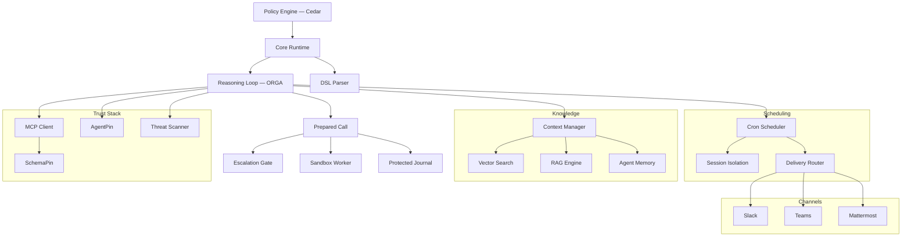

# Documentacao do Symbiont

Plataforma governada por politicas para construir aplicacoes agenticas. Execute agentes de IA e ferramentas sob controles explicitos de politicas, identidade e auditoria.

## Comece de onde comeca o seu trabalho

Esta documentacao atende a tres trabalhos diferentes. Eles precisam de paginas diferentes em uma ordem diferente, entao escolha o caminho em vez de ler a lista inteira.

**Avaliar se isto e confiavel.** Voce precisa saber o que e de fato aplicado, o que e apenas registrado e onde ficam os limites da afirmacao. Pode ser que voce nunca escreva um arquivo `.symbi`.

1. [Prove o gate em 30 segundos](#prove-it-first-offline-no-api-key) — abaixo; offline, sem compromisso de instalacao
2. [Modelo de seguranca](/security-model) — limites de confianca, as tres camadas de isolamento, o que e confiado em vez de verificado
3. [Chamadas preparadas](/prepared-calls) — o que *e* uma autorizacao e por que ela nao pode ser reexecutada
4. [Auditoria de execucao protegida](/run-audit) — o que o journal prova e o que ele nao prova
5. [Ciclo de vida de aprovacao](/approval-lifecycle) — liberacao vinculada a revisao, prazos e os limites da identidade do aprovador
6. [Guia de contencao](/containment-branch-guide) — a cobertura atual e as lacunas ditas com clareza
7. A avaliacao publicada — [DOI 10.5281/zenodo.20043247](https://doi.org/10.5281/zenodo.20043247)

**Construir e operar agentes.** Voce precisa de um projeto rodando e, depois, de uma cerca em volta dele que se sustente quando outra pessoa estiver de plantao.

1. [Prove o gate](#prove-it-first-offline-no-api-key) — comece por uma recusa, nao por um sucesso
2. [Introducao](/getting-started) — instalacao, `symbi init`, primeiro agente
3. [Guia DSL](/dsl-guide) — definicoes de agentes, mais [Politicas de efeito inline](/inline-policies) para o subconjunto de regras aplicado
4. [Isolamento de comandos](/toolclad-command-boundary) — configure o worker em que suas ferramentas realmente executam
5. [ToolClad](/toolclad) — contratos declarativos de ferramentas e aplicacao de escopo
6. [Ciclo de vida de aprovacao](/approval-lifecycle) — a resposta correta para uma negacao que deveria envolver uma pessoa
7. [Arquitetura do runtime](/runtime-architecture) e [Referencia de API](/api-reference) — na hora de implantar
8. [Symbi Shell](/symbi-shell) (Beta) — autoria interativa e o painel Gate

**Ler a especificacao.** Voce se importa com conformidade, reprodutibilidade e se o padrao e separavel do fornecedor.

1. [Open Agent Trust Stack](https://openagenttruststack.org) — a especificacao (CC BY 4.0), OATS Extended C1–C7 + E1–E8
2. [Loop de raciocinio](/reasoning-loop) — o ciclo ORGA com typestate, como implementado
3. [Chamadas preparadas](/prepared-calls) — o objeto de autorizacao e a cobertura de regressao dele
4. [Modelo de seguranca](/security-model) — garantias por camada, incluindo a atestacao do convidado na Tier 3
5. Trabalhos publicados — [Typestate ORGA Loops](https://doi.org/10.5281/zenodo.19896446), [ToolClad](https://doi.org/10.5281/zenodo.19957596), [Empirical Evaluation](https://doi.org/10.5281/zenodo.20043247)
6. [Contribuindo](/contributing) — os harnesses de reproducao ficam no repositorio

> **Fazendo a configuracao com um agente de programacao de IA?** Aponte-o para <https://symbiont.dev/agent-guide.md> antes que ele toque em qualquer coisa. E um arquivo de instrucoes em texto puro e estavel, com a gramatica e as flags atuais, e uma regra permanente de nunca resolver um erro de configuracao ampliando a politica.

---

<a id="prove-it-first-offline-no-api-key"></a>

## Prove primeiro — offline, sem chave de API

Comece fazendo o Symbiont recusar alguma coisa. Este e o mesmo gate Cedar que o runtime conecta ao loop de raciocinio ao vivo, avaliado de forma isolada, entao uma negacao aqui e uma negacao la. Nao e preciso provedor de modelo, nem Docker, nem projeto.

**Instalar:**

```bash
curl -fsSL https://symbiont.dev/install.sh | bash
```

**Escreva duas politicas e avalie contra elas:**

```bash
mkdir -p /tmp/p && cat > /tmp/p/policy.cedar <<'EOF'
forbid(principal, action == Symbi::Action::"tool_call::list_agents",   resource);
permit(principal, action == Symbi::Action::"tool_call::system_health", resource);
EOF

echo '{"tool_name":"list_agents"}'   | symbi policy evaluate --stdin --policies /tmp/p --json
echo '{"tool_name":"system_health"}' | symbi policy evaluate --stdin --policies /tmp/p --json
```

```json
{"decision":"deny","reason":"deny policies matched: policy_0","tool":"list_agents", ...}
{"decision":"allow","reason":"allow policies matched: policy_1","tool":"system_health", ...}
```

**Depois veja a validacao de argumentos barrar uma chamada antes de ela executar:**

```bash
symbi tools init greet
symbi tools validate
symbi tools test greet --arg target=example
```

```
greet                                    OK

  ✓ target (string): example → OK

  Command:   greet example
  Cedar:     Tool::Greet / execute_tool

  [dry run — command not executed]
```

A negacao e a demonstracao. Um guia rapido que termina em uma execucao bem-sucedida prova apenas que um programa rodou — o que o guia rapido de todo framework de agentes tambem prova.

Executar um *agente* exige um provedor de modelo; continue em [Introducao](/getting-started).

---

## O que e o Symbiont?

O Symbiont e uma plataforma nativa em Rust para executar agentes de IA e ferramentas sob controles explicitos de politicas, identidade e auditoria.

A maioria dos frameworks de agentes foca em orquestracao. O Symbiont foca no que acontece quando agentes rodam em ambientes reais com risco real: ferramentas nao confiaveis, dados sensiveis, limites de aprovacao, requisitos de auditoria e aplicacao repetivel.

### Como funciona

O Symbiont separa a intencao do agente da autoridade de execucao:

1. **Agentes propoem** acoes atraves do loop de raciocinio (Observe-Reason-Gate-Act)
2. **O runtime prepara** cada acao — normalizando argumentos e congelando o contrato, o efeito resolvido, o sandbox selecionado e o prazo em uma unica chamada imutavel
3. **A politica decide** — o Cedar e as regras inline suportadas precisam *ambos* permitir; acoes negadas sao bloqueadas, e acoes marcadas para aprovacao sao encaminhadas a uma pessoa
4. **O registro vem primeiro** — a gravacao obrigatoria no journal pre-efeito precisa ter sucesso antes do despacho
5. **O worker executa** — dentro do sandbox selecionado, nunca no host

A saida do modelo nunca e tratada como autoridade de execucao. O runtime controla o que realmente acontece.

### Capacidades principais

| Capacidade | O que faz |
|-----------|-------------|
| **Motor de politicas** | Autorizacao granular com [Cedar](https://www.cedarpolicy.com/) para acoes de agentes, chamadas de ferramentas e acesso a recursos |
| **Chamadas preparadas** | Autorizacao emitida sobre uma invocacao congelada — de uso unico, nao clonavel, reverificada no despacho contra principal, sessao, identidade do executor e expiracao |
| **Contencao de execucao** | Comandos, parsers, sessoes MCP, PTYs e filhos de CLI gerenciada rodam no worker selecionado. Sem fallback no host: um backend indisponivel faz a execucao falhar |
| **Aprovacao de chamada exata** | `human_approval = true` libera apenas um snapshot revisado — relay de terminal, painel Gate do shell ou chat com um comando de ID mais digest |
| **Verificacao de ferramentas** | Verificacao criptografica [SchemaPin](https://schemapin.org) de esquemas de ferramentas MCP antes da execucao |
| **Identidade de agentes** | Identidade ES256 ancorada ao dominio com [AgentPin](https://agentpin.org) para agentes e tarefas agendadas |
| **Loop de raciocinio** | Ciclo Observe-Reason-Gate-Act com aplicacao de typestate, gates de politicas e circuit breakers |
| **Sandboxing** | Tres camadas OSS -- Docker (Tier 1), gVisor (Tier 2), microVM Firecracker (Tier 3) -- selecionaveis pelo DSL e sem restricao Enterprise |
| **Auditoria protegida** | Journals privados e assinados por execucao em `.symbiont/governed/`; a falha de uma gravacao obrigatoria interrompe o despacho |
| **Melhorias governadas opcionais** | [Instrucoes de fluxo de trabalho versionadas](/governed-improvements), avaliacao de testes assinada, aprovacao exata do operador, ativacao explicita e fixacao de versao por execucao; desativadas ate serem explicitamente inicializadas e selecionadas |
| **Gestao de segredos** | Integracao com Vault/OpenBao, armazenamento criptografado AES-256-GCM, com escopo por agente |
| **Integracao MCP** | Suporte nativo ao Model Context Protocol com acesso governado a ferramentas |
| **CLI gerenciada governada** | Execute uma CLI de IA externa como um filho contido — sem montagem do codigo-fonte, sem rede externa, sem credenciais do host; o acesso ao codigo-fonte se da por ferramentas ToolClad registradas |

Capacidades adicionais: varredura de ameacas para conteudo de ferramentas/habilidades, agendamento cron, memoria persistente de agentes, busca RAG hibrida (LanceDB/Qdrant), verificacao de webhooks, roteamento de entregas, telemetria OTLP, endurecimento de seguranca HTTP, adaptadores de canal (Slack/Teams/Mattermost), e plugins de governanca para [Claude Code](https://github.com/thirdkeyai/symbi-claude-code) e [Gemini CLI](https://github.com/thirdkeyai/symbi-gemini-cli).

---

## Criar um projeto

```bash
symbi init        # Interativo: perfil, modo SchemaPin, camada de sandbox.
                  # Gera symbiont.toml, agents/, policies/, docker-compose.yml
                  # e um .env com uma SYMBIONT_MASTER_KEY gerada.
symbi run <agent> # Executar um unico agente sem iniciar o runtime completo
symbi up          # Iniciar o runtime completo com auto-configuracao
symbi shell       # Shell interativo de orquestracao de agentes (Beta)
```

Nao interativo, para CI:

```bash
symbi init --profile assistant --schemapin tofu --sandbox tier1 --no-interact
```

Com Docker — passe `--dir`, porque o WORKDIR da imagem nao e a sua montagem:

```bash
docker run --rm -v $(pwd):/workspace ghcr.io/thirdkeyai/symbi:latest \
  init --profile assistant --no-interact --dir /workspace
docker compose up
```

API do runtime em `http://localhost:8080`, HTTP Input em `http://localhost:8081`.

Outras formas de instalacao — Homebrew (`brew tap thirdkeyai/tap && brew install symbi`), `cargo install symbi` (exige Rust 1.89+ e `protobuf-compiler`) ou [GitHub Releases](https://github.com/thirdkeyai/symbiont/releases). Detalhes completos em [Introducao](/getting-started).

### Seu primeiro agente

```symbiont
metadata {
    version = "1.0.0"
    author = "your-name"
    description = "Writes one reviewed file"
}

agent writer() {
    capabilities = ["write"]

    with sandbox = "docker", timeout = 20.seconds {}

    policy files {
        allow: "edit_file" if invocation.arguments.path == "result.txt"
        deny:  "edit_file" if invocation.arguments.content == ""
    }
}
```

Blocos `policy` inline sao compilados e aplicados junto com o Cedar — **ambos precisam permitir**. O subconjunto suportado e deliberadamente pequeno, e uma regra que o runtime nao consegue aplicar faz a invocacao falhar *antes* de o modelo ser chamado, em vez de ser ignorada em silencio. Veja [Politicas de efeito inline](/inline-policies) para a gramatica exata, e o [Guia DSL](/dsl-guide) para os blocos `metadata`, `schedule`, `webhook` e `channel`.

### Shell interativo (Beta)

`symbi shell` e uma interface de terminal baseada em ratatui para autoria de agentes, ferramentas e politicas com assistencia de LLM, orquestracao de padroes multi-agente (`/chain`, `/parallel`, `/race`, `/debate`), gestao de agendamentos e canais, e attach a runtimes remotos. Pressione `Ctrl+G` para abrir o painel Gate e revisar acoes retidas. O status e **beta** — a superficie de comandos e os formatos de persistencia ainda podem mudar entre versoes menores. Veja o [guia do Symbi Shell](/symbi-shell) e a [configuracao de workspace do shell](/shell-containment).

### Deploy de agentes unicos (Beta)

O comando `/deploy` do shell empacota o agente ativo e o envia para Docker (`/deploy local`), Google Cloud Run (`/deploy cloudrun`) ou AWS App Runner (`/deploy aws`). A stack OSS e de agente unico; topologias multi-agente se compoem via mensagens entre instancias. Veja [Symbi Shell — Deploy](/symbi-shell#deployment-beta).

---

## Arquitetura



---

## Modelo de seguranca

O Symbiont e projetado em torno de um principio simples: **a saida do modelo nunca deve ser confiada como autoridade de execucao.**

As acoes fluem atraves de controles do runtime:

- **Confianca zero** — todas as entradas de agentes sao nao confiaveis por padrao
- **Chamadas preparadas** — a invocacao autorizada e congelada, de uso unico e reverificada no despacho
- **Verificacoes de politica** — Cedar mais as regras inline suportadas, ambos fail-closed, antes de cada chamada de ferramenta
- **Verificacao de ferramentas** — verificacao criptografica SchemaPin de esquemas de ferramentas
- **Contencao** — workers Docker, gVisor ou Firecracker, sem fallback no host
- **Aprovacao do operador** — revisao humana da requisicao completa, liberada por digest em vez de por ID
- **Controle de segredos** — backends Vault/OpenBao, armazenamento local criptografado, namespaces de agentes
- **Registro de auditoria** — registros a prova de adulteracao gravados antes do efeito, nao depois

Consulte o guia do [Modelo de seguranca](/security-model) para detalhes completos, e o [Guia de contencao](/containment-branch-guide) para a cobertura atual e as lacunas restantes.

### O que nao e afirmado

Uma pagina de seguranca que lista apenas garantias esta pedindo para ser acreditada. Estes limites sao declarados aqui em vez de descobertos depois:

- A configuracao do host, as imagens de worker, o runtime de containeres, os endpoints de inferencia fornecidos pelo operador e as implementacoes injetadas pelo SDK sao componentes **confiados**, nao verificados.
- A contencao nao esta completa em todos os pontos de entrada. Execucao publica de navegador, controle agregado de admissao e reexecucao ou recuperacao automatica estao indisponiveis ou fora destes contratos.
- Um loop de raciocinio pode chegar a `Completed` depois de um erro de ferramenta ou de uma negacao de politica — inspecione os desfechos individuais das ferramentas. Uma gravacao terminal pode falhar *depois* de um efeito ter ocorrido: **um erro nao e um rollback.** Um journal ausente ou incompleto e ausencia de evidencia, nao evidencia de sucesso.
- A identidade do aprovador no terminal e o UID efetivo do operador local — uma conta do sistema operacional, nao uma pessoa verificada de forma independente. Um digest de revisao vincula a requisicao exata; ele nao prova que alguem a leu.
- Ensaios de laboratorio deterministicos e pareados estabelecem os cenarios individuais deles. **Eles nao fornecem uma taxa de escape do modelo.**
- SOC 2, HIPAA e ISO 27001 sao alvos de alinhamento para os quais a trilha de auditoria foi projetada. Nenhuma certificacao e detida ou implicada.

---

## Todos os guias

**Contencao e governanca**

- [Guia de contencao](/containment-branch-guide) — fluxos do operador, arquitetura, migracao, lacunas restantes
- [Chamadas preparadas](/prepared-calls) — autorizacao de chamada exata e formato da requisicao Cedar
- [Ciclo de vida de aprovacao](/approval-lifecycle) — revisoes por terminal, TUI e chat
- [Auditoria de execucao protegida](/run-audit) — identidade da execucao, verificacao do journal, desfechos incompletos
- [Inspecao de falhas](/crash-inspection) — verifique execucoes interrompidas e efeitos nao resolvidos sem reexecutar
- [Politicas de efeito inline](/inline-policies) — o subconjunto de regras do DSL que e aplicado
- [Isolamento de comandos](/toolclad-command-boundary) — configuracao do worker para ferramentas e parsers
- [Concessoes de arquivo por operacao](/filesystem-grants) — entradas declaradas, novas saidas delimitadas, isolamento de parsers
- [Propriedade no Docker](/docker-containment) — tempo de vida, limpeza e recuperacao
- [Terminais interativos](/interactive-terminal-boundary) — sessoes PTY contidas
- [Workspace do shell](/shell-containment) — ferramentas governadas de arquivo e de comando na TUI
- [CLI gerenciada](/managed-cli-containment) — executando uma CLI de IA externa como um filho contido
- [Broker governado](/governed-tool-broker) — a API de chamadas de ferramentas intermediadas
- [Contexto de invocacao do DSL](/dsl-invocation-context) — identidade do chamador e raiz de projeto congelada
- [Execucao agendada](/scheduled-execution) — IDs de invocacao e resultados terminais
- [Idempotencia de invocacao](/invocation-idempotency) — identidades persistentes de requisicao na CLI e recuperacao segura de resultados

**Nucleo**

- [Introducao](/getting-started) — instalacao, configuracao, primeiro agente
- [Symbi Shell](/symbi-shell) (Beta) — TUI interativa para autoria, orquestracao e attach remoto
- [Modelo de seguranca](/security-model) — arquitetura de confianca zero, aplicacao de politicas, camadas de isolamento
- [Arquitetura do runtime](/runtime-architecture) — internos do runtime e modelo de execucao
- [Loop de raciocinio](/reasoning-loop) — ciclo ORGA, gates de politicas, circuit breakers
- [Guia DSL](/dsl-guide) — referencia da linguagem de definicao de agentes
- [ToolClad](/toolclad) — contratos declarativos de ferramentas, validacao de argumentos, aplicacao de escopo
- [Ferramentas MCP](/mcp-tools) — acesso governado ao Model Context Protocol
- [Referencia de API](/api-reference) — endpoints HTTP API e configuracao
- [Agendamento](/scheduling) — motor cron, roteamento de entregas, filas de mensagens mortas
- [Entrada HTTP](/http-input) — servidor de webhooks, autenticacao, limitacao de taxa
- [Configuracao do Firecracker](/firecracker-setup) — kernel, rootfs e transporte de convidado da Tier 3
- [Servico de host gerenciado do Firecracker](/firecracker-host-service) — jailer opcional, limites de host, implantacao do watchdog
- [Tipos de sessao](/session-types) (Experimental) — monitoramento de conformidade de protocolo entre agentes

---

## Comunidade e recursos

- **Guia para agentes**: [symbiont.dev/agent-guide.md](https://symbiont.dev/agent-guide.md) — instrucoes para um agente de programacao de IA que faca a sua configuracao
- **Pacotes**: [crates.io/crates/symbi](https://crates.io/crates/symbi) | [npm symbiont-sdk-js](https://www.npmjs.com/package/symbiont-sdk-js) | [PyPI symbiont-sdk](https://pypi.org/project/symbiont-sdk/)
- **SDKs**: [JavaScript/TypeScript](https://github.com/ThirdKeyAI/symbiont-sdk-js) | [Python](https://github.com/ThirdKeyAI/symbiont-sdk-python)
- **Plugins**: [Claude Code](https://github.com/thirdkeyai/symbi-claude-code) | [Gemini CLI](https://github.com/thirdkeyai/symbi-gemini-cli)
- **Issues**: [GitHub Issues](https://github.com/thirdkeyai/symbiont/issues)
- **Licenca**: Apache 2.0 (Community Edition)

---

## Proximos passos

<div class="grid grid-cols-1 md:grid-cols-3 gap-6 mt-8">
  <div class="card">
    <h3>Prove o gate</h3>
    <p>Faca o Symbiont recusar alguma coisa antes de voce instalar um projeto.</p>
    <a href="#prove-it-first-offline-no-api-key" class="btn btn-outline">Verificacao de 30 segundos</a>
  </div>

  <div class="card">
    <h3>Modelo de seguranca</h3>
    <p>Entenda os limites de confianca e a aplicacao de politicas.</p>
    <a href="/security-model" class="btn btn-outline">Guia de seguranca</a>
  </div>

  <div class="card">
    <h3>Comecar</h3>
    <p>Instale o Symbiont e execute seu primeiro agente governado.</p>
    <a href="/getting-started" class="btn btn-outline">Guia de inicio rapido</a>
  </div>
</div>
