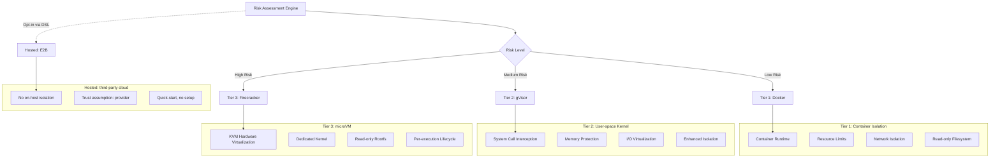
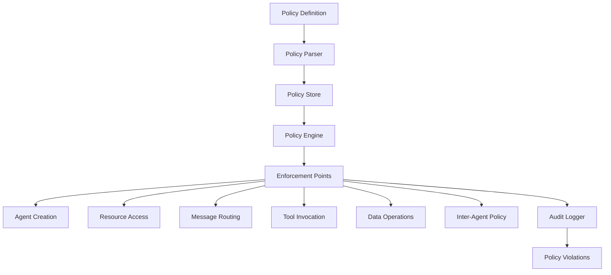
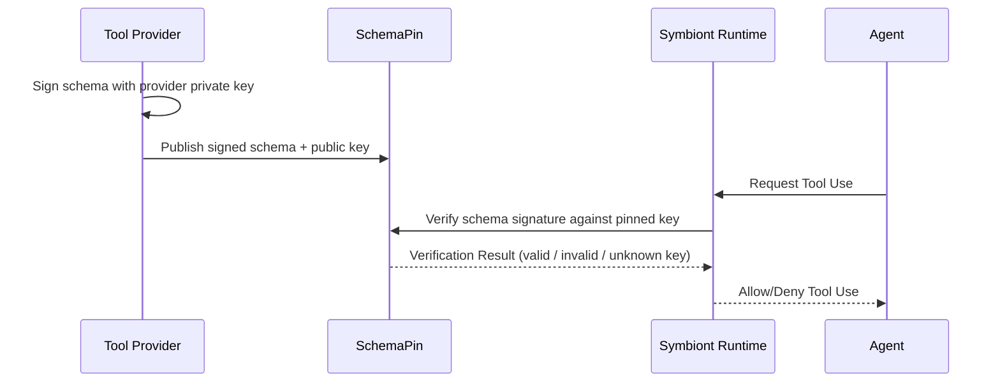
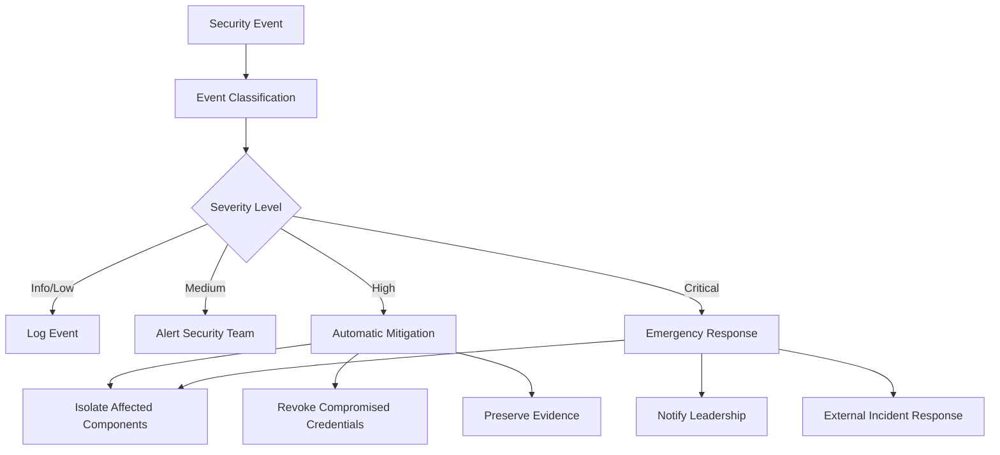

# Modelo de Segurança

Arquitetura de segurança abrangente garantindo proteção de confiança zero e orientada por políticas para agentes de IA.

## Outros idiomas


---

## Visão Geral

**Cobertura de contenção:** a 1.21.0 acrescenta limites de efeito Docker/gVisor
selecionados, aprovações exatas de chamadas preparadas, journals protegidos nos
pontos de entrada cobertos e propriedade independente dos workers. Veja o
[guia de contenção](/containment-branch-guide) para os caminhos implementados e as
premissas de implantação. A arquitetura e a configuração de camadas descritas
abaixo não são evidência de aplicação completa em todos os caminhos. Os comandos
oneshot do Firecracker, os parsers, o MCP stdio, as sessões PTY e os workers de
CLI gerenciada usam um transporte de convidado versionado e propriedade
independente do VMM. As VMs gerenciadas recebem apenas as capacidades de
ferramentas/inferência emitidas pelo runtime. A execução isolada de navegador
continua indisponível. A [configuração do Firecracker](/firecracker-setup) descreve
os requisitos de implantação no convidado e no host; os testes com Docker não
validam uma implantação em VM.

O Symbiont implementa uma arquitetura de segurança em primeiro lugar projetada para ambientes regulamentados e de alta garantia. O modelo de segurança é construído sobre princípios de confiança zero com aplicação abrangente de políticas, sandboxing de várias camadas e auditabilidade criptográfica.

### Princípios de Segurança

- **Confiança Zero**: Todos os componentes e comunicações são verificados
- **Defesa em Profundidade**: Múltiplas camadas de segurança sem ponto único de falha
- **Orientado por Políticas**: Políticas de segurança declarativas aplicadas em tempo de execução
- **Auditabilidade Completa**: Cada operação registrada com integridade criptográfica
- **Menor Privilégio**: Permissões mínimas necessárias para operação

---

## Sandboxing de Múltiplas Camadas

O runtime entrega três camadas de isolamento no host (Tier 1 → Tier 3) mais um backend de execução hospedada (E2B). As camadas formam uma escada de isolamento monotonicamente crescente; o E2B **não** é um par nessa escada — executa em infraestrutura de terceiros e é documentado separadamente abaixo.



> **Toda camada de isolamento no host — landlock, Docker, gVisor e Firecracker — é entregue no runtime OSS.** Operadores escolhem a camada por agente via o bloco DSL `with { sandbox = ... }`, ou definem um padrão de projeto via `[sandbox] tier = "..."` em `symbiont.toml`. O E2B é opt-in apenas via DSL (`with { sandbox = "e2b" }`) e intencionalmente não é exposto como um valor de `[sandbox] tier`.
>
> Isolamento forte é uma base, não um upsell. As camadas permanecem no runtime de
> código aberto para que a comunidade possa ler, auditar e reproduzir o limite do
> qual depende. A atestação do convidado é o caso mais claro: uma impressão digital
> sobre fontes que você não pode ler não atesta nada, por isso o serviço convidado é
> de código aberto justamente por ser um controle de segurança.

<a id="landlock-daemon-free"></a>

### Landlock (workers nativos)

Chamada de `landlock`, sem número. Este backend opcional do Linux usa processos
nativos e um supervisor delegado gerenciado externamente. Ele não precisa de
imagem nem de daemon de contêiner. O Docker continua sendo o padrão. Veja
[configuração e migração do serviço](/landlock-supervision).

**Configuração:** `[sandbox] tier = "landlock"` em `symbiont.toml`. Os tetos de
somente leitura e de escrita vêm de `[sandbox.roots]`, compartilhado com os demais
backends. `[sandbox.landlock]` carrega `abi_floor`, `require_network`, os limites
de memória, CPU, PIDs, tempo de vida e saída, além da configuração de
`supervisor` dele. A ABI padrão e mínima suportada agora é a 6, mesmo quando uma
configuração antiga define um piso menor. Um piso configurado mais alto continua
valendo. São exigidos x86_64 ou aarch64 nativos little-endian e filtragem seccomp
funcional.

**Casos de uso:**
- Uma estação de trabalho ou desktop onde executar um daemon de contêiner por
  agente não é razoável
- Confinar o alcance de sistema de arquivos, os sockets e os sinais de saída de um
  processo local sem provisionar uma imagem

**Recursos de segurança:**
- Confinamento do sistema de arquivos às raízes declaradas, aplicado pelo kernel
- Os escopos da ABI 6 do Landlock impedem sinais e conexões a sockets Unix
  abstratos para processos fora do domínio do worker. Sinais dentro do domínio
  continuam utilizáveis.
- Com o padrão `require_network = true`, o seccomp nega novos sockets, cobrindo
  TCP, UDP e sockets Unix com pathname. Pares privados de sockets Unix de
  **stream** continuam utilizáveis. Pares de datagrama são negados porque podem
  enviar a sockets com pathname não relacionados. Operações `io_uring` e ABIs
  alternativas de syscall são recusadas para que não contornem essa restrição.
- `require_network = false` permite explicitamente novos sockets IPv4/IPv6. Ele
  não permite sockets Unix do host, outras famílias de socket, pares de datagrama
  nem `io_uring`. Essa opção concede acesso à rede IP, inclusive ao loopback; não
  é uma allowlist de egresso.
- Uma concessão básica de leitura/execução para os diretórios de executáveis e
  bibliotecas do sistema, necessária antes que qualquer programa com ligação
  dinâmica possa iniciar. Ela não carrega nenhum caminho de escrita, nada sob um
  diretório home e nenhuma concessão ampla de `/etc`.
- Os rulesets exigem aplicação integral. O padrão da crate é o de melhor esforço,
  que ignora silenciosamente o que o kernel não suporta; esse padrão não é usado.
- As regras e o filtro de syscalls são construídos no processo pai contra objetos
  de sistema de arquivos abertos. Substituir uma raiz após a preparação não
  consegue redirecionar a concessão dela. O filho instala as restrições e marca os
  descritores acima do stderr como close-on-exec usando syscalls brutas. Raízes
  declaradas ausentes fazem a preparação falhar; caminhos de sistema opcionais
  ausentes podem ser omitidos. Uma instalação malsucedida aborta o spawn.
- Descritores extras herdados de arquivos, sockets e rings são fechados no exec.
  Stdin, stdout e stderr permanecem capacidades explícitas: quem chama pelo SDK
  deve fornecer apenas os canais pretendidos. O caminho MCP entregue usa pipes.
  Isso não revoga capacidades que um operador repasse deliberadamente via stdio ou
  conceda através de raízes legíveis.

**Migração.** Hosts com ABI 4 ou 5 agora falham de forma fechada; baixar o
`abi_floor` não restaura o limite mais fraco. Cargas de trabalho que exigem
serviços Unix, pares de datagrama, `io_uring` ou executáveis de compatibilidade
precisam usar um backend supervisionado adequado. Os descritores de auditoria
incluem a versão 3 do limite, a admissão compartilhada e a supervisão por cgroup,
o requisito efetivo de ABI, os escopos de sinal/socket, a política de sockets, a
recusa de rings e a política de descritores herdados.

**Cobertura atual.** O MCP stdio sem arquivos declarados e o caminho de baixo
nível de lançamento do `CliExecutor` do SDK usam este backend. Comandos públicos
de execução única, parsers de saída personalizados, PTYs interativas, a preparação
de arquivos declarados e a configuração entregue de CLI gerenciada ainda não o
suportam. Selecionar o Landlock nesses caminhos falha, em vez de passar para a
execução irrestrita.

**Tempo de vida da concessão.** Um domínio não pode ser relaxado depois de
aplicado. O filho de CLI do SDK recebe o domínio dele uma vez, no spawn, incluindo
acesso de escrita ao próprio diretório de trabalho. As raízes diretas autorizam a
hierarquia configurada por esse tempo de vida; elas não tiram um snapshot do
conteúdo dos arquivos nem restringem as escritas à publicação de arquivos novos. A
descoberta e as chamadas MCP sem arquivos declarados limpam as raízes de host
configuradas. Os workers de MCP governado e de CLI de baixo nível do SDK mantêm
reservas duráveis e compartilhadas de CPU/memória/workers até a remoção do cgroup.
Os cgroups delegados aplicam os limites de recursos e param os descendentes mesmo
quando estes deixam o grupo de processos. O gerenciador de serviços independente
lida com a falha do supervisor e a expiração do watchdog. A primitiva bruta
`PreparedDomain` apenas aplica os controles de acesso do kernel e não adquire um
lease.

**Falha fechada.** A ABI Landlock exigida e a arquitetura nativa são verificadas
antes da autorização. Falhas na construção ou na instalação do ruleset, inclusive
a indisponibilidade da filtragem seccomp, abortam o spawn antes de o executável do
worker iniciar. Não há aplicação parcial nem fallback para execução irrestrita no
host.

**Indisponível para agentes registrados.** Nenhum `SecurityTier` nomeia o
landlock, então um agente agendado ou registrado via HTTP não pode declará-lo;
esses caminhos o recusam em vez de mapeá-lo para uma camada vizinha e reportar
incorretamente o isolamento em uso. Selecione-o em `[sandbox]` para execuções
diretas.

**Validação.** `crates/runtime/tests/landlock_sandbox.rs` exercita filhos
restritos reais, incluindo raízes de leitura/escrita substituídas e o acesso
legítimo através dos objetos originais, restrições de socket e de sinal,
descritores herdados, IPC privado por stream, acesso IP explícito e a recusa de
ABIs alternativas de syscall. O `scripts/test-landlock-boundary.py --binary
/path/to/symbi --report /path/to/report.json` exercita o dispatch MCP assinado tal
como entregue, a saída útil, as negações de sistema de arquivos/TCP/UDP/sockets
Unix e de sinais, a auditoria obrigatória e a recusa em kernels não suportados,
com fixtures sintéticas locais. Observadores protegidos verificam de forma
independente a entrega de mensagens e de sinais. Essas verificações não
estabelecem resistência adaptativa a escapes. O
`scripts/test-landlock-supervision.py`, à parte, exercita falhas reais no ciclo de
vida dos cgroups. Veja o
[contrato Landlock do kernel](https://docs.kernel.org/userspace-api/landlock.html).

### Camada 1: Isolamento Docker

**Casos de Uso:**
- Tarefas de desenvolvimento confiáveis
- Processamento de dados de baixa sensibilidade
- Operações de ferramentas internas

**Recursos de Segurança:**
```yaml
docker_security:
  memory_limit: "512MB"
  cpu_limit: "0.5"
  network_mode: "none"
  read_only_root: true
  security_opts:
    - "no-new-privileges:true"
    - "seccomp:default"
  capabilities:
    drop: ["ALL"]
    add: ["SETUID", "SETGID"]
```

**Proteção contra Ameaças:**
- Isolamento de processos do host
- Prevenção de esgotamento de recursos
- Controle de acesso à rede
- Proteção do sistema de arquivos

### Camada 2: Isolamento gVisor

**Casos de Uso:**
- Cargas de trabalho de produção padrão
- Processamento de dados sensíveis
- Integração de ferramentas externas

**Recursos de Segurança:**
- Implementação de kernel em espaço de usuário
- Filtragem e tradução de chamadas do sistema
- Limites de proteção de memória
- Validação de solicitações de E/S

**Configuração:**
```yaml
gvisor_security:
  runtime: "runsc"
  platform: "ptrace"
  network: "sandbox"
  file_access: "exclusive"
  debug: false
  strace: false
```

**Proteção Avançada:**
- Isolamento de vulnerabilidades do kernel
- Interceptação de chamadas do sistema
- Prevenção de corrupção de memória
- Mitigação de ataques de canal lateral

**Pré-requisitos:** Instale [`runsc`](https://gvisor.dev/docs/user_guide/install/) e registre-o como runtime do Docker em `/etc/docker/daemon.json`. `symbi doctor` reporta se `runsc` está acessível.

### Camada 3: microVM Firecracker

**Casos de Uso:**
- Cargas de trabalho de mais alto isolamento (código não confiável, multi-tenant, dados regulamentados)
- Onde a granularidade do filtro de syscalls (gVisor) não é suficiente e um limite real de kernel é necessário
- Ciclo de vida de VM por execução para contenção mais forte do raio de impacto

**Recursos de Segurança:**
- Virtualização de hardware via KVM
- microVM por execução com kernel + rootfs fornecidos pelo operador
- Sistema de arquivos raiz somente leitura por padrão
- Sem superfície de kernel compartilhada com o host
- **Atestação do convidado:** o handshake verifica a versão do protocolo e uma
  impressão digital das fontes do serviço convidado, e recusa uma imagem obsoleta ou
  incompatível antes de qualquer comando ser enviado
- **Propriedade independente do VMM:** um supervisor fora do loop de raciocínio
  detém o ciclo de vida da VM, de modo que uma VM não pode sobreviver ao seu
  supervisor, e uma VM órfã é recuperada contra uma identidade de processo
  verificada em vez de um PID reutilizável
- **Carga de trabalho convidada sem privilégios:** os comandos são executados como
  usuário convidado não root com `no_new_privs` e limites explícitos de processos e
  descritores de arquivo

**Configuração:** `[sandbox.firecracker]` em `symbiont.toml`:

```toml
[sandbox]
tier = "tier3"

[sandbox.firecracker]
kernel_image_path = "/var/lib/firecracker/vmlinux"
rootfs_path       = "/var/lib/firecracker/rootfs.ext4"
vcpus             = 1
mem_mib           = 512
rootfs_read_only  = true
```

**Pré-requisitos:** O operador deve fornecer (a) uma imagem de kernel compatível com Firecracker e (b) uma imagem de sistema de arquivos raiz com o serviço convidado compilado correspondente. **Veja [`docs/firecracker-setup.md`](firecracker-setup.md) para um guia rápido passo a passo, o contrato de init dentro da VM e uma checklist de hardening.** `symbi doctor` reporta se o binário `firecracker` está acessível.

Uma vez que você tenha ambos os artefatos, faça scaffolding de um projeto tier3 com:

```bash
symbi init --profile assistant --sandbox tier3 \
  --firecracker-kernel /var/lib/firecracker/vmlinux \
  --firecracker-rootfs /var/lib/firecracker/rootfs.ext4
```

`symbi init` valida que ambos os arquivos existem antes de escrever `symbiont.toml`, de modo que configurações incorretas aparecem no momento do scaffold em vez da primeira execução do agente.

### Execução hospedada: E2B

**O E2B é um backend de sandbox em nuvem hospedado, não uma camada de isolamento no host.** Fica fora da escada Tier 1 → Tier 3 e é documentado aqui para fins de completude.

**O que é:** O código roda na infraestrutura do E2B via API HTTPS deles; o runtime envia apenas um cliente HTTP. Defina `E2B_API_KEY` e selecione-o por agente com `with { sandbox = "e2b" }`. Não há flag `--sandbox e2b` no `symbi init` — o E2B é intencionalmente opt-in apenas via DSL, pois representa um modelo de confiança diferente das camadas no host.

**Casos de uso:**
- Demos de início rápido e avaliação sem instalar Docker, gVisor ou Firecracker.
- Ambientes de desenvolvimento onde o operador não pode rodar um host de sandbox (CI sem modo privilegiado, laptops bloqueados, máquinas de desenvolvimento ARM).

**O que não é:**
- Não é um substituto para isolamento no host. Código, prompts e saídas de ferramentas atravessam a infraestrutura do E2B. Não use para cargas de trabalho com requisitos de privacidade, residência ou conformidade.
- Não é comparável a Tier 1/2/3 em uma revisão de segurança. O runtime mapeia `E2B → SecurityTier::Hosted`, que ordena **abaixo** de `Tier1` — políticas que exigem isolamento no host (`tier >= Tier1`) rejeitarão a execução hospedada.

**Configuração:** Sem configuração no nível do projeto; defina `E2B_API_KEY` no ambiente e use `with { sandbox = "e2b" }` por agente.

---

## Motor de Políticas

### Arquitetura de Políticas

O motor de políticas fornece controles de segurança declarativos com aplicação em tempo de execução:



### Tipos de Políticas

#### Políticas de Controle de Acesso

Definem quem pode acessar quais recursos sob quais condições:

```rust
policy secure_data_access {
    allow: read(sensitive_data) if (
        user.clearance >= "secret" &&
        user.need_to_know.contains(data.classification) &&
        session.mfa_verified == true
    )

    deny: export(data) if data.contains_pii == true

    require: [
        user.background_check.current,
        session.secure_connection,
        audit_trail = "detailed"
    ]
}
```

#### Políticas de Fluxo de Dados

Controlam como os dados se movem através do sistema:

```rust
policy data_flow_control {
    allow: transform(data) if (
        source.classification <= target.classification &&
        user.transform_permissions.contains(operation.type)
    )

    deny: aggregate(datasets) if (
        any(datasets, |d| d.privacy_level > operation.privacy_budget)
    )

    require: differential_privacy for statistical_operations
}
```

#### Políticas de Uso de Recursos

Gerenciam alocação de recursos computacionais:

```rust
policy resource_governance {
    allow: allocate(resources) if (
        user.resource_quota.remaining >= resources.total &&
        operation.priority <= user.max_priority
    )

    deny: long_running_operations if system.maintenance_mode

    require: supervisor_approval for high_memory_operations
}
```

### Motor de Avaliação de Políticas

```rust
pub trait PolicyEngine {
    async fn evaluate_policy(
        &self,
        context: PolicyContext,
        action: Action
    ) -> PolicyDecision;

    async fn register_policy(&self, policy: Policy) -> Result<PolicyId>;
    async fn update_policy(&self, policy_id: PolicyId, policy: Policy) -> Result<()>;
}

pub enum PolicyDecision {
    Allow,
    Deny { reason: String },
    AllowWithConditions { conditions: Vec<PolicyCondition> },
    RequireApproval { approver: String },
}
```

### Otimização de Performance

**Cache de Políticas:**
- Avaliação de políticas compiladas para performance
- Cache LRU para decisões frequentes
- Avaliação em lote para operações em massa
- Tempos de avaliação sub-milissegundo

**Atualizações Incrementais:**
- Atualizações de políticas em tempo real sem reinicialização
- Implantação de políticas versionadas
- Capacidades de rollback para erros de políticas

### Motor de Políticas Cedar (Feature `cedar`)

O Symbiont integra a [linguagem de políticas Cedar](https://www.cedarpolicy.com/) para autorização formal. O Cedar permite políticas de controle de acesso granulares e auditáveis que são avaliadas no gate de políticas do loop de raciocínio.

**Habilitado por padrão desde v1.14.x:** O Cedar faz parte do conjunto de features padrão do `symbi-runtime` e está incluído em todo binário publicado (crates.io, Docker, tarballs do GitHub Release). `symbi up` e `symbi run` auto-conectam o `CedarPolicyGate` a partir de arquivos `policies/*.cedar` no startup; quando ao menos um arquivo de política está presente, o gate é construído com `deny_by_default()` e cada arquivo `.cedar` é carregado como uma política nomeada. Quando nenhum arquivo de política está presente, o runtime recorre ao `DefaultPolicyGate::new()` fail-closed (que nega toda ação `ToolCall` e `Delegate`). Para desabilitar o Cedar completamente — em builds que fixam o `OpaPolicyGateBridge` ou um `ReasoningPolicyGate` personalizado — compile com `cargo build --no-default-features --features "keychain,vector-lancedb"`.

```bash
cargo build --features cedar
```

**Capacidades principais:**
- **Verificação formal**: Políticas Cedar podem ser analisadas estaticamente para correção
- **Autorização granular**: Controle de acesso baseado em entidades com permissões hierárquicas
- **Integração com loop de raciocínio**: `CedarPolicyGate` implementa a trait `ReasoningPolicyGate`, avaliando cada ação proposta contra políticas Cedar antes da execução
- **Trilha de auditoria**: Todas as decisões de políticas Cedar são registradas com contexto completo

```rust
use symbi_runtime::reasoning::cedar_gate::CedarPolicyGate;

// Criar um portão de políticas Cedar com postura deny-by-default
let cedar_gate = CedarPolicyGate::deny_by_default();
let agent_id = symbi_runtime::types::AgentId::new();
let (journal, audit) = symbi_runtime::reasoning::run_audit::open_run_journal(
    trusted_project, agent_id,
).await?;
println!("Audit: {}", serde_json::to_string(&audit)?);
let runner = ReasoningLoopRunner::builder()
    .provider(provider)
    .executor(executor)
    .policy_gate(Arc::new(cedar_gate))
    .journal(journal)
    .build();
```

### Padrão do Policy Gate do Loop de Raciocínio (após auditoria v1.13.0)

O loop de raciocínio em `symbi up` e `symbi run` é **fail-closed** por padrão. `DefaultPolicyGate::new()` retorna `LoopDecision::Deny` para cada ação `ToolCall` e `Delegate`, com o motivo `"No policy gate configured (DefaultPolicyGate::new is fail-closed; wire OpaPolicyGateBridge or pass --insecure-allow-all)"`. Ações `Respond` permanecem permitidas para que o agente ainda possa produzir saída de texto.

Essa mudança fecha a lacuna em que o binário de produção anteriormente fixava `DefaultPolicyGate::permissive()` em hard-code e silenciosamente permitia toda ação — veja `SECURITY_AUDIT.md` C2 para a trilha de auditoria.

Operadores têm dois caminhos:

1. **Conectar um backend de política real** (recomendado): construa `CedarPolicyGate`, `OpaPolicyGateBridge` ou sua própria implementação da trait `ReasoningPolicyGate` e passe-a para o runner.
2. **Optar por modo permissivo para desenvolvimento local**: passe `--insecure-allow-all` para `symbi up` / `symbi run`, ou defina `SYMBI_INSECURE_ALLOW_ALL=1`. Um banner de múltiplas linhas é impresso em stderr toda vez que o runtime inicia nesse modo, e `tracing::warn!` dispara em cada ação avaliada.

O construtor legado `permissive()` foi renomeado para `permissive_for_dev_only()` e marcado como `#[doc(hidden)]` para desencorajar uso incidental em caminhos de código de produção.

#### Escopo de políticas por superfície (desde a v1.19.0)

Antes, todos os pontos de entrada carregavam o mesmo conjunto plano de `policies/*.cedar`, de modo que um `permit` escrito para um deles se aplicava silenciosamente a todos. Os pontos de entrada não compartilham modelo de ameaças: `symbi run` e o servidor de entrada HTTP despacham chamadas reais de ferramentas, `symbi shell` expõe seu próprio conjunto de ferramentas de edição de arquivos, e o coordenador de chat do `symbi up` não executa ferramenta alguma.

As políticas agora são aplicadas em camadas:

- `policies/*.cedar` — **compartilhadas**, carregadas pelo gate de todas as superfícies.
- `policies/<surface>/*.cedar` — carregadas **apenas** pela superfície que nomeiam.

Os nomes de superfície são `run`, `coordinator`, `http-input`, `managed-cli`, `eval` e `shell`. O `symbi up` constrói um gate por superfície (`coordinator` e `http-input`) em vez de um compartilhado, de modo que uma permissão destinada a agentes de webhook não supervisionados não alcança o caminho de chat do operador, e vice-versa. Ambos continuam compartilhando uma única fila de escalonamento, para que ações retidas cheguem aos mesmos aprovadores.

Arquivos planos permanecem globais, então nenhum deployment existente muda de comportamento até criar um subdiretório. Reserve o diretório plano para regras que realmente se aplicam em todo lugar e coloque o que for específico de ferramentas sob a sua superfície. Note que o Mode B lê `policies/managed-cli/`, não `policies/run/` — iniciar um subprocesso gerenciado tem um raio de impacto diferente do loop de raciocínio em processo, e uma política deixada no diretório errado não é carregada por nada, embora pareça idêntica a não ter escrito nenhuma.

Quando um gate cai para fail-closed, o log nomeia os dois diretórios que pesquisou.

#### Endurecimento de transporte do backend OPA

Ao usar `OpaPolicyGateBridge` com `SYMBIONT_OPA_URL`, o cliente **recusa HTTP em texto puro para um host não-loopback** e falha de forma fechada (nega) — caso contrário, um atacante na rota poderia forjar uma decisão `allow`. O texto puro só é permitido para loopback (um sidecar OPA local) ou quando `SYMBIONT_OPA_ALLOW_INSECURE=1` está definido (somente para testes locais). Defina `SYMBIONT_OPA_AUTH_TOKEN` para enviar um token bearer em cada consulta de autorização. Use `https://` para qualquer endpoint OPA remoto.

### Política de Comunicação Inter-Agente

O `CommunicationPolicyGate` aplica regras de autorização para toda a comunicação inter-agente. Cada chamada por `ask`, `delegate`, `send_to`, `parallel` ou `race` é avaliada contra as regras de política antes da execução.

**Estrutura das regras:**
- **Condições**: `SenderIs(agent)`, `RecipientIs(agent)`, `Always`, compostos `All`/`Any`
- **Efeitos**: `Allow` ou `Deny { reason }`
- **Prioridade**: Regras avaliadas da prioridade mais alta para a mais baixa; a primeira correspondência vence
- **Padrão**: Allow (compatível com versões anteriores — projetos existentes funcionam sem alteração)

**A negação de política é uma falha firme** — o agente chamador recebe um erro através do loop ORGA e pode raciocinar sobre ele. Todas as mensagens inter-agente são assinadas criptograficamente via Ed25519 e criptografadas com AES-256-GCM.

Exemplo de política: impedir que um agente worker delegue para outros agentes:
```cedar
forbid(
    principal == Agent::"worker",
    action == Action::"delegate",
    resource
);
```

---

## Segurança Criptográfica

### Assinaturas Digitais

Todas as operações relevantes para segurança são assinadas criptograficamente:

**Algoritmo de Assinatura:** Ed25519 (RFC 8032)
- **Tamanho da Chave:** Chaves privadas de 256 bits, chaves públicas de 256 bits
- **Tamanho da Assinatura:** 512 bits (64 bytes)
- **Performance:** 70.000+ assinaturas/segundo, 25.000+ verificações/segundo

```rust
pub struct MessageSignature {
    pub signature: Vec<u8>,
    pub algorithm: SignatureAlgorithm,
    pub public_key: Vec<u8>,
}

impl AuditEvent {
    pub fn sign(&mut self, private_key: &PrivateKey) -> Result<()> {
        let message = self.serialize_for_signing()?;
        self.signature = private_key.sign(&message);
        Ok(())
    }

    pub fn verify(&self, public_key: &PublicKey) -> bool {
        let message = self.serialize_for_signing().unwrap();
        public_key.verify(&message, &self.signature)
    }
}
```

### Gerenciamento de Chaves

**Armazenamento de Chaves:**
- Integração com Módulo de Segurança de Hardware (HSM)
- Suporte a enclave seguro para proteção de chaves
- Rotação de chaves com intervalos configuráveis
- Backup e recuperação de chaves distribuídos

**Hierarquia de Chaves:**
- Chaves de assinatura raiz para operações do sistema
- Chaves por agente para assinatura de operações
- Chaves efêmeras para criptografia de sessão
- Chaves externas para verificação de ferramentas

> **Recurso planejado** — A API `KeyManager` mostrada abaixo é parte do roteiro de segurança e ainda não está disponível na versão atual. A implementação atual fornece utilitários de chave via `KeyUtils` em `crypto.rs`.

```rust
pub struct KeyManager {
    hsm: HardwareSecurityModule,
    key_store: SecureKeyStore,
    rotation_policy: KeyRotationPolicy,
}

impl KeyManager {
    pub async fn generate_agent_keys(&self, agent_id: AgentId) -> Result<KeyPair>;
    pub async fn rotate_keys(&self, key_id: KeyId) -> Result<KeyPair>;
    pub async fn revoke_key(&self, key_id: KeyId) -> Result<()>;
}
```

### Padrões de Criptografia

**Criptografia Simétrica:** AES-256-GCM
- Chaves de 256 bits com criptografia autenticada
- Nonces únicos para cada operação de criptografia
- Dados associados para vinculação de contexto

**Criptografia Assimétrica:** X25519 + ChaCha20-Poly1305
- Troca de chaves de curva elíptica
- Cifra de fluxo com criptografia autenticada
- Sigilo perfeito para frente

**Criptografia de Mensagens:**
```rust
pub fn encrypt_message(
    plaintext: &[u8],
    recipient_public_key: &PublicKey,
    sender_private_key: &PrivateKey
) -> Result<EncryptedMessage> {
    let shared_secret = sender_private_key.diffie_hellman(recipient_public_key);
    let nonce = generate_random_nonce();
    let ciphertext = ChaCha20Poly1305::new(&shared_secret)
        .encrypt(&nonce, plaintext)?;

    Ok(EncryptedMessage {
        nonce,
        ciphertext,
        sender_public_key: sender_private_key.public_key(),
    })
}
```

---

## Auditoria e Conformidade

### Trilha de Auditoria Criptográfica

Dois subsistemas mantêm um registro assinado e encadeado por hash: a cadeia de
auditoria do crítico (`crates/runtime/src/reasoning/critic_audit.rs`, verificada
com `verify_chain` / `verify_chain_anchored`) e os transcripts de sessão
(`crates/runtime/src/session/transcript.rs`). A estrutura abaixo descreve essas
cadeias.

Esta branch também acrescenta journals de execução protegidos obrigatórios para a
CLI comum/gerenciada, o HTTP, o ORGA agendado e a execução padrão de
`reason()`/`tool_call()` no DSL. Eles são privados, acrescentados de forma
durável, assinados com Ed25519 e encadeados por hash; os registros vinculados a
uma invocação incluem o ID da execução. Veja
[auditoria de execução](/run-audit) para o formato real, a custódia das chaves, a
verificação e os desfechos terminais incompletos.

Isso ainda fica aquém de um log de auditoria de todo o sistema. A interface
subjacente `JournalWriter` continua permitindo um writer em memória com buffer em
outros caminhos ou a injeção explícita pelo SDK; nem todos os journals internos
delegados são expostos ao operador. Os caminhos diretos de LLM/composição e outros
caminhos de raciocínio do shell ainda precisam ser migrados. A estrutura de evento
ilustrativa abaixo descreve as cadeias de crítico/transcript, não o formato de
transmissão do journal de execução protegido.

Um evento nessas cadeias se parece com:

```rust
pub struct AuditEvent {
    pub event_id: Uuid,
    pub timestamp: SystemTime,
    pub agent_id: AgentId,
    pub event_type: AuditEventType,
    pub details: serde_json::Value,
    pub signature: Ed25519Signature,
    pub previous_hash: Hash,
    pub event_hash: Hash,
}
```

**Tipos de Eventos de Auditoria:**
- Eventos do ciclo de vida do agente (criação, término)
- Decisões de avaliação de políticas
- Alocação e uso de recursos
- Envio e roteamento de mensagens
- Invocações de ferramentas externas
- Violações de segurança e alertas

### Encadeamento de Hash

Eventos são vinculados em uma cadeia imutável:

```rust
impl AuditChain {
    pub fn append_event(&mut self, mut event: AuditEvent) -> Result<()> {
        event.previous_hash = self.last_hash;
        event.event_hash = self.calculate_event_hash(&event);
        event.sign(&self.signing_key)?;

        self.events.push(event.clone());
        self.last_hash = event.event_hash;

        self.verify_chain_integrity()?;
        Ok(())
    }

    pub fn verify_integrity(&self) -> Result<bool> {
        for (i, event) in self.events.iter().enumerate() {
            // Verify signature
            if !event.verify(&self.public_key) {
                return Ok(false);
            }

            // Verify hash chain
            if i > 0 && event.previous_hash != self.events[i-1].event_hash {
                return Ok(false);
            }
        }
        Ok(true)
    }
}
```

---

## Relay de Aprovação Humana (`symbi-approval-relay`)

Quando uma decisão de política retorna `require: approval`, a ação é bloqueada até que um revisor humano a aprove ou negue. `symbi-approval-relay` é o crate que leva essas solicitações a um humano e traz a decisão de volta, mantendo ambos os trechos auditáveis.

### Design de canal duplo

O relay é **de canal duplo** por design: cada aprovação percorre dois caminhos independentes e ambos precisam concordar antes que o runtime desbloqueie a ação.

- **Canal primário** — uma superfície interativa para o revisor (adaptador de chat, interface web, prompt de CLI). É onde o revisor lê a solicitação e decide.
- **Canal de atestado** — um caminho de verificação independente (por exemplo, um callback assinado, um segundo operador ou uma confirmação fora de banda). O runtime não desbloqueará apenas com uma aprovação do canal primário.

Essa estrutura derrota o caso de comprometimento de canal único — um atacante que toma o canal primário ainda não consegue conceder aprovações, porque o canal de atestado não compartilha confiança com ele.

### O que o relay transporta

Cada solicitação de aprovação em trânsito carrega:
- A identidade do agente (ancorada por AgentPin) e a decisão de política que disparou a solicitação
- O contexto completo da ação — invocação de ferramenta, recurso, argumentos — com hash para que os revisores possam confirmar que aprovaram *esta* ação e não uma substituída
- Um prazo após o qual a solicitação é automaticamente negada
- IDs de correlação para que a trilha de auditoria vincule as decisões dos dois canais de volta a uma única ação

Aprovações e negações são registradas na mesma cadeia de auditoria criptograficamente resistente a adulteração que qualquer outra decisão do runtime. Um humano dizendo "sim" é uma decisão no log, não um desvio dele.

### Onde é usado

- Políticas Cedar que emitem veredictos `RequireApproval { approver: "..." }`
- Chamadas de ferramentas destrutivas ou de alto privilégio mediadas por hooks `approval` do ToolClad
- Tarefas agendadas configuradas com `one_shot = true` mais uma política de aprovação
- Qualquer bloco `policy` de DSL que nomeie `require: <role>_approval`

Se nenhum relay estiver configurado, ações mediadas por aprovação falham de forma fechada — são negadas, não permitidas silenciosamente.

---

## Segurança de Ferramentas com SchemaPin

### Processo de Verificação de Ferramentas

Ferramentas externas são verificadas usando assinaturas criptográficas:



> **A verificação do SchemaPin é puramente criptográfica** — validação de assinatura e fixação de chaves (TOFU). Ela não realiza nenhuma revisão de comportamento de ferramentas por IA ou por humanos; essa é uma capacidade separada e planejada, descrita na seção *Revisão de Ferramentas Orientada por IA* mais abaixo.

### Confiança no Primeiro Uso (TOFU)

**Processo de Fixação de Chaves:**
1. Primeiro encontro com um provedor de ferramentas
2. Verificar a chave pública do provedor através de canais externos
3. Fixar a chave pública no armazenamento de confiança local
4. Usar a chave fixada para todas as verificações futuras

> **Recurso planejado** — A API `TOFUKeyStore` mostrada abaixo é parte do roteiro de segurança e ainda não está disponível na versão atual.

```rust
pub struct TOFUKeyStore {
    pinned_keys: HashMap<ProviderId, PinnedKey>,
    trust_policies: Vec<TrustPolicy>,
}

impl TOFUKeyStore {
    pub async fn pin_key(&mut self, provider: ProviderId, key: PublicKey) -> Result<()> {
        if self.pinned_keys.contains_key(&provider) {
            return Err("Key already pinned for provider");
        }

        self.pinned_keys.insert(provider, PinnedKey {
            public_key: key,
            pinned_at: SystemTime::now(),
            trust_level: TrustLevel::Unverified,
        });

        Ok(())
    }

    pub fn verify_tool(&self, tool: &MCPTool) -> VerificationResult {
        if let Some(pinned_key) = self.pinned_keys.get(&tool.provider_id) {
            if pinned_key.public_key.verify(&tool.schema_hash, &tool.signature) {
                VerificationResult::Trusted
            } else {
                VerificationResult::SignatureInvalid
            }
        } else {
            VerificationResult::UnknownProvider
        }
    }
}
```

### Revisão de Ferramentas Orientada por IA

Análise de segurança automatizada antes da aprovação de ferramentas:

**Componentes de Análise:**
- **Detecção de Vulnerabilidades**: Correspondência de padrões contra assinaturas de vulnerabilidades conhecidas
- **Detecção de Código Malicioso**: Identificação de comportamento malicioso baseada em ML
- **Análise de Uso de Recursos**: Avaliação de requisitos de recursos computacionais
- **Avaliação de Impacto na Privacidade**: Manuseio de dados e implicações de privacidade

> **Recurso planejado** — A API `SecurityAnalyzer` mostrada abaixo é parte do roteiro de segurança e ainda não está disponível na versão atual.

```rust
pub struct SecurityAnalyzer {
    vulnerability_patterns: VulnerabilityDatabase,
    ml_detector: MaliciousCodeDetector,
    resource_analyzer: ResourceAnalyzer,
    privacy_assessor: PrivacyAssessor,
}

impl SecurityAnalyzer {
    pub async fn analyze_tool(&self, tool: &MCPTool) -> SecurityAnalysis {
        let mut findings = Vec::new();

        // Vulnerability pattern matching
        findings.extend(self.vulnerability_patterns.scan(&tool.schema));

        // ML-based detection
        let ml_result = self.ml_detector.analyze(&tool.schema).await?;
        findings.extend(ml_result.findings);

        // Resource usage analysis
        let resource_risk = self.resource_analyzer.assess(&tool.schema);

        // Privacy impact assessment
        let privacy_impact = self.privacy_assessor.evaluate(&tool.schema);

        SecurityAnalysis {
            tool_id: tool.id.clone(),
            risk_score: calculate_risk_score(&findings),
            findings,
            resource_requirements: resource_risk,
            privacy_impact,
            recommendation: self.generate_recommendation(&findings),
        }
    }
}
```

---

## Scanner de Skills ClawHavoc

O scanner ClawHavoc fornece defesa em nível de conteúdo para skills de agentes. Cada arquivo de skill é varrido linha por linha antes do carregamento, e descobertas com severidade Crítica ou Alta bloqueiam a execução da skill.

### Modelo de Severidade

| Nível | Ação | Descrição |
|-------|------|-----------|
| **Crítica** | Falhar varredura | Padrões de exploração ativa (reverse shells, injeção de código) |
| **Alta** | Falhar varredura | Roubo de credenciais, escalação de privilégio, injeção de processo |
| **Média** | Avisar | Suspeito mas potencialmente legítimo (downloaders, symlinks) |
| **Aviso** | Avisar | Indicadores de baixo risco (referências a arquivos env, chmod) |
| **Info** | Registrar | Descobertas informativas |

### Categorias de Detecção (40 Regras)

**Regras de Defesa Originais (10)**
- `pipe-to-shell`, `wget-pipe-to-shell` — Execução remota de código via downloads canalizados
- `eval-with-fetch`, `fetch-with-eval` — Injeção de código via eval + rede
- `base64-decode-exec` — Execução ofuscada via decodificação base64
- `soul-md-modification`, `memory-md-modification` — Adulteração de identidade
- `rm-rf-pattern` — Operações destrutivas no sistema de arquivos
- `env-file-reference`, `chmod-777` — Acesso a arquivos sensíveis, permissões world-writable

**Reverse Shells (7)** — Severidade Crítica
- `reverse-shell-bash`, `reverse-shell-nc`, `reverse-shell-ncat`, `reverse-shell-mkfifo`, `reverse-shell-python`, `reverse-shell-perl`, `reverse-shell-ruby`

**Coleta de Credenciais (6)** — Severidade Alta
- `credential-ssh-keys`, `credential-aws`, `credential-cloud-config`, `credential-browser-cookies`, `credential-keychain`, `credential-etc-shadow`

**Exfiltração de Rede (3)** — Severidade Alta
- `exfil-dns-tunnel`, `exfil-dev-tcp`, `exfil-nc-outbound`

**Injeção de Processo (4)** — Severidade Crítica
- `injection-ptrace`, `injection-ld-preload`, `injection-proc-mem`, `injection-gdb-attach`

**Escalação de Privilégio (5)** — Severidade Alta
- `privesc-sudo`, `privesc-setuid`, `privesc-setcap`, `privesc-chown-root`, `privesc-nsenter`

**Symlink / Travessia de Caminho (2)** — Severidade Média
- `symlink-escape`, `path-traversal-deep`

**Cadeias de Download (3)** — Severidade Média
- `downloader-curl-save`, `downloader-wget-save`, `downloader-chmod-exec`

### Whitelist de Executáveis

O tipo de regra `AllowedExecutablesOnly` restringe quais executáveis uma skill de agente pode invocar:

```rust
// Apenas permitir estes executáveis — todo o resto é bloqueado
ScanRule::AllowedExecutablesOnly(vec![
    "python3".into(),
    "node".into(),
    "cargo".into(),
])
```

### Regras Personalizadas

Padrões específicos de domínio podem ser adicionados junto com os padrões ClawHavoc:

```rust
let mut scanner = SkillScanner::new();
scanner.add_custom_rule(
    "block-internal-api",
    r"internal\.corp\.example\.com",
    ScanSeverity::High,
    "References to internal API endpoints are not allowed in skills",
);
```

---

## Sanitização de Caracteres Invisíveis (`symbi-invis-strip`)

`symbi-invis-strip` é um crate utilitário sem dependências usado em todo o runtime para remover caracteres que são renderizados como nada mas alteram o significado — o payload clássico para ataques de prompt injection e evasão de políticas.

### O que ele remove

- ASCII C0 (0x00–0x1F) e DEL (0x7F), exceto `\t` `\n` `\r`
- ASCII C1 (0x80–0x9F)
- Caracteres de largura zero (ZWSP, ZWNJ, ZWJ)
- Sobrescritas bidirecionais (LRO, RLO, PDF, LRE, RLE, LRI, RLI, FSI, PDI)
- Word joiner e o bloco de operadores invisíveis
- Marcas de ordem de bytes (BOM)
- Seletores de variação (VS1–VS16 e suplementares VS17–VS256)
- Caracteres no bloco Unicode Tag (U+E0000–U+E007F)

### Onde é executado

- Payloads de chat e webhooks de entrada — antes de chegarem ao orquestrador
- Argumentos de chamadas de ferramentas — antes de chegarem à avaliação Cedar
- Conteúdo DSL de skills e agentes — antes do scanner e do parser

### Remoção opcional de marcação

A variante opt-in `sanitize_field_with_markup` remove adicionalmente:
- Comentários HTML `<!-- ... -->`
- Blocos de código delimitados por crases triplas

A remoção de marcação é apropriada para superfícies onde marcação oculta pelo renderizador não tem uso legítimo — por exemplo, campos curtos de justificativa de política ou metadados apenas para exibição. Ela **não** é aplicada a campos que legitimamente carregam markdown ou código (como fontes de agentes, corpos de políticas ou saídas de ferramentas).

---

## Linter de Políticas Cedar

`.github/scripts/lint-cedar-policies.py` é um passe de análise estática que roda em cada arquivo `.cedar` no repositório. Ele captura uma classe de ataque na qual um fluxo de autoria malicioso (ou comprometido) escreve uma política que *parece* correta mas contém caracteres que produzem uma decisão de autorização diferente da que o revisor espera.

### O que ele captura

- **Identificadores homóglifos** — `а` cirílico (U+0430) se passando por `a` latino, `ο` grego (U+03BF) como `o` latino e outros sósias em nomes de principal/action/resource.
- **Caracteres de controle invisíveis** dentro de identificadores, literais de string ou entre tokens.

### Onde é executado

- **Hook de pre-commit** — bloqueia commits que introduzam qualquer uma das classes de problemas.
- **CI** — a mesma checagem é um job de teste obrigatório, de modo que commits que contornam o hook (via `--no-verify`) ainda falham no CI.

Combinado com `symbi-invis-strip` no caminho de dados, o linter fecha o vetor do caminho de autoria: truques invisíveis não podem entrar no repositório, e quaisquer que escapem em tempo de execução são removidos antes da avaliação de políticas.

---

## Segurança de Rede

### Comunicação Segura

**Segurança de Camada de Transporte:**
- TLS 1.3 para todas as comunicações externas
- TLS mútuo (mTLS) para comunicação serviço-a-serviço
- Fixação de certificados para serviços conhecidos
- Sigilo perfeito para frente

**Segurança em Nível de Mensagem:**
- Criptografia ponta-a-ponta para mensagens de agentes
- Códigos de autenticação de mensagem (MAC)
- Prevenção de ataques de replay com timestamps
- Garantias de ordenação de mensagens

```rust
pub struct SecureChannel {
    encryption_key: [u8; 32],
    mac_key: [u8; 32],
    send_counter: AtomicU64,
    recv_counter: AtomicU64,
}

impl SecureChannel {
    pub fn encrypt_message(&self, plaintext: &[u8]) -> Result<Vec<u8>> {
        let counter = self.send_counter.fetch_add(1, Ordering::SeqCst);
        let nonce = self.generate_nonce(counter);

        let ciphertext = ChaCha20Poly1305::new(&self.encryption_key)
            .encrypt(&nonce, plaintext)?;

        let mac = Hmac::<Sha256>::new_from_slice(&self.mac_key)?
            .chain_update(&ciphertext)
            .chain_update(&counter.to_le_bytes())
            .finalize()
            .into_bytes();

        Ok([ciphertext, mac.to_vec()].concat())
    }
}
```

### Isolamento de Rede

**Controle de Rede do Sandbox:**
- Sem acesso à rede por padrão
- Lista de permissões explícita para conexões externas
- Monitoramento de tráfego e detecção de anomalias
- Filtragem e validação de DNS

**Políticas de Rede:**
```yaml
network_policy:
  default_action: "deny"
  allowed_destinations:
    - domain: "api.openai.com"
      ports: [443]
      protocol: "https"
    - ip_range: "10.0.0.0/8"
      ports: [6333]  # Qdrant (only needed if using optional Qdrant backend)
      protocol: "http"

  monitoring:
    log_all_connections: true
    detect_anomalies: true
    rate_limiting: true
```

---

## Resposta a Incidentes

### Detecção de Eventos de Segurança

**Detecção Automatizada:**
- Monitoramento de violações de políticas
- Detecção de comportamento anômalo
- Anomalias de uso de recursos
- Rastreamento de autenticação falhada

**Classificação de Alertas:**
```rust
pub enum ViolationSeverity {
    Info,       // Normal security events
    Warning,    // Minor policy violations
    Error,      // Confirmed security issues
    Critical,   // Active security breaches
}

pub struct SecurityEvent {
    pub id: Uuid,
    pub timestamp: SystemTime,
    pub severity: ViolationSeverity,
    pub category: SecurityEventCategory,
    pub description: String,
    pub affected_components: Vec<ComponentId>,
    pub recommended_actions: Vec<String>,
}
```

### Fluxo de Trabalho de Resposta a Incidentes



### Procedimentos de Recuperação

**Recuperação Automatizada:**
- Reinicialização de agente com estado limpo
- Rotação de chaves para credenciais comprometidas
- Atualizações de políticas para prevenir recorrência
- Verificação de saúde do sistema

**Recuperação Manual:**
- Análise forense de eventos de segurança
- Análise de causa raiz e remediação
- Atualizações de controles de segurança
- Documentação de incidentes e lições aprendidas

---

## Melhores Práticas de Segurança

### Diretrizes de Desenvolvimento

1. **Seguro por Padrão**: Todos os recursos de segurança habilitados por padrão
2. **Princípio do Menor Privilégio**: Permissões mínimas para todas as operações
3. **Defesa em Profundidade**: Múltiplas camadas de segurança com redundância
4. **Falhar com Segurança**: Falhas de segurança devem negar acesso, não conceder
5. **Auditar Tudo**: Registro completo de operações relevantes para segurança

### Segurança de Implantação

**Endurecimento do Ambiente:**
```bash
# Disable unnecessary services
systemctl disable cups bluetooth

# Kernel hardening
echo "kernel.dmesg_restrict=1" >> /etc/sysctl.conf
echo "kernel.kptr_restrict=2" >> /etc/sysctl.conf

# File system security
mount -o remount,nodev,nosuid,noexec /tmp
```

**Segurança de Contêineres:**
```dockerfile
# Use minimal base image
FROM scratch
COPY --from=builder /app/symbiont /bin/symbiont

# Run as non-root user
USER 1000:1000

# Set security options
LABEL security.no-new-privileges=true
```

### Segurança Operacional

**Lista de Verificação de Monitoramento:**
- [ ] Monitoramento de eventos de segurança em tempo real
- [ ] Rastreamento de violações de políticas
- [ ] Detecção de anomalias de uso de recursos
- [ ] Monitoramento de autenticação falhada
- [ ] Rastreamento de expiração de certificados

**Procedimentos de Manutenção:**
- Atualizações e patches de segurança regulares
- Rotação de chaves programada
- Revisão e atualizações de políticas
- Auditoria de segurança e testes de penetração
- Testes do plano de resposta a incidentes

---

## Configuração de Segurança

### Variáveis de Ambiente

```bash
# Cryptographic settings
export SYMBIONT_CRYPTO_PROVIDER=ring
export SYMBIONT_KEY_STORE_TYPE=hsm
export SYMBIONT_HSM_CONFIG_PATH=/etc/symbiont/hsm.conf

# Audit settings
export SYMBIONT_AUDIT_ENABLED=true
export SYMBIONT_AUDIT_STORAGE=/var/audit/symbiont
export SYMBIONT_AUDIT_RETENTION_DAYS=2555  # 7 years

# Security policies
export SYMBIONT_POLICY_ENFORCEMENT=strict
export SYMBIONT_DEFAULT_SANDBOX_TIER=gvisor
export SYMBIONT_TOFU_ENABLED=true
```

### Arquivo de Configuração de Segurança

```toml
[security]
# Cryptographic settings
crypto_provider = "ring"
signature_algorithm = "ed25519"
encryption_algorithm = "chacha20_poly1305"

# Key management
key_rotation_interval_days = 90
hsm_enabled = true
hsm_config_path = "/etc/symbiont/hsm.conf"

# Audit settings
audit_enabled = true
audit_storage_path = "/var/audit/symbiont"
audit_retention_days = 2555
audit_compression = true

# Sandbox security
default_sandbox_tier = "gvisor"
sandbox_escape_detection = true
resource_limit_enforcement = "strict"

# Network security
tls_min_version = "1.3"
certificate_pinning = true
network_isolation = true

# Policy enforcement
policy_enforcement_mode = "strict"
policy_violation_action = "deny_and_alert"
emergency_override_enabled = false

[tofu]
enabled = true
key_verification_required = true
trust_on_first_use_timeout_hours = 24
automatic_key_pinning = false
```

---

## Métricas de Segurança

### Indicadores-Chave de Performance

**Operações de Segurança:**
- Latência de avaliação de políticas: média <1ms
- Taxa de geração de eventos de auditoria: 10.000+ eventos/segundo
- Tempo de resposta a incidentes de segurança: <5 minutos
- Throughput de operações criptográficas: 70.000+ ops/segundo

**Métricas de Conformidade:**
- Taxa de conformidade de políticas: >99,9%
- Integridade da trilha de auditoria: 100%
- Taxa de falsos positivos de eventos de segurança: <1%
- Tempo de resolução de incidentes: <24 horas

**Avaliação de Risco:**
- Tempo de aplicação de patches de vulnerabilidades: <48 horas
- Efetividade dos controles de segurança: >95%
- Precisão de detecção de ameaças: >99%
- Objetivo de tempo de recuperação: <1 hora

---

## Melhorias Futuras

### Criptografia Avançada

**Criptografia Pós-Quântica:**
- Algoritmos pós-quânticos aprovados pelo NIST
- Esquemas híbridos clássico/pós-quântico
- Planejamento de migração para ameaças quânticas

**Criptografia Homomórfica:**
- Computação que preserva privacidade em dados criptografados
- Esquema CKKS para aritmética aproximada
- Integração com fluxos de trabalho de aprendizado de máquina

**Provas de Conhecimento Zero:**
- zk-SNARKs para verificação de computação
- Autenticação que preserva privacidade
- Geração de provas de conformidade

### Segurança Aprimorada por IA

**Análise de Comportamento:**
- Aprendizado de máquina para detecção de anomalias
- Análise de segurança preditiva
- Resposta adaptativa a ameaças

**Resposta Automatizada:**
- Controles de segurança auto-curativos
- Geração dinâmica de políticas
- Classificação inteligente de incidentes

---

## Próximos Passos

- **[Contribuir](/contributing)** - Diretrizes de desenvolvimento de segurança
- **[Arquitetura de Runtime](/runtime-architecture)** - Detalhes de implementação técnica
- **[Referência da API](/api-reference)** - Documentação da API de segurança

O modelo de segurança do Symbiont fornece proteção de nível empresarial adequada para indústrias regulamentadas e ambientes de alta garantia. Sua abordagem em camadas garante proteção robusta contra ameaças em evolução, mantendo a eficiência operacional.
