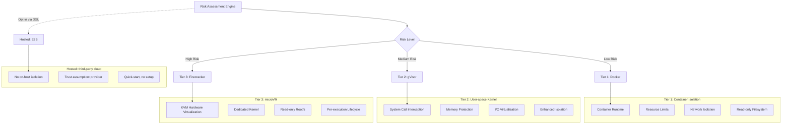
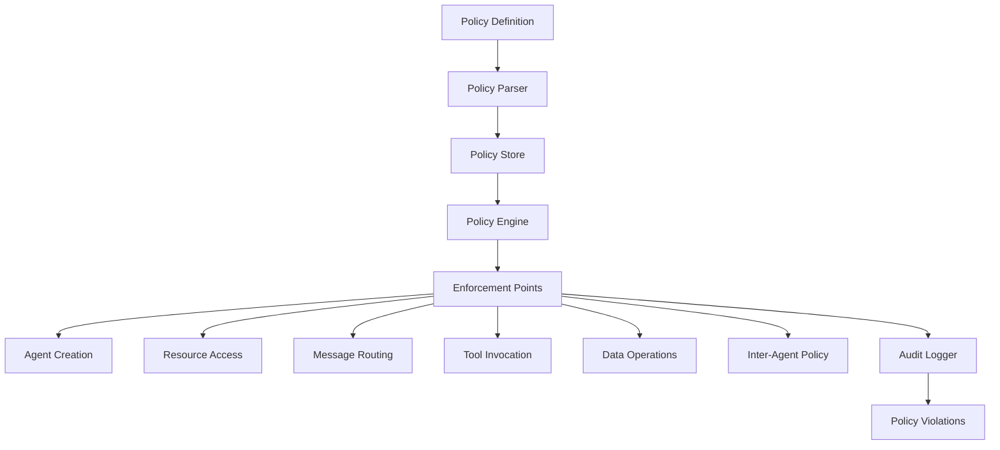
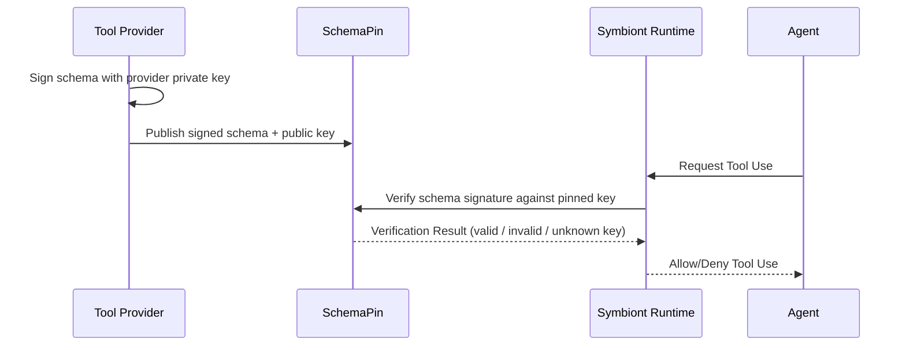
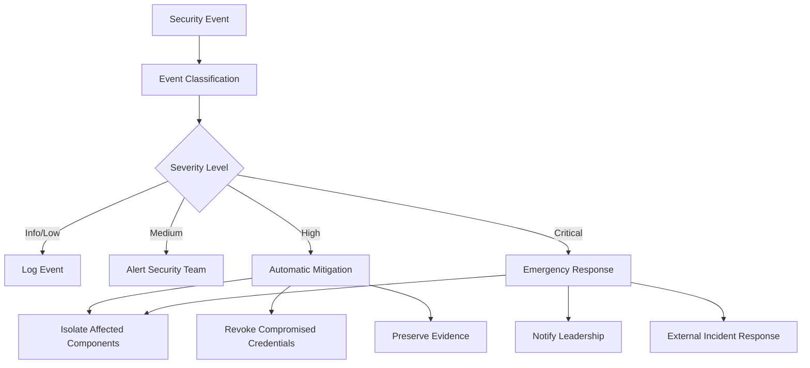

# Security Model

Comprehensive security architecture ensuring zero-trust, policy-driven protection for AI agents.


---

## Overview

**Containment coverage:** 1.21.0 adds selected Docker/gVisor effect
boundaries, exact prepared-call approvals, protected journals on covered entry
points and independent worker ownership. See the [containment guide](containment-branch-guide.md)
for implemented paths and deployment assumptions. The architecture and tier
configuration below are not evidence of complete enforcement across all paths.
Firecracker oneshot commands, parsers, MCP stdio, PTY sessions and managed CLI
workers use a versioned guest transport and independent VMM ownership. Managed
VMs receive only runtime-issued tool/inference capabilities. Isolated browser
execution remains unavailable. [Firecracker setup](firecracker-setup.md) describes guest and
host deployment requirements; Docker tests do not validate a VM deployment.

Symbiont implements a security-first architecture designed for regulated and high-assurance environments. The security model is built on zero-trust principles with comprehensive policy enforcement, multi-tier sandboxing, and cryptographic auditability.

### Security Principles

- **Zero Trust**: All components and communications are verified
- **Defense in Depth**: Multiple security layers with no single point of failure
- **Policy-Driven**: Declarative security policies enforced at runtime
- **Complete Auditability**: Every operation logged with cryptographic integrity
- **Least Privilege**: Minimal permissions required for operation

---

## Multi-Tier Sandboxing

The runtime ships three host-isolation tiers (Tier 1 → Tier 3) plus one hosted-execution backend (E2B). The tiers form a monotonically increasing isolation ladder; E2B is **not** a peer on that ladder — it executes on third-party infrastructure and is documented separately below.



> **Every host-isolation tier — landlock, Docker, gVisor, and Firecracker — ships in the OSS runtime.** Operators pick the tier per agent via the DSL `with { sandbox = ... }` block, or set a project default via `[sandbox] tier = "..."` in `symbiont.toml`. E2B is opt-in only via the DSL (`with { sandbox = "e2b" }`) and is intentionally not exposed as an `[sandbox] tier` value.
>
> Strong isolation is a baseline, not an upsell. The tiers stay in the open-source
> runtime so the community can read, audit and reproduce the boundary it depends on.
> Guest attestation is the clearest case: a fingerprint over sources you cannot read
> attests to nothing, so the guest service is open source precisely because it is a
> security control.

<a id="landlock-daemon-free"></a>

### Landlock (native workers)

Named `landlock`, not numbered. This optional Linux backend uses native processes
and an externally managed delegated supervisor. It needs no container image or
container daemon. Docker remains the default. See
[service setup and migration](landlock-supervision.md).

**Configuration:** `[sandbox] tier = "landlock"` in `symbiont.toml`. Read-only
and writable ceilings come from `[sandbox.roots]`, shared with the other
backends. `[sandbox.landlock]` carries `abi_floor`, `require_network`, memory, CPU,
PID, lifetime and output limits, plus its `supervisor` configuration.
The default and minimum supported ABI is now 6, even when an older configuration
sets a lower floor. A higher configured floor still applies. Native little-endian
x86_64 or aarch64 and working seccomp filtering are required.

**Use cases:**
- A workstation or desktop where running a container daemon per agent is not
  reasonable
- Confining a local process's filesystem reach, sockets and outgoing signals without
  provisioning an image

**Security features:**
- Filesystem confinement to declared roots, enforced by the kernel
- Landlock ABI-6 scopes prevent signals and abstract Unix socket connections to
  processes outside the worker's domain. Signals within the domain remain usable.
- With the default `require_network = true`, seccomp denies new sockets, covering
  TCP, UDP and pathname Unix sockets. Private Unix **stream** socket pairs remain
  usable. Datagram pairs are denied because they can send to unrelated pathname
  sockets. `io_uring` operations and alternate syscall ABIs are refused so they
  cannot bypass this restriction.
- `require_network = false` explicitly permits new IPv4/IPv6 sockets. It does not
  permit host Unix sockets, other socket families, datagram pairs or `io_uring`.
  This option grants IP network access, including loopback; it is not an egress
  allowlist.
- A base read/execute grant for system executable and library directories, needed
  before any dynamically linked program can start. It carries no writable path,
  nothing under a home directory and no broad `/etc` grant.
- Rulesets demand full enforcement. The crate's default is best-effort, which
  silently ignores what the kernel does not support; that default is not used.
- Rules and the syscall filter are constructed in the parent against open
  filesystem objects. Replacing a root after preparation cannot redirect its
  grant. The child installs the restrictions and marks descriptors above stderr
  close-on-exec using raw syscalls. Missing declared roots fail preparation;
  absent optional system paths may be omitted. Failed installation aborts spawn.
- Extra inherited file, socket and ring descriptors close at exec. Stdin, stdout
  and stderr remain explicit capabilities: SDK callers must supply only intended
  channels. The shipping MCP path uses pipes. This does not revoke capabilities
  an operator deliberately passes through stdio or grants through readable roots.

**Migration.** Hosts with ABI 4 or 5 now fail closed; lowering `abi_floor` cannot
restore the weaker boundary. Workloads requiring Unix services, datagram pairs,
`io_uring` or compatibility executables must use a suitable supervised backend.
Audit descriptors include boundary version 3, shared admission and cgroup supervision, the effective ABI requirement,
signal/socket scopes, socket policy, ring refusal and inherited-descriptor policy.

**Current coverage.** MCP stdio without declared files and the SDK's low-level
`CliExecutor` launch path use this backend. Public one-shot commands, custom
output parsers, interactive PTYs, declared-file staging and the shipping managed
CLI setup do not yet support it. Selecting Landlock on those paths fails rather
than switching to unrestricted execution.

**Grant lifetime.** A domain cannot be relaxed once applied. The SDK CLI child
receives its domain once at spawn, including write access to its working
directory. Direct roots authorize the configured hierarchy for that lifetime;
they do not snapshot file contents or restrict writes to new-file publication.
MCP discovery and calls without declared files clear the configured host roots.
Governed MCP and low-level SDK CLI workers retain durable shared CPU/memory/worker
reservations until cgroup removal. Delegated cgroups enforce resource limits and
stop descendants even when they leave the process group. The independent service
manager handles supervisor failure and watchdog expiry. The raw `PreparedDomain`
primitive only applies kernel access controls and does not acquire a lease.

**Fail-closed.** The required Landlock ABI and native architecture are checked
before authorization. Ruleset construction or installation failures, including
unavailable seccomp filtering, abort spawn before the worker executable starts.
There is no partial application or fallback to unrestricted host execution.

**Not available for registered agents.** No `SecurityTier` names landlock, so a
scheduled or HTTP-registered agent cannot declare it; those paths refuse it
rather than mapping it onto a neighboring tier and misreporting the isolation
in use. Select it in `[sandbox]` for direct runs.

**Validation.** `crates/runtime/tests/landlock_sandbox.rs` exercises real restricted
children, including replaced read/write roots and legitimate access through the
original objects, socket and signal restrictions, inherited descriptors, private
stream IPC, explicit IP access and alternate syscall ABI refusal.
`scripts/test-landlock-boundary.py --binary /path/to/symbi
--report /path/to/report.json` exercises shipping signed MCP dispatch, useful
output, filesystem/TCP/UDP/Unix socket and signal denials, required audit and
unsupported-kernel refusal with local synthetic fixtures. Protected observers
independently check for delivered messages and signals. These checks do not
establish adaptive escape resistance. The separate
`scripts/test-landlock-supervision.py` exercises real cgroup lifecycle failures. See the
[kernel's Landlock contract](https://docs.kernel.org/userspace-api/landlock.html).

### Tier 1: Docker Isolation

**Use Cases:**
- Trusted development tasks
- Low-sensitivity data processing
- Internal tool operations

**Security Features:**
```yaml
docker_security:
  memory_limit: "512MB"
  cpu_limit: "0.5"
  network_mode: "none"
  read_only_root: true
  security_opts:
    - "no-new-privileges:true"
    - "seccomp:default"
  capabilities:
    drop: ["ALL"]
    add: ["SETUID", "SETGID"]
```

**Threat Protection:**
- Process isolation from host
- Resource exhaustion prevention
- Network access control
- Filesystem protection

### Tier 2: gVisor Isolation

**Use Cases:**
- Standard production workloads
- Sensitive data processing
- External tool integration

**Security Features:**
- User-space kernel implementation
- System call filtering and translation
- Memory protection boundaries
- I/O request validation

**Configuration:**
```yaml
gvisor_security:
  runtime: "runsc"
  platform: "ptrace"
  network: "sandbox"
  file_access: "exclusive"
  debug: false
  strace: false
```

**Advanced Protection:**
- Kernel vulnerability isolation
- System call interception
- Memory corruption prevention
- Side-channel attack mitigation

**Prerequisites:** Install [`runsc`](https://gvisor.dev/docs/user_guide/install/) and register it as a Docker runtime in `/etc/docker/daemon.json`. `symbi doctor` reports whether `runsc` is reachable.

### Tier 3: Firecracker microVM

**Use Cases:**
- Highest-isolation workloads (untrusted code, multi-tenant, regulated data)
- Where syscall-filter granularity (gVisor) is insufficient and a real kernel boundary is required
- Per-execution VM lifecycle for stronger blast-radius containment

**Security Features:**
- Hardware virtualization via KVM
- Per-execution microVM with operator-supplied kernel + rootfs
- Read-only root filesystem by default
- No shared kernel surface with the host
- **Guest attestation:** the handshake checks the protocol version and a fingerprint
  of the guest service sources, and refuses a stale or mismatched image before any
  command is sent
- **Independent VMM ownership:** a supervisor outside the reasoning loop owns VM
  lifetime, so a VM cannot outlive its supervisor, and an orphaned VM is reclaimed
  against a verified process identity rather than a reusable PID
- **Unprivileged guest workload:** commands run as a non-root guest user with
  `no_new_privs` and explicit process and file-descriptor limits

**Configuration:** `[sandbox.firecracker]` in `symbiont.toml`:

```toml
[sandbox]
tier = "tier3"

[sandbox.firecracker]
kernel_image_path = "/var/lib/firecracker/vmlinux"
rootfs_path       = "/var/lib/firecracker/rootfs.ext4"
vcpus             = 1
mem_mib           = 512
rootfs_read_only  = true
```

**Prerequisites:** Operator must supply (a) a Firecracker-compatible kernel image and (b) a root filesystem image with the matching compiled guest service. **See [`docs/firecracker-setup.md`](firecracker-setup.md) for a step-by-step quickstart, the in-VM init contract, and a hardening checklist.** `symbi doctor` reports whether the `firecracker` binary is reachable.

Once you have both artifacts, scaffold a tier3 project with:

```bash
symbi init --profile assistant --sandbox tier3 \
  --firecracker-kernel /var/lib/firecracker/vmlinux \
  --firecracker-rootfs /var/lib/firecracker/rootfs.ext4
```

`symbi init` validates that both files exist before writing `symbiont.toml`, so misconfigurations surface at scaffold time rather than first agent run.

### Hosted execution: E2B

**E2B is a hosted cloud-sandbox backend, not a host-isolation tier.** It sits outside the Tier 1 → Tier 3 ladder and is documented here for completeness.

**What it is:** Code runs on E2B's infrastructure via their HTTPS API; the runtime ships only an HTTP client. Set `E2B_API_KEY` and select it per agent with `with { sandbox = "e2b" }`. There is no `--sandbox e2b` flag on `symbi init` — E2B is intentionally opt-in via DSL only, since it represents a different trust model than the on-host tiers.

**Use cases:**
- Quick-start demos and evaluation without installing Docker, gVisor, or Firecracker.
- Development environments where the operator can't run a sandbox host (CI without privileged mode, locked-down laptops, ARM developer machines).

**What it is not:**
- Not a substitute for on-host isolation. Code, prompts, and tool outputs traverse E2B's infrastructure. Don't use it for workloads with privacy, residency, or compliance requirements.
- Not comparable to Tier 1/2/3 in a security review. The runtime maps `E2B → SecurityTier::Hosted`, which sorts **below** `Tier1` for ordering — policies that require host isolation (`tier >= Tier1`) will reject hosted execution.

**Configuration:** No project-level config; set `E2B_API_KEY` in the environment and use `with { sandbox = "e2b" }` per agent.

---

## Policy Engine

### Policy Architecture

The policy engine provides declarative security controls with runtime enforcement:



### Policy Types

#### Access Control Policies

Define who can access what resources under which conditions:

```rust
policy secure_data_access {
    allow: read(sensitive_data) if (
        user.clearance >= "secret" &&
        user.need_to_know.contains(data.classification) &&
        session.mfa_verified == true
    )
    
    deny: export(data) if data.contains_pii == true
    
    require: [
        user.background_check.current,
        session.secure_connection,
        audit_trail = "detailed"
    ]
}
```

#### Data Flow Policies

Control how data moves through the system:

```rust
policy data_flow_control {
    allow: transform(data) if (
        source.classification <= target.classification &&
        user.transform_permissions.contains(operation.type)
    )
    
    deny: aggregate(datasets) if (
        any(datasets, |d| d.privacy_level > operation.privacy_budget)
    )
    
    require: differential_privacy for statistical_operations
}
```

#### Resource Usage Policies

Manage computational resource allocation:

```rust
policy resource_governance {
    allow: allocate(resources) if (
        user.resource_quota.remaining >= resources.total &&
        operation.priority <= user.max_priority
    )
    
    deny: long_running_operations if system.maintenance_mode
    
    require: supervisor_approval for high_memory_operations
}
```

### Policy Evaluation Engine

```rust
pub trait PolicyEngine {
    async fn evaluate_policy(
        &self, 
        context: PolicyContext, 
        action: Action
    ) -> PolicyDecision;
    
    async fn register_policy(&self, policy: Policy) -> Result<PolicyId>;
    async fn update_policy(&self, policy_id: PolicyId, policy: Policy) -> Result<()>;
}

pub enum PolicyDecision {
    Allow,
    Deny { reason: String },
    AllowWithConditions { conditions: Vec<PolicyCondition> },
    RequireApproval { approver: String },
}
```

### Performance Optimization

**Policy Caching:**
- Compiled policy evaluation for performance
- LRU cache for frequent decisions
- Batch evaluation for bulk operations
- Sub-millisecond evaluation times

**Incremental Updates:**
- Real-time policy updates without restart
- Versioned policy deployment
- Rollback capabilities for policy errors

### Cedar Policy Engine (`cedar` Feature)

Symbiont integrates the [Cedar policy language](https://www.cedarpolicy.com/) for formal authorization. Cedar enables fine-grained, auditable access control policies that are evaluated at the reasoning loop's policy gate.

**Default-on since v1.14.x:** Cedar ships in the default feature set of `symbi-runtime` and is included in every published binary (crates.io, Docker, GitHub Release tarballs). `symbi up` and `symbi run` auto-wire `CedarPolicyGate` from `policies/*.cedar` files at startup; when at least one policy file is present the gate is constructed with `deny_by_default()` and each `.cedar` file is loaded as a named policy. When no policy files are present, the runtime falls through to the fail-closed `DefaultPolicyGate::new()` (which denies every `ToolCall` and `Delegate` action). To disable Cedar entirely — for builds that pin `OpaPolicyGateBridge` or a custom `ReasoningPolicyGate` — build with `cargo build --no-default-features --features "keychain,vector-lancedb"`.

```bash
cargo build --features cedar
```

**Key capabilities:**
- **Formal verification**: Cedar policies can be statically analyzed for correctness
- **Fine-grained authorization**: Entity-based access control with hierarchical permissions
- **Reasoning loop integration**: `CedarPolicyGate` implements the `ReasoningPolicyGate` trait, evaluating each proposed action against Cedar policies before execution
- **Audit trail**: All Cedar policy decisions are logged with full context

```rust
use symbi_runtime::reasoning::cedar_gate::CedarPolicyGate;

// Create a Cedar policy gate with deny-by-default stance
let cedar_gate = CedarPolicyGate::deny_by_default();
let agent_id = symbi_runtime::types::AgentId::new();
let (journal, audit) = symbi_runtime::reasoning::run_audit::open_run_journal(
    trusted_project, agent_id,
).await?;
println!("Audit: {}", serde_json::to_string(&audit)?);
let runner = ReasoningLoopRunner::builder()
    .provider(provider)
    .executor(executor)
    .policy_gate(Arc::new(cedar_gate))
    .journal(journal)
    .build();
```

### Reasoning-Loop Policy Gate Default (post-v1.13.0 audit)

The reasoning loop in `symbi up` and `symbi run` is **fail-closed** by default. `DefaultPolicyGate::new()` returns `LoopDecision::Deny` for every `ToolCall` and `Delegate` action, with the reason `"No policy gate configured (DefaultPolicyGate::new is fail-closed; wire OpaPolicyGateBridge or pass --insecure-allow-all)"`. `Respond` actions remain allowed so the agent can still produce text output.

This change closes the gap where the production binary previously hard-coded `DefaultPolicyGate::permissive()` and silently allowed every action — see `SECURITY_AUDIT.md` C2 for the audit trail.

Operators have two paths:

1. **Wire a real policy backend** (recommended): construct `CedarPolicyGate`, `OpaPolicyGateBridge`, or your own implementation of the `ReasoningPolicyGate` trait and pass it to the runner.
2. **Opt into permissive mode for local dev**: pass `--insecure-allow-all` to `symbi up` / `symbi run`, or set `SYMBI_INSECURE_ALLOW_ALL=1`. A multi-line stderr banner is printed every time the runtime starts in this mode, and `tracing::warn!` fires on every evaluated action.

The legacy `permissive()` constructor was renamed `permissive_for_dev_only()` and marked `#[doc(hidden)]` to discourage incidental use in production code paths.

#### Per-surface policy scoping (since v1.19.0)

Every entry point used to load the same flat pile of `policies/*.cedar`, so a `permit` written for one of them silently applied to all of them. Entry points do not share a threat model: `symbi run` and the HTTP input server dispatch real tool calls, `symbi shell` exposes its own file-editing toolset, and the `symbi up` chat coordinator executes no tools at all.

Policies are now layered:

- `policies/*.cedar` — **shared**, loaded by every surface's gate.
- `policies/<surface>/*.cedar` — loaded **only** by the surface it names.

The surface names are `run`, `coordinator`, `http-input`, `managed-cli`, `eval`, and `shell`. `symbi up` builds one gate per surface (`coordinator` and `http-input`) rather than one shared between them, so a grant intended for unattended webhook agents does not reach the operator chat path, and vice versa. They still share one escalation queue, so held actions reach the same approvers.

Flat files remain global, so no existing deployment changes behaviour until it creates a subdirectory. Reserve the flat directory for rules that genuinely apply everywhere, and put anything tool-specific under its surface. Note that Mode B reads `policies/managed-cli/`, not `policies/run/` — spawning a managed subprocess is a different blast radius from the in-process reasoning loop, and a policy left in the wrong directory is loaded by nothing while looking identical to having written none.

When a gate falls through to fail-closed, the log names both directories it searched.

#### OPA backend transport hardening

When using `OpaPolicyGateBridge` with `SYMBIONT_OPA_URL`, the client **refuses plaintext HTTP to a non-loopback host** and fails closed (denies) — an on-path attacker could otherwise spoof an `allow` decision. Plaintext is permitted only for loopback (a local OPA sidecar) or when `SYMBIONT_OPA_ALLOW_INSECURE=1` is set (local testing only). Set `SYMBIONT_OPA_AUTH_TOKEN` to send a bearer token with each authorization query. Use `https://` for any remote OPA endpoint.

### Inter-Agent Communication Policy

The `CommunicationPolicyGate` enforces authorization rules for all inter-agent communication. Every call through `ask`, `delegate`, `send_to`, `parallel`, or `race` is evaluated against policy rules before execution.

**Rule structure:**
- **Conditions**: `SenderIs(agent)`, `RecipientIs(agent)`, `Always`, composite `All`/`Any`
- **Effects**: `Allow` or `Deny { reason }`
- **Priority**: Rules evaluated highest-priority first; first match wins
- **Default**: Allow (backward compatible — existing projects work unchanged)

**Policy denial is a hard fail** — the calling agent receives an error through the ORGA loop and can reason about it. All inter-agent messages are cryptographically signed via Ed25519 and encrypted with AES-256-GCM.

Example policy: prevent a worker agent from delegating to other agents:
```cedar
forbid(
    principal == Agent::"worker",
    action == Action::"delegate",
    resource
);
```

---

## Cryptographic Security

### Digital Signatures

All security-relevant operations are cryptographically signed:

**Signature Algorithm:** Ed25519 (RFC 8032)
- **Key Size:** 256-bit private keys, 256-bit public keys
- **Signature Size:** 512 bits (64 bytes)
- **Performance:** 70,000+ signatures/second, 25,000+ verifications/second

```rust
pub struct MessageSignature {
    pub signature: Vec<u8>,
    pub algorithm: SignatureAlgorithm,
    pub public_key: Vec<u8>,
}

impl AuditEvent {
    pub fn sign(&mut self, private_key: &PrivateKey) -> Result<()> {
        let message = self.serialize_for_signing()?;
        self.signature = private_key.sign(&message);
        Ok(())
    }

    pub fn verify(&self, public_key: &PublicKey) -> bool {
        let message = self.serialize_for_signing().unwrap();
        public_key.verify(&message, &self.signature)
    }
}
```

### Key Management

**Key Storage:**
- Hardware Security Module (HSM) integration
- Secure enclave support for key protection
- Key rotation with configurable intervals
- Distributed key backup and recovery

**Key Hierarchy:**
- Root signing keys for system operations
- Per-agent keys for operation signing
- Ephemeral keys for session encryption
- External keys for tool verification

> **Planned feature** — The `KeyManager` API shown below is part of the security roadmap and not yet available in the current release. The current implementation provides key utilities via `KeyUtils` in `crypto.rs`.

```rust
// PLANNED — not yet implemented in the current release
pub struct KeyManager {
    hsm: HardwareSecurityModule,
    key_store: SecureKeyStore,
    rotation_policy: KeyRotationPolicy,
}

impl KeyManager {
    pub async fn generate_agent_keys(&self, agent_id: AgentId) -> Result<KeyPair>;
    pub async fn rotate_keys(&self, key_id: KeyId) -> Result<KeyPair>;
    pub async fn revoke_key(&self, key_id: KeyId) -> Result<()>;
}
```

### Encryption Standards

**Symmetric Encryption:** AES-256-GCM
- 256-bit keys with authenticated encryption
- Unique nonces for each encryption operation
- Associated data for context binding

**Asymmetric Encryption:** X25519 + ChaCha20-Poly1305
- Elliptic curve key exchange
- Stream cipher with authenticated encryption
- Perfect forward secrecy

**Message Encryption:**
```rust
pub fn encrypt_message(
    plaintext: &[u8], 
    recipient_public_key: &PublicKey,
    sender_private_key: &PrivateKey
) -> Result<EncryptedMessage> {
    let shared_secret = sender_private_key.diffie_hellman(recipient_public_key);
    let nonce = generate_random_nonce();
    let ciphertext = ChaCha20Poly1305::new(&shared_secret)
        .encrypt(&nonce, plaintext)?;
    
    Ok(EncryptedMessage {
        nonce,
        ciphertext,
        sender_public_key: sender_private_key.public_key(),
    })
}
```

---

## Audit and Compliance

### Cryptographic Audit Trail

Two subsystems keep a signed, hash-chained record: the critic audit chain
(`crates/runtime/src/reasoning/critic_audit.rs`, verified with `verify_chain` /
`verify_chain_anchored`) and session transcripts
(`crates/runtime/src/session/transcript.rs`). The structure below describes those
chains.

The branch also adds required protected run journals for ordinary/managed CLI,
HTTP, scheduled ORGA and default DSL `reason()`/`tool_call()` execution. These are
private, durably appended, Ed25519-signed and hash-chained; invocation-bound
records include the run ID. See [run audit](run-audit.md) for the actual format,
key custody, verification and incomplete terminal outcomes.

This remains short of a system-wide audit log. The underlying `JournalWriter`
interface still permits a buffered in-memory writer on other paths or explicit
SDK injection; delegated internal journals are not all surfaced to the operator.
Direct LLM/composition and other shell reasoning paths still need migration. The
illustrative event structure below describes the critic/transcript chains, not
the protected run journal's wire format.

An event in those chains looks like:

```rust
pub struct AuditEvent {
    pub event_id: Uuid,
    pub timestamp: SystemTime,
    pub agent_id: AgentId,
    pub event_type: AuditEventType,
    pub details: serde_json::Value,
    pub signature: Ed25519Signature,
    pub previous_hash: Hash,
    pub event_hash: Hash,
}
```

**Audit Event Types:**
- Agent lifecycle events (creation, termination)
- Policy evaluation decisions
- Resource allocation and usage
- Message sending and routing
- External tool invocations
- Security violations and alerts

### Hash Chaining

Events are linked in an immutable chain:

```rust
impl AuditChain {
    pub fn append_event(&mut self, mut event: AuditEvent) -> Result<()> {
        event.previous_hash = self.last_hash;
        event.event_hash = self.calculate_event_hash(&event);
        event.sign(&self.signing_key)?;
        
        self.events.push(event.clone());
        self.last_hash = event.event_hash;
        
        self.verify_chain_integrity()?;
        Ok(())
    }
    
    pub fn verify_integrity(&self) -> Result<bool> {
        for (i, event) in self.events.iter().enumerate() {
            // Verify signature
            if !event.verify(&self.public_key) {
                return Ok(false);
            }
            
            // Verify hash chain
            if i > 0 && event.previous_hash != self.events[i-1].event_hash {
                return Ok(false);
            }
        }
        Ok(true)
    }
}
```

---

## Human Approval Relay (`symbi-approval-relay`)

When a policy decision returns `require: approval`, the action blocks until a human reviewer either approves or denies it. `symbi-approval-relay` is the crate that carries those requests to a human and the decision back, while keeping both hops auditable.

### Dual-channel design

The relay is **dual-channel** by design: every approval round-trips through two independent paths, and both must agree before the runtime unblocks the action.

- **Primary channel** — an interactive surface for the reviewer (chat adapter, web UI, CLI prompt). This is where the reviewer reads the request and decides.
- **Attestation channel** — an independent verification path (for example a signed callback, a second operator, or an out-of-band confirmation). The runtime will not unblock on a primary-channel approval alone.

This structure defeats the single-channel compromise case — an attacker who seizes the primary channel still cannot grant approvals, because the attestation channel doesn't share trust with it.

### What the relay carries

Every approval request in flight carries:
- The agent identity (AgentPin-anchored) and the policy decision that triggered the request
- The full action context — tool invocation, resource, arguments — hashed so reviewers can confirm they approved *this* action and not a swapped one
- A deadline after which the request auto-denies
- Correlation IDs so the audit trail ties the two channels' decisions back to a single action

Approvals and denials are recorded in the same cryptographically tamper-evident audit chain as every other runtime decision. A human saying "yes" is a decision in the log, not a bypass of it.

### Where it's used

- Cedar policies that emit `RequireApproval { approver: "..." }` verdicts
- Destructive or high-privilege tool calls gated by ToolClad `approval` hooks
- Scheduled jobs configured with `one_shot = true` plus an approval policy
- Any DSL `policy` block that names `require: <role>_approval`

If no relay is configured, approval-gated actions fail closed — they're denied, not silently allowed.

---

## Tool Security

Symbiont provides two complementary layers for tool security:

- **SchemaPin** — cryptographic verification of MCP tool schemas (identity and integrity)
- **[ToolClad](/toolclad)** — declarative tool contracts with argument validation, scope enforcement, injection prevention, and Cedar policy generation

ToolClad governs *how* tools execute (input validation, scope boundaries, evidence capture). SchemaPin governs *whether* to trust a tool's identity (signature verification, key pinning).

### SchemaPin Verification Process

External tools are verified using cryptographic signatures:



> SchemaPin verification is purely cryptographic — signature validation and key pinning (TOFU). It performs no AI or human review of tool behavior; that is a separate, planned capability described under [AI-Driven Tool Review](#ai-driven-tool-review).

### Trust-On-First-Use (TOFU)

**Key Pinning Process:**
1. First encounter with a tool provider
2. Verify provider's public key through external channels
3. Pin the public key in local trust store
4. Use pinned key for all future verifications

> **Planned feature** — The `TOFUKeyStore` API shown below is part of the security roadmap and not yet available in the current release.

```rust
// PLANNED — not yet implemented in the current release
pub struct TOFUKeyStore {
    pinned_keys: HashMap<ProviderId, PinnedKey>,
    trust_policies: Vec<TrustPolicy>,
}

impl TOFUKeyStore {
    pub async fn pin_key(&mut self, provider: ProviderId, key: PublicKey) -> Result<()> {
        if self.pinned_keys.contains_key(&provider) {
            return Err("Key already pinned for provider");
        }

        self.pinned_keys.insert(provider, PinnedKey {
            public_key: key,
            pinned_at: SystemTime::now(),
            trust_level: TrustLevel::Unverified,
        });

        Ok(())
    }

    pub fn verify_tool(&self, tool: &MCPTool) -> VerificationResult {
        if let Some(pinned_key) = self.pinned_keys.get(&tool.provider_id) {
            if pinned_key.public_key.verify(&tool.schema_hash, &tool.signature) {
                VerificationResult::Trusted
            } else {
                VerificationResult::SignatureInvalid
            }
        } else {
            VerificationResult::UnknownProvider
        }
    }
}
```

### AI-Driven Tool Review

Automated security analysis before tool approval:

**Analysis Components:**
- **Vulnerability Detection**: Pattern matching against known vulnerability signatures
- **Malicious Code Detection**: ML-based malicious behavior identification
- **Resource Usage Analysis**: Assessment of computational resource requirements
- **Privacy Impact Assessment**: Data handling and privacy implications

> **Planned feature** — The `SecurityAnalyzer` API shown below is part of the security roadmap and not yet available in the current release.

```rust
// PLANNED — not yet implemented in the current release
pub struct SecurityAnalyzer {
    vulnerability_patterns: VulnerabilityDatabase,
    ml_detector: MaliciousCodeDetector,
    resource_analyzer: ResourceAnalyzer,
    privacy_assessor: PrivacyAssessor,
}

impl SecurityAnalyzer {
    pub async fn analyze_tool(&self, tool: &MCPTool) -> SecurityAnalysis {
        let mut findings = Vec::new();

        // Vulnerability pattern matching
        findings.extend(self.vulnerability_patterns.scan(&tool.schema));

        // ML-based detection
        let ml_result = self.ml_detector.analyze(&tool.schema).await?;
        findings.extend(ml_result.findings);

        // Resource usage analysis
        let resource_risk = self.resource_analyzer.assess(&tool.schema);

        // Privacy impact assessment
        let privacy_impact = self.privacy_assessor.evaluate(&tool.schema);

        SecurityAnalysis {
            tool_id: tool.id.clone(),
            risk_score: calculate_risk_score(&findings),
            findings,
            resource_requirements: resource_risk,
            privacy_impact,
            recommendation: self.generate_recommendation(&findings),
        }
    }
}
```

---

## ClawHavoc Skill Scanner

The ClawHavoc scanner provides content-level defense for agent skills. Every skill file is scanned line-by-line before loading, and findings at Critical or High severity block the skill from executing.

### Severity Model

| Level | Action | Description |
|-------|--------|-------------|
| **Critical** | Fail scan | Active exploitation patterns (reverse shells, code injection) |
| **High** | Fail scan | Credential theft, privilege escalation, process injection |
| **Medium** | Warn | Suspicious but potentially legitimate (downloaders, symlinks) |
| **Warning** | Warn | Low-risk indicators (env file references, chmod) |
| **Info** | Log | Informational findings |

### Detection Categories (40 Rules)

**Original Defense Rules (10)**
- `pipe-to-shell`, `wget-pipe-to-shell` — Remote code execution via piped downloads
- `eval-with-fetch`, `fetch-with-eval` — Code injection via eval + network
- `base64-decode-exec` — Obfuscated execution via base64 decoding
- `soul-md-modification`, `memory-md-modification` — Identity tampering
- `rm-rf-pattern` — Destructive filesystem operations
- `env-file-reference`, `chmod-777` — Sensitive file access, world-writable permissions

**Reverse Shells (7)** — Critical severity
- `reverse-shell-bash`, `reverse-shell-nc`, `reverse-shell-ncat`, `reverse-shell-mkfifo`, `reverse-shell-python`, `reverse-shell-perl`, `reverse-shell-ruby`

**Credential Harvesting (6)** — High severity
- `credential-ssh-keys`, `credential-aws`, `credential-cloud-config`, `credential-browser-cookies`, `credential-keychain`, `credential-etc-shadow`

**Network Exfiltration (3)** — High severity
- `exfil-dns-tunnel`, `exfil-dev-tcp`, `exfil-nc-outbound`

**Process Injection (4)** — Critical severity
- `injection-ptrace`, `injection-ld-preload`, `injection-proc-mem`, `injection-gdb-attach`

**Privilege Escalation (5)** — High severity
- `privesc-sudo`, `privesc-setuid`, `privesc-setcap`, `privesc-chown-root`, `privesc-nsenter`

**Symlink / Path Traversal (2)** — Medium severity
- `symlink-escape`, `path-traversal-deep`

**Downloader Chains (3)** — Medium severity
- `downloader-curl-save`, `downloader-wget-save`, `downloader-chmod-exec`

### Executable Whitelisting

The `AllowedExecutablesOnly` rule type restricts which executables an agent skill can invoke:

```rust
// Only allow these executables — everything else is blocked
ScanRule::AllowedExecutablesOnly(vec![
    "python3".into(),
    "node".into(),
    "cargo".into(),
])
```

### Custom Rules

Domain-specific patterns can be added alongside ClawHavoc defaults:

```rust
let mut scanner = SkillScanner::new();
scanner.add_custom_rule(
    "block-internal-api",
    r"internal\.corp\.example\.com",
    ScanSeverity::High,
    "References to internal API endpoints are not allowed in skills",
);
```

---

## Invisible-Character Sanitization (`symbi-invis-strip`)

`symbi-invis-strip` is a zero-dependency utility crate used across the runtime to strip characters that render as nothing but change meaning — the classic payload for prompt-injection and policy-evasion attacks.

### What it removes

- ASCII C0 (0x00–0x1F) and DEL (0x7F), except for `\t` `\n` `\r`
- ASCII C1 (0x80–0x9F)
- Zero-width characters (ZWSP, ZWNJ, ZWJ)
- Bidirectional overrides (LRO, RLO, PDF, LRE, RLE, LRI, RLI, FSI, PDI)
- Word joiner and the invisible-operator block
- Byte-order marks (BOM)
- Variation selectors (VS1–VS16 and supplementary VS17–VS256)
- Characters in the Unicode Tag block (U+E0000–U+E007F)

### Where it runs

- Inbound chat and webhook payloads — before they reach the orchestrator
- Tool-call arguments — before they reach Cedar evaluation
- Skill and agent DSL content — before the scanner and parser

### Optional markup stripping

The opt-in `sanitize_field_with_markup` variant additionally removes:
- `<!-- ... -->` HTML comments
- Triple-backtick fenced code blocks

Markup stripping is appropriate for surfaces where renderer-hidden markup has no legitimate use — for example, short policy rationale fields or display-only metadata. It is **not** applied to fields that legitimately carry markdown or code (like agent source, policy bodies, or tool outputs).

---

## Cedar Policy Linter

`.github/scripts/lint-cedar-policies.py` is a static analysis pass that runs on every `.cedar` file in the repository. It catches a class of attack where a malicious (or compromised) authoring flow writes a policy that *looks* correct but contains characters that produce a different authorization decision than the reviewer expects.

### What it catches

- **Homoglyph identifiers** — Cyrillic `а` (U+0430) masquerading as Latin `a`, Greek `ο` (U+03BF) as Latin `o`, and similar lookalikes in principal/action/resource names.
- **Invisible control characters** inside identifiers, string literals, or between tokens.

### Where it runs

- **Pre-commit hook** — blocks commits that introduce either class of issue.
- **CI** — the same check is a required test job, so commits that bypass the hook (via `--no-verify`) still fail CI.

Combined with `symbi-invis-strip` on the data path, the linter closes the authoring-path vector: invisible tricks can't enter the repo, and any that slip through at runtime are stripped before policy evaluation.

---

## Network Security

### Secure Communication

**Transport Layer Security:**
- TLS 1.3 for all external communications
- Mutual TLS (mTLS) for service-to-service communication
- Certificate pinning for known services
- Perfect forward secrecy

**Message-Level Security:**
- End-to-end encryption for agent messages
- Message authentication codes (MAC)
- Replay attack prevention with timestamps
- Message ordering guarantees

```rust
pub struct SecureChannel {
    encryption_key: [u8; 32],
    mac_key: [u8; 32],
    send_counter: AtomicU64,
    recv_counter: AtomicU64,
}

impl SecureChannel {
    pub fn encrypt_message(&self, plaintext: &[u8]) -> Result<EncryptedMessage> {
        let counter = self.send_counter.fetch_add(1, Ordering::SeqCst);
        let nonce = self.generate_nonce(counter);

        let ciphertext = ChaCha20Poly1305::new(&self.encryption_key)
            .encrypt(&nonce, plaintext)?;

        let mac = Hmac::<Sha256>::new_from_slice(&self.mac_key)?
            .chain_update(&ciphertext)
            .chain_update(&counter.to_le_bytes())
            .finalize()
            .into_bytes();

        Ok(EncryptedMessage {
            nonce: nonce.to_vec(),
            ciphertext,
            sender_public_key: self.local_public_key(),
        })
    }
}
```

### Network Isolation

**Sandbox Network Control:**
- No network access by default
- Explicit allow-list for external connections
- Traffic monitoring and anomaly detection
- DNS filtering and validation

**Network Policies:**
```yaml
network_policy:
  default_action: "deny"
  allowed_destinations:
    - domain: "api.openai.com"
      ports: [443]
      protocol: "https"
    - ip_range: "10.0.0.0/8"
      ports: [6333]  # Qdrant (only needed if using optional Qdrant backend)
      protocol: "http"
  
  monitoring:
    log_all_connections: true
    detect_anomalies: true
    rate_limiting: true
```

---

## Incident Response

### Security Event Detection

**Automated Detection:**
- Policy violation monitoring
- Anomalous behavior detection
- Resource usage anomalies
- Failed authentication tracking

**Alert Classification:**
```rust
pub enum ViolationSeverity {
    Info,       // Normal security events
    Warning,    // Minor policy violations
    Error,      // Confirmed security issues
    Critical,   // Active security breaches
}

pub struct SecurityEvent {
    pub id: Uuid,
    pub timestamp: SystemTime,
    pub severity: ViolationSeverity,
    pub category: SecurityEventCategory,
    pub description: String,
    pub affected_components: Vec<ComponentId>,
    pub recommended_actions: Vec<String>,
}
```

### Incident Response Workflow



### Recovery Procedures

**Automated Recovery:**
- Agent restart with clean state
- Key rotation for compromised credentials
- Policy updates to prevent recurrence
- System health verification

**Manual Recovery:**
- Forensic analysis of security events
- Root cause analysis and remediation
- Security control updates
- Incident documentation and lessons learned

---

## Security Best Practices

### Development Guidelines

1. **Secure by Default**: All security features enabled by default
2. **Principle of Least Privilege**: Minimal permissions for all operations
3. **Defense in Depth**: Multiple security layers with redundancy
4. **Fail Securely**: Security failures should deny access, not grant it
5. **Audit Everything**: Complete logging of security-relevant operations

### Deployment Security

**Environment Hardening:**
```bash
# Disable unnecessary services
systemctl disable cups bluetooth

# Kernel hardening
echo "kernel.dmesg_restrict=1" >> /etc/sysctl.conf
echo "kernel.kptr_restrict=2" >> /etc/sysctl.conf

# File system security
mount -o remount,nodev,nosuid,noexec /tmp
```

**Container Security:**
```dockerfile
# Use minimal base image
FROM scratch
COPY --from=builder /app/symbiont /bin/symbiont

# Run as non-root user
USER 1000:1000

# Set security options
LABEL security.no-new-privileges=true
```

### Operational Security

**Monitoring Checklist:**
- [ ] Real-time security event monitoring
- [ ] Policy violation tracking
- [ ] Resource usage anomaly detection
- [ ] Failed authentication monitoring
- [ ] Certificate expiration tracking

**Maintenance Procedures:**
- Regular security updates and patches
- Key rotation on schedule
- Policy review and updates
- Security audit and penetration testing
- Incident response plan testing

---

## Security Configuration

### Environment Variables

```bash
# Cryptographic settings
export SYMBIONT_CRYPTO_PROVIDER=ring
export SYMBIONT_KEY_STORE_TYPE=hsm
export SYMBIONT_HSM_CONFIG_PATH=/etc/symbiont/hsm.conf

# Audit settings
export SYMBIONT_AUDIT_ENABLED=true
export SYMBIONT_AUDIT_STORAGE=/var/audit/symbiont
export SYMBIONT_AUDIT_RETENTION_DAYS=2555  # 7 years

# Security policies
export SYMBIONT_POLICY_ENFORCEMENT=strict
export SYMBIONT_DEFAULT_SANDBOX_TIER=gvisor
export SYMBIONT_TOFU_ENABLED=true
```

### Security Configuration File

```toml
[security]
# Cryptographic settings
crypto_provider = "ring"
signature_algorithm = "ed25519"
encryption_algorithm = "chacha20_poly1305"

# Key management
key_rotation_interval_days = 90
hsm_enabled = true
hsm_config_path = "/etc/symbiont/hsm.conf"

# Audit settings
audit_enabled = true
audit_storage_path = "/var/audit/symbiont"
audit_retention_days = 2555
audit_compression = true

# Sandbox security
default_sandbox_tier = "gvisor"
sandbox_escape_detection = true
resource_limit_enforcement = "strict"

# Network security
tls_min_version = "1.3"
certificate_pinning = true
network_isolation = true

# Policy enforcement
policy_enforcement_mode = "strict"
policy_violation_action = "deny_and_alert"
emergency_override_enabled = false

[tofu]
enabled = true
key_verification_required = true
trust_on_first_use_timeout_hours = 24
automatic_key_pinning = false
```

---

## Security Metrics

### Key Performance Indicators

**Security Operations:**
- Policy evaluation latency: <1ms average
- Audit event generation rate: 10,000+ events/second
- Security incident response time: <5 minutes
- Cryptographic operation throughput: 70,000+ ops/second

**Compliance Metrics:**
- Policy compliance rate: >99.9%
- Audit trail integrity: chain verification detects any reordering, mutation, or
  tail truncation of the critic audit chain and session transcripts (see
  [Cryptographic Audit Trail](#cryptographic-audit-trail) for what is and is not
  covered)
- Security event false positive rate: <1%
- Incident resolution time: <24 hours

**Risk Assessment:**
- Vulnerability patching time: <48 hours
- Security control effectiveness: >95%
- Threat detection accuracy: >99%
- Recovery time objective: <1 hour

---

## Future Enhancements

### Advanced Cryptography

**Post-Quantum Cryptography:**
- NIST-approved post-quantum algorithms
- Hybrid classical/post-quantum schemes
- Migration planning for quantum threats

**Homomorphic Encryption:**
- Privacy-preserving computation on encrypted data
- CKKS scheme for approximate arithmetic
- Integration with machine learning workflows

**Zero-Knowledge Proofs:**
- zk-SNARKs for computation verification
- Privacy-preserving authentication
- Compliance proof generation

### AI-Enhanced Security

**Behavior Analysis:**
- Machine learning for anomaly detection
- Predictive security analytics
- Adaptive threat response

**Automated Response:**
- Self-healing security controls
- Dynamic policy generation
- Intelligent incident classification

---

## Next Steps

- **[Contributing](/contributing)** - Security development guidelines
- **[Runtime Architecture](/runtime-architecture)** - Technical implementation details
- **[API Reference](/api-reference)** - Security API documentation

The Symbiont security model provides enterprise-grade protection suitable for regulated industries and high-assurance environments. Its layered approach ensures robust protection against evolving threats while maintaining operational efficiency.
