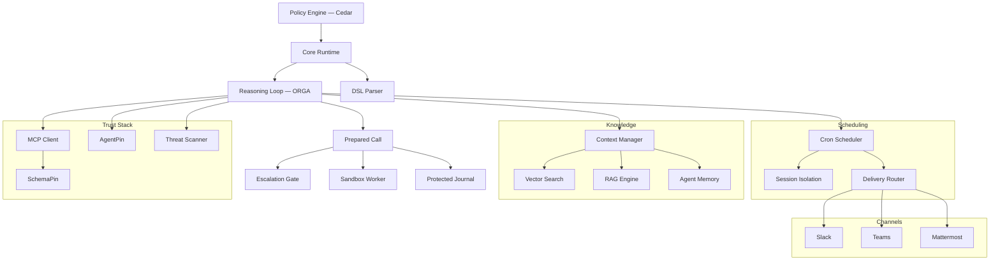

# Symbiont 文档

用于构建智能体应用的策略治理平台。在明确的策略、身份和审计控制下执行 AI 智能体和工具。

## 从您的工作出发

本套文档服务于三类不同的工作。它们需要不同的页面和不同的阅读顺序，所以请选择路径，而不是逐条通读清单。

**评估它是否值得信任。** 您需要知道哪些是真正强制执行的、哪些只是被记录下来的，以及这些声明的边界在哪里。您可能永远不会写一个 `.symbi` 文件。

1. [用 30 秒验证门控](#prove-it-first-offline-no-api-key) — 见下文；离线进行，无需承诺安装
2. [安全模型](/security-model) — 信任边界、三个隔离层级，以及哪些是被信任而非被验证的
3. [预备调用](/prepared-calls) — 一次授权究竟*是什么*，以及它为何无法被重放
4. [受保护运行审计](/run-audit) — 日志能证明什么，以及不能证明什么
5. [审批生命周期](/approval-lifecycle) — 与审阅绑定的放行、截止时间，以及审批者身份的局限
6. [收容指南](/containment-branch-guide) — 当前覆盖范围，以及坦率列出的缺口
7. 已发表的评估 — [DOI 10.5281/zenodo.20043247](https://doi.org/10.5281/zenodo.20043247)

**构建和运维智能体。** 您需要一个能跑起来的项目，然后在它周围建起一道即使换人值班也依然成立的围栏。

1. [验证门控](#prove-it-first-offline-no-api-key) — 从一次拒绝开始，而不是从一次成功开始
2. [入门指南](/getting-started) — 安装、`symbi init`、第一个智能体
3. [DSL 指南](/dsl-guide) — 智能体定义，以及说明可强制执行规则子集的[内联作用策略](/inline-policies)
4. [命令隔离](/toolclad-command-boundary) — 配置您的工具实际运行其中的工作进程
5. [ToolClad](/toolclad) — 声明式工具契约与作用域强制
6. [审批生命周期](/approval-lifecycle) — 当一次拒绝应当由人参与时的正确做法
7. [运行时架构](/runtime-architecture)和 [API 参考](/api-reference) — 部署阶段阅读
8. [Symbi Shell](/symbi-shell)（Beta）— 交互式编写与 Gate 面板

**阅读规范。** 您关心的是一致性、可复现性，以及该标准能否与厂商分离。

1. [Open Agent Trust Stack](https://openagenttruststack.org) — 规范（CC BY 4.0），OATS Extended C1–C7 + E1–E8
2. [推理循环](/reasoning-loop) — 已实现的类型状态 ORGA 循环
3. [预备调用](/prepared-calls) — 授权对象及其回归测试覆盖
4. [安全模型](/security-model) — 各层级的保证，包括第 3 层的来宾证明
5. 已发表的成果 — [Typestate ORGA Loops](https://doi.org/10.5281/zenodo.19896446)、[ToolClad](https://doi.org/10.5281/zenodo.19957596)、[Empirical Evaluation](https://doi.org/10.5281/zenodo.20043247)
6. [参与贡献](/contributing) — 复现用的测试装置就在本仓库中

> **打算让 AI 编码智能体来帮您配置？** 在它动手之前，先把 <https://symbiont.dev/agent-guide.md> 指给它。那是一份稳定的纯文本指令文件，包含当前的语法和标志，以及一条长期有效的规则：绝不以放宽策略的方式解决配置错误。

---

<a id="prove-it-first-offline-no-api-key"></a>

## 先验证 —— 离线，无需 API 密钥

先让 Symbiont 拒绝一件事。这就是运行时接入实时推理循环的那同一个 Cedar 门控，只不过单独运行，因此这里的拒绝就是那里的拒绝。它不需要模型提供方、不需要 Docker，也不需要项目。

**安装：**

```bash
curl -fsSL https://symbiont.dev/install.sh | bash
```

**写两条策略并据此求值：**

```bash
mkdir -p /tmp/p && cat > /tmp/p/policy.cedar <<'EOF'
forbid(principal, action == Symbi::Action::"tool_call::list_agents",   resource);
permit(principal, action == Symbi::Action::"tool_call::system_health", resource);
EOF

echo '{"tool_name":"list_agents"}'   | symbi policy evaluate --stdin --policies /tmp/p --json
echo '{"tool_name":"system_health"}' | symbi policy evaluate --stdin --policies /tmp/p --json
```

```json
{"decision":"deny","reason":"deny policies matched: policy_0","tool":"list_agents", ...}
{"decision":"allow","reason":"allow policies matched: policy_1","tool":"system_health", ...}
```

**然后看参数校验如何在调用执行之前就把它拦下：**

```bash
symbi tools init greet
symbi tools validate
symbi tools test greet --arg target=example
```

```
greet                                    OK

  ✓ target (string): example → OK

  Command:   greet example
  Cedar:     Tool::Greet / execute_tool

  [dry run — command not executed]
```

这次拒绝才是真正的演示。一个以成功运行收尾的快速上手，只能证明某个程序跑起来了 —— 而每个智能体框架的快速上手都能证明这一点。

运行一个*智能体*需要模型提供方；请继续阅读[入门指南](/getting-started)。

---

## 什么是 Symbiont？

Symbiont 是一个 Rust 原生平台，用于在明确的策略、身份和审计控制下执行 AI 智能体和工具。

大多数智能体框架关注编排。Symbiont 关注的是智能体在具有真实风险的环境中运行时会发生什么：不受信任的工具、敏感数据、审批边界、审计需求和可重复的执行。

### 工作原理

Symbiont 将智能体意图与执行权限分离：

1. **智能体提议**通过推理循环（Observe-Reason-Gate-Act）发起操作
2. **运行时进行准备** — 规范化参数，并把契约、解析出的作用、所选沙箱和截止时间冻结为一次不可变的调用
3. **策略决定** — Cedar 和受支持的内联规则必须*同时*允许；被拒绝的操作会被阻止，标记为需要审批的操作会转交人工处理
4. **记录先落地** — 必需的作用前日志写入必须成功，才能进行派发
5. **工作进程执行** — 在所选沙箱内执行，绝不在主机上执行

模型输出永远不被视为执行权限。运行时控制实际发生的事情。

### 核心能力

| 能力 | 功能说明 |
|-----------|-------------|
| **策略引擎** | 使用 [Cedar](https://www.cedarpolicy.com/) 对智能体操作、工具调用和资源访问进行细粒度授权 |
| **预备调用** | 针对一次被冻结的调用签发授权 —— 一次性、不可复制，并在派发时对主体、会话、执行器身份和有效期重新校验 |
| **执行收容** | 命令、解析器、MCP 会话、PTY 和托管 CLI 子进程都在所选的工作进程中运行。不回退到主机：后端不可用时该次运行失败 |
| **精确调用审批** | `human_approval = true` 只会放行经过审阅的快照 —— 通过终端中继、shell 的 Gate 面板，或聊天中「ID + 摘要」形式的命令 |
| **工具验证** | 执行前通过 [SchemaPin](https://schemapin.org) 对 MCP 工具模式进行密码学验证 |
| **智能体身份** | 通过 [AgentPin](https://agentpin.org) 为智能体和计划任务提供域锚定的 ES256 身份 |
| **推理循环** | 类型状态强制的 Observe-Reason-Gate-Act 循环，带策略门控和断路器 |
| **沙箱** | 三个 OSS 层级 —— Docker（第 1 层）、gVisor（第 2 层）、Firecracker microVM（第 3 层）—— 在 DSL 中选择，无任何企业版限制 |
| **受保护审计** | 位于 `.symbiont/governed/` 下、按次运行的私有签名日志；必需写入失败会中止派发 |
| **可选的受治理改进** | [带版本的工作流指令](/governed-improvements)、签名的试运行评估、精确的运维审批、显式启用和按次运行的版本固定；在显式初始化并选用之前保持禁用 |
| **密钥管理** | Vault/OpenBao 集成，AES-256-GCM 加密存储，按智能体隔离 |
| **MCP 集成** | 原生 Model Context Protocol 支持，带治理工具访问 |
| **受治理的托管 CLI** | 把外部 AI CLI 作为被收容的子进程运行 —— 没有源码挂载、没有外部网络、没有主机凭据；对源码的访问由已注册的 ToolClad 工具提供 |

附加能力：工具/技能内容的威胁扫描、cron 调度、持久智能体记忆、混合 RAG 搜索（LanceDB/Qdrant）、webhook 验证、投递路由、OTLP 遥测、HTTP 安全加固、通道适配器（Slack/Teams/Mattermost），以及 [Claude Code](https://github.com/thirdkeyai/symbi-claude-code) 和 [Gemini CLI](https://github.com/thirdkeyai/symbi-gemini-cli) 的治理插件。

---

## 搭建项目

```bash
symbi init        # Interactive: profile, SchemaPin mode, sandbox tier.
                  # Writes symbiont.toml, agents/, policies/, docker-compose.yml,
                  # and a .env with a generated SYMBIONT_MASTER_KEY.
symbi run <agent> # Run a single agent without starting the full runtime
symbi up          # Start the full runtime with auto-configuration
symbi shell       # Interactive agent orchestration shell (Beta)
```

非交互式，适用于 CI：

```bash
symbi init --profile assistant --schemapin tofu --sandbox tier1 --no-interact
```

使用 Docker 时 —— 请传入 `--dir`，因为镜像的 WORKDIR 并不是您挂载的目录：

```bash
docker run --rm -v $(pwd):/workspace ghcr.io/thirdkeyai/symbi:latest \
  init --profile assistant --no-interact --dir /workspace
docker compose up
```

运行时 API 位于 `http://localhost:8080`，HTTP Input 位于 `http://localhost:8081`。

其他安装途径 —— Homebrew（`brew tap thirdkeyai/tap && brew install symbi`）、`cargo install symbi`（需要 Rust 1.89+ 和 `protobuf-compiler`），或 [GitHub Releases](https://github.com/thirdkeyai/symbiont/releases)。完整详情见[入门指南](/getting-started)。

### 您的第一个智能体

```symbiont
metadata {
    version = "1.0.0"
    author = "your-name"
    description = "Writes one reviewed file"
}

agent writer() {
    capabilities = ["write"]

    with sandbox = "docker", timeout = 20.seconds {}

    policy files {
        allow: "edit_file" if invocation.arguments.path == "result.txt"
        deny:  "edit_file" if invocation.arguments.content == ""
    }
}
```

内联 `policy` 块会被编译并与 Cedar 一起强制执行 —— **两者都必须允许**。受支持的子集是刻意保持精简的；对于运行时无法强制执行的规则，调用会在模型被调用*之前*失败，而不是被悄悄忽略。确切语法参见[内联作用策略](/inline-policies)，`metadata`、`schedule`、`webhook` 和 `channel` 块参见 [DSL 指南](/dsl-guide)。

### 交互式 shell（Beta）

`symbi shell` 是一个基于 ratatui 的终端 UI，用于在 LLM 辅助下编写智能体、工具和策略，编排多智能体模式（`/chain`、`/parallel`、`/race`、`/debate`），管理调度和通道，并附加到远程运行时。按 `Ctrl+G` 可打开 Gate 面板审阅被挂起的动作。状态为 **beta** —— 命令接口和持久化格式仍可能在次要版本之间变化。请参阅 [Symbi Shell 指南](/symbi-shell)和 [shell 工作区配置](/shell-containment)。

### 部署单个智能体（Beta）

shell 的 `/deploy` 命令会打包当前活动的智能体并将其交付到 Docker（`/deploy local`）、Google Cloud Run（`/deploy cloudrun`）或 AWS App Runner（`/deploy aws`）。OSS 技术栈为单智能体；多智能体拓扑通过跨实例消息传递组合。请参阅 [Symbi Shell —— 部署](/symbi-shell#deployment-beta)。

---

## 架构



---

## 安全模型

Symbiont 围绕一个简单原则设计：**模型输出永远不应被信任为执行权限。**

操作通过运行时控制流转：

- **零信任** — 所有智能体输入默认不受信任
- **预备调用** — 被授权的调用是冻结的、一次性的，并在派发时重新校验
- **策略检查** — 每次工具调用之前，Cedar 和受支持的内联规则都会进行检查，两者都失败关闭
- **工具验证** — SchemaPin 对工具模式的密码学验证
- **收容** — Docker、gVisor 或 Firecracker 工作进程，不回退到主机
- **操作员审批** — 对完整请求的人工审核，按摘要而非仅按 ID 放行
- **密钥控制** — Vault/OpenBao 后端、加密本地存储、智能体命名空间
- **审计日志** — 防篡改记录在作用发生之前写入，而不是之后

有关完整详情，请参阅[安全模型](/security-model)指南；当前覆盖范围和剩余缺口参见[收容指南](/containment-branch-guide)。

### 未作出的声明

一个只罗列保证的安全页面，是在要求别人相信它。以下这些限制在此直接写明，而不是留待日后被发现：

- 主机配置、工作进程镜像、容器运行时、运维方提供的推理端点，以及注入的 SDK 实现，都是**被信任**的组件，而不是被验证的组件。
- 收容并未覆盖所有入口点。公开的浏览器执行、汇总准入控制，以及自动重放或恢复，要么不可用，要么不在这些契约范围内。
- 推理循环在工具出错或策略拒绝之后仍可能达到 `Completed` —— 请逐一检查工具结果。终态写入可能在某项作用发生*之后*失败：**错误不等于回滚。** 日志缺失或不完整是证据的缺失，而不是成功的证据。
- 终端审批者的身份是本地运维方的有效 UID —— 那是一个操作系统账户，而不是经过独立验证的个人。审阅摘要绑定的是确切的请求；它并不能证明有人读过它。
- 确定性的配对实验室试验只能证明其各自的场景。**它们不能给出模型逃逸率。**
- SOC 2、HIPAA 和 ISO 27001 是审计轨迹所对齐的目标。我们并未持有、也不暗示持有任何认证。

---

## 全部指南

**收容与治理**

- [收容指南](/containment-branch-guide) — 运维流程、架构、迁移、剩余缺口
- [预备调用](/prepared-calls) — 精确调用授权与 Cedar 请求结构
- [审批生命周期](/approval-lifecycle) — 终端、TUI 和聊天审阅
- [受保护运行审计](/run-audit) — 运行身份、日志校验、不完整结果
- [崩溃检查](/crash-inspection) — 无需重放即可核实被中断的运行和未解决的作用
- [内联作用策略](/inline-policies) — 可强制执行的 DSL 规则子集
- [命令隔离](/toolclad-command-boundary) — 工具和解析器的工作进程配置
- [按操作的文件授权](/filesystem-grants) — 已声明的输入、有界的新输出、解析器隔离
- [Docker 所有权](/docker-containment) — 生命周期、清理与恢复
- [交互式终端](/interactive-terminal-boundary) — 被收容的 PTY 会话
- [Shell 工作区](/shell-containment) — TUI 中受治理的文件和命令工具
- [托管 CLI](/managed-cli-containment) — 把外部 AI CLI 作为被收容的子进程运行
- [受治理中转器](/governed-tool-broker) — 中转式工具调用 API
- [DSL 调用上下文](/dsl-invocation-context) — 调用方身份与冻结的项目根目录
- [计划执行](/scheduled-execution) — 调用 ID 与终态结果
- [调用幂等性](/invocation-idempotency) — 持久化的 CLI 请求身份与安全的结果取回

**核心**

- [入门指南](/getting-started) — 安装、配置、第一个智能体
- [Symbi Shell](/symbi-shell)（Beta）— 用于编写、编排和远程附加的交互式 TUI
- [安全模型](/security-model) — 零信任架构、策略执行、隔离层级
- [运行时架构](/runtime-architecture) — 运行时内部机制和执行模型
- [推理循环](/reasoning-loop) — ORGA 循环、策略门控、断路器
- [DSL 指南](/dsl-guide) — 智能体定义语言参考
- [ToolClad](/toolclad) — 声明式工具契约、参数校验、作用域强制
- [MCP 工具](/mcp-tools) — 受治理的 Model Context Protocol 访问
- [API 参考](/api-reference) — HTTP API 端点和配置
- [调度](/scheduling) — Cron 引擎、投递路由、死信队列
- [HTTP 输入](/http-input) — Webhook 服务器、认证、速率限制
- [Firecracker 设置](/firecracker-setup) — 第 3 层的内核、rootfs 与来宾传输
- [托管 Firecracker 主机服务](/firecracker-host-service) — 可选的 jailer、主机限制、watchdog 部署
- [会话类型](/session-types)（实验性）— 智能体间协议一致性监控

---

## 社区与资源

- **智能体指南**：[symbiont.dev/agent-guide.md](https://symbiont.dev/agent-guide.md) — 面向代您完成配置的 AI 编码智能体的说明
- **包**：[crates.io/crates/symbi](https://crates.io/crates/symbi) | [npm symbiont-sdk-js](https://www.npmjs.com/package/symbiont-sdk-js) | [PyPI symbiont-sdk](https://pypi.org/project/symbiont-sdk/)
- **SDK**：[JavaScript/TypeScript](https://github.com/ThirdKeyAI/symbiont-sdk-js) | [Python](https://github.com/ThirdKeyAI/symbiont-sdk-python)
- **插件**：[Claude Code](https://github.com/thirdkeyai/symbi-claude-code) | [Gemini CLI](https://github.com/thirdkeyai/symbi-gemini-cli)
- **问题**：[GitHub Issues](https://github.com/thirdkeyai/symbiont/issues)
- **许可证**：Apache 2.0（社区版）

---

## 下一步

<div class="grid grid-cols-1 md:grid-cols-3 gap-6 mt-8">
  <div class="card">
    <h3>验证门控</h3>
    <p>在安装项目之前，先让 Symbiont 拒绝一件事。</p>
    <a href="#prove-it-first-offline-no-api-key" class="btn btn-outline">30 秒验证</a>
  </div>

  <div class="card">
    <h3>安全模型</h3>
    <p>了解信任边界和策略执行。</p>
    <a href="/security-model" class="btn btn-outline">安全指南</a>
  </div>

  <div class="card">
    <h3>开始使用</h3>
    <p>安装 Symbiont 并运行您的第一个治理智能体。</p>
    <a href="/getting-started" class="btn btn-outline">快速开始指南</a>
  </div>
</div>
