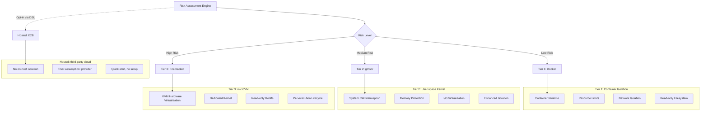
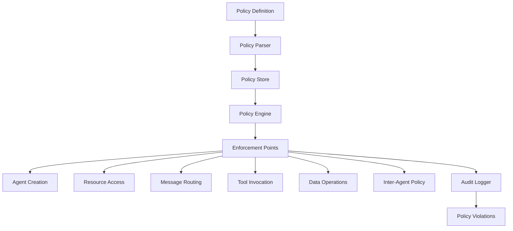
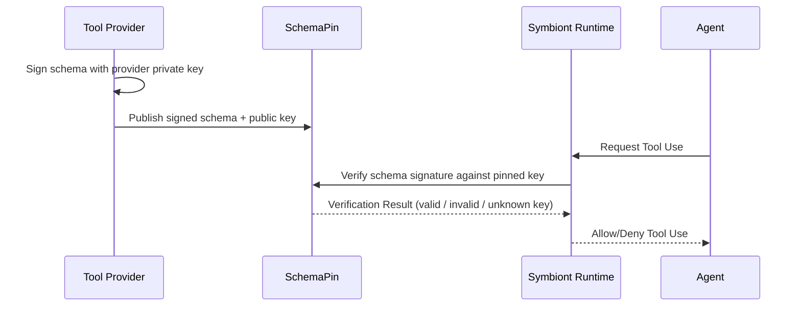
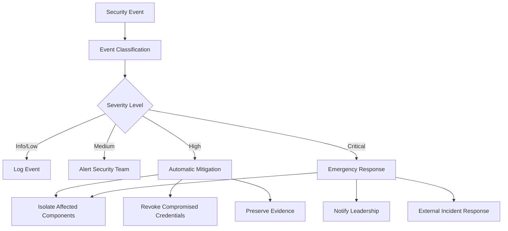

# 安全模型

全面的安全架构，确保为 AI 智能体提供零信任、策略驱动的保护。

## 其他语言


---

## 概述

**收容覆盖范围：** 1.21.0 增加了所选的 Docker/gVisor 作用边界、精确的预备调用审批、
覆盖入口点上的受保护日志，以及独立的工作进程所有权。已实现的路径和部署假设参见
[收容指南](/containment-branch-guide)。下文的架构和层级配置并不能证明所有路径上
都已完整强制执行。Firecracker 的一次性命令、解析器、MCP stdio、PTY 会话和托管 CLI
工作进程使用带版本的来宾传输协议和独立的 VMM 所有权。托管 VM 只会获得由运行时
签发的工具/推理能力。隔离的浏览器执行仍不可用。[Firecracker 设置](/firecracker-setup)
说明了来宾和主机的部署要求；Docker 测试不能验证 VM 部署。

Symbiont 实现了专为受监管和高保障环境设计的安全优先架构。该安全模型建立在零信任原则之上，具有全面的策略执行、多层沙箱和密码学可审计性。

### 安全原则

- **零信任**：所有组件和通信都经过验证
- **纵深防御**：多个安全层，无单点故障
- **策略驱动**：在运行时强制执行声明性安全策略
- **完整审计性**：每个操作都记录并具有密码学完整性
- **最小权限**：操作所需的最小权限

---

## 多层沙箱

运行时附带三个主机隔离层（第 1 层 → 第 3 层），外加一个托管执行后端（E2B）。这些层级构成一条单调递增的隔离阶梯；E2B **不是**这条阶梯上的对等项 —— 它在第三方基础设施上执行，下文单独说明。



> **每一个主机隔离层 —— landlock、Docker、gVisor 和 Firecracker —— 都包含在 OSS 运行时中。** 运维方可在 DSL 的 `with { sandbox = ... }` 块中按智能体选择层级，或通过 `symbiont.toml` 的 `[sandbox] tier = "..."` 设置项目默认值。E2B 仅可通过 DSL（`with { sandbox = "e2b" }`）显式启用，并且故意不作为 `[sandbox] tier` 的取值暴露。
>
> 强隔离是基线，而非增值销售项。这些层级保留在开源运行时中，以便社区能够阅读、审计并复现自己所依赖的边界。来宾证明是最清晰的例子：针对无法阅读的源码计算的指纹并不能证明任何事情，因此来宾服务正是因为它是一项安全控制才必须开源。

<a id="landlock-daemon-free"></a>

### Landlock（原生工作进程）

它的名称是 `landlock`，而不是编号层级。这个可选的 Linux 后端使用原生进程和一个由
外部管理的委派监督进程。它不需要容器镜像，也不需要容器守护进程。Docker 仍是默认
选项。参见[服务配置与迁移](/landlock-supervision)。

**配置：** 在 `symbiont.toml` 中设置 `[sandbox] tier = "landlock"`。只读和可写的
上限来自 `[sandbox.roots]`，与其他后端共用。`[sandbox.landlock]` 包含 `abi_floor`、
`require_network`、内存、CPU、PID、生命周期和输出限制，以及它的 `supervisor` 配置。
默认且最低支持的 ABI 现在是 6，即使旧配置设置了更低的下限也是如此。配置更高的下限
仍然有效。要求原生的小端 x86_64 或 aarch64，并且 seccomp 过滤可用。

**使用场景：**
- 为每个智能体运行一个容器守护进程并不现实的工作站或桌面环境
- 在不准备镜像的情况下限制本地进程可触及的文件系统、套接字和对外发送的信号

**安全特性：**
- 由内核强制执行的文件系统限制，只允许访问已声明的根目录
- Landlock ABI-6 的 scope 机制可阻止向工作进程所属域之外的进程发送信号和连接抽象
  Unix 套接字。域内的信号仍可使用。
- 在默认的 `require_network = true` 下，seccomp 会拒绝新建套接字，涵盖 TCP、UDP 和
  路径名 Unix 套接字。私有的 Unix **流**套接字对仍可使用。数据报套接字对会被拒绝，
  因为它们可以向无关的路径名套接字发送数据。`io_uring` 操作和替代的系统调用 ABI
  也会被拒绝，以免绕过这项限制。
- `require_network = false` 显式允许新建 IPv4/IPv6 套接字。它不会允许主机 Unix
  套接字、其他套接字族、数据报套接字对或 `io_uring`。该选项授予的是 IP 网络访问
  （包括回环），它不是一份出站允许列表。
- 对系统可执行文件和库目录授予基础的读/执行权限，任何动态链接的程序启动前都需要它。
  它不包含任何可写路径，不包含家目录下的任何内容，也不包含对 `/etc` 的宽泛授权。
- Ruleset 要求完整强制执行。该 crate 的默认行为是尽力而为，会静默忽略内核不支持的
  部分；这里不使用该默认值。
- 规则和系统调用过滤器在父进程中针对已打开的文件系统对象构建。在准备完成之后替换
  某个根目录无法改变其授权指向。子进程使用原始系统调用安装这些限制，并把 stderr
  以上的描述符标记为 close-on-exec。已声明的根目录缺失会导致准备失败；可选的系统
  路径缺失时可以省略。安装失败会中止启动。
- 额外继承的文件、套接字和 ring 描述符会在 exec 时关闭。stdin、stdout 和 stderr
  仍然是显式的能力：SDK 调用方必须只提供预期的通道。随产品发布的 MCP 路径使用管道。
  这并不会撤销运维方有意通过 stdio 传入、或通过可读根目录授予的能力。

**迁移。** ABI 为 4 或 5 的主机现在会失败关闭；调低 `abi_floor` 无法恢复更弱的边界。
需要 Unix 服务、数据报套接字对、`io_uring` 或兼容性可执行文件的工作负载，必须改用
合适的受监督后端。审计描述符包含边界版本 3、共享准入与 cgroup 监督、生效的 ABI
要求、信号/套接字 scope、套接字策略、ring 拒绝策略和继承描述符策略。

**当前覆盖范围。** 未声明文件的 MCP stdio，以及 SDK 的底层 `CliExecutor` 启动路径
使用该后端。公开的一次性命令、自定义输出解析器、交互式 PTY、已声明文件的暂存，以及
随产品发布的托管 CLI 配置尚不支持它。在这些路径上选择 Landlock 会失败，而不会切换到
不受限制的执行。

**授权生命周期。** 域一经应用便无法放宽。SDK 的 CLI 子进程在启动时一次性获得其域，
其中包含对其工作目录的写权限。直接根目录在该生命周期内授权所配置的目录层级；它们
不会对文件内容做快照，也不会把写入限制为仅发布新文件。未声明文件的 MCP 发现和调用
会清除已配置的主机根目录。受治理的 MCP 和底层 SDK CLI 工作进程会持有持久的共享
CPU/内存/工作进程预留，直到 cgroup 被移除。委派的 cgroup 强制执行资源限制，并且
即使子进程离开进程组也能将其停止。独立的服务管理器负责处理监督进程故障和 watchdog
到期。原始的 `PreparedDomain` 原语只应用内核访问控制，不会获取租约。

**失败关闭。** 所需的 Landlock ABI 和原生架构会在授权之前进行检查。Ruleset 构建或
安装失败（包括 seccomp 过滤不可用）会在工作进程可执行文件启动之前中止启动。不存在
部分应用，也不会回退到不受限制的主机执行。

**不适用于已注册的智能体。** 没有任何 `SecurityTier` 的名称是 landlock，因此计划
任务或通过 HTTP 注册的智能体无法声明它；这些路径会直接拒绝，而不是把它映射到相邻
层级并错误上报实际使用的隔离方式。请在 `[sandbox]` 中为直接运行选择它。

**验证。** `crates/runtime/tests/landlock_sandbox.rs` 会运行真实的受限子进程，覆盖
被替换的读/写根目录以及通过原始对象进行的合法访问、套接字和信号限制、继承描述符、
私有流 IPC、显式 IP 访问以及替代系统调用 ABI 的拒绝。
`scripts/test-landlock-boundary.py --binary /path/to/symbi
--report /path/to/report.json` 会用本地合成夹具，覆盖随产品发布的签名 MCP 派发、
有效输出、文件系统/TCP/UDP/Unix 套接字和信号拒绝、必需审计，以及对不受支持内核的
拒绝。受保护的观察者会独立检查是否有消息和信号被送达。这些检查并不能证明具备自适应
的抗逃逸能力。另有 `scripts/test-landlock-supervision.py` 用于验证真实的 cgroup
生命周期故障。参见[内核的 Landlock 契约](https://docs.kernel.org/userspace-api/landlock.html)。

### 第一层：Docker 隔离

**使用场景：**
- 可信开发任务
- 低敏感度数据处理
- 内部工具操作

**安全功能：**
```yaml
docker_security:
  memory_limit: "512MB"
  cpu_limit: "0.5"
  network_mode: "none"
  read_only_root: true
  security_opts:
    - "no-new-privileges:true"
    - "seccomp:default"
  capabilities:
    drop: ["ALL"]
    add: ["SETUID", "SETGID"]
```

**威胁防护：**
- 与主机的进程隔离
- 资源耗尽预防
- 网络访问控制
- 文件系统保护

### 第二层：gVisor 隔离

**使用场景：**
- 标准生产工作负载
- 敏感数据处理
- 外部工具集成

**安全功能：**
- 用户空间内核实现
- 系统调用过滤和转换
- 内存保护边界
- I/O 请求验证

**配置：**
```yaml
gvisor_security:
  runtime: "runsc"
  platform: "ptrace"
  network: "sandbox"
  file_access: "exclusive"
  debug: false
  strace: false
```

**高级保护：**
- 内核漏洞隔离
- 系统调用拦截
- 内存损坏预防
- 侧信道攻击缓解

**前置条件：** 安装 [`runsc`](https://gvisor.dev/docs/user_guide/install/) 并在 `/etc/docker/daemon.json` 中将其注册为 Docker 运行时。`symbi doctor` 会报告 `runsc` 是否可用。

### 第三层：Firecracker microVM

**使用场景：**
- 最高隔离级别工作负载（不受信任代码、多租户、受监管数据）
- 当系统调用过滤粒度（gVisor）不够，且需要真正的内核边界时
- 通过逐次执行的 VM 生命周期获得更强的爆炸半径控制

**安全功能：**
- 通过 KVM 实现硬件虚拟化
- 每次执行使用一个由运维方提供的内核 + rootfs 的 microVM
- 默认只读的根文件系统
- 与主机不共享任何内核表面
- **来宾证明：** 握手会校验协议版本以及来宾服务源码的指纹，并在发送任何命令之前拒绝过期或不匹配的镜像
- **独立的 VMM 所有权：** 推理循环之外的监督进程拥有 VM 生命周期，因此 VM 无法比其监督进程存活更久；孤立的 VM 会针对经过验证的进程标识（而非可复用的 PID）进行回收
- **非特权来宾工作负载：** 命令以非 root 的来宾用户身份运行，并施加 `no_new_privs` 以及明确的进程数和文件描述符上限

**配置：** `symbiont.toml` 中的 `[sandbox.firecracker]`：

```toml
[sandbox]
tier = "tier3"

[sandbox.firecracker]
kernel_image_path = "/var/lib/firecracker/vmlinux"
rootfs_path       = "/var/lib/firecracker/rootfs.ext4"
vcpus             = 1
mem_mib           = 512
rootfs_read_only  = true
```

**前置条件：** 运维方必须提供 (a) 一个与 Firecracker 兼容的内核映像，以及 (b) 一个带有与之匹配的、已编译来宾服务的根文件系统映像。**详见 [`docs/firecracker-setup.md`](/firecracker-setup)，其中提供了分步快速指南、VM 内 init 契约以及加固清单。** `symbi doctor` 会报告 `firecracker` 二进制是否可用。

在准备好两个工件后，可以通过以下命令脚手架一个第 3 层项目：

```bash
symbi init --profile assistant --sandbox tier3 \
  --firecracker-kernel /var/lib/firecracker/vmlinux \
  --firecracker-rootfs /var/lib/firecracker/rootfs.ext4
```

`symbi init` 会在写入 `symbiont.toml` 之前先校验两个文件是否存在，因此配置错误会在脚手架阶段就暴露出来，而不会等到第一次运行智能体时才发现。

### 托管执行：E2B

**E2B 是托管的云沙箱后端，不是主机隔离层级。** 它处于第 1 层 → 第 3 层阶梯之外，此处仅为完整起见单独说明。

**它是什么：** 代码在 E2B 的基础设施上通过其 HTTPS API 运行；运行时只附带 HTTP 客户端。设置 `E2B_API_KEY`，并通过 `with { sandbox = "e2b" }` 按智能体选择启用。`symbi init` 上没有 `--sandbox e2b` 标志 —— E2B 故意只通过 DSL 显式启用，因为它代表的信任模型与主机端各层级不同。

**适用场景：**
- 在不安装 Docker、gVisor 或 Firecracker 的情况下进行快速演示和评估。
- 运维方无法运行沙箱主机的开发环境（没有 privileged 模式的 CI、被锁定的笔记本电脑、ARM 开发机）。

**它不是什么：**
- 不能替代主机端隔离。代码、提示和工具输出都会经过 E2B 的基础设施。请勿用于具有隐私、数据驻留或合规要求的工作负载。
- 在安全审查中，无法与第 1/2/3 层相提并论。运行时将 `E2B → SecurityTier::Hosted` 映射，其在排序中位于 `Tier1` **之下** —— 任何要求主机隔离（`tier >= Tier1`）的策略都会拒绝托管执行。

**配置：** 没有项目级配置；在环境中设置 `E2B_API_KEY`，并按智能体使用 `with { sandbox = "e2b" }`。

---

## 策略引擎

### 策略架构

策略引擎通过运行时强制执行提供声明性安全控制：



### 策略类型

#### 访问控制策略

定义谁可以在什么条件下访问什么资源：

```rust
policy secure_data_access {
    allow: read(sensitive_data) if (
        user.clearance >= "secret" &&
        user.need_to_know.contains(data.classification) &&
        session.mfa_verified == true
    )

    deny: export(data) if data.contains_pii == true

    require: [
        user.background_check.current,
        session.secure_connection,
        audit_trail = "detailed"
    ]
}
```

#### 数据流策略

控制数据在系统中的流动方式：

```rust
policy data_flow_control {
    allow: transform(data) if (
        source.classification <= target.classification &&
        user.transform_permissions.contains(operation.type)
    )

    deny: aggregate(datasets) if (
        any(datasets, |d| d.privacy_level > operation.privacy_budget)
    )

    require: differential_privacy for statistical_operations
}
```

#### 资源使用策略

管理计算资源分配：

```rust
policy resource_governance {
    allow: allocate(resources) if (
        user.resource_quota.remaining >= resources.total &&
        operation.priority <= user.max_priority
    )

    deny: long_running_operations if system.maintenance_mode

    require: supervisor_approval for high_memory_operations
}
```

### 策略评估引擎

```rust
pub trait PolicyEngine {
    async fn evaluate_policy(
        &self,
        context: PolicyContext,
        action: Action
    ) -> PolicyDecision;

    async fn register_policy(&self, policy: Policy) -> Result<PolicyId>;
    async fn update_policy(&self, policy_id: PolicyId, policy: Policy) -> Result<()>;
}

pub enum PolicyDecision {
    Allow,
    Deny { reason: String },
    AllowWithConditions { conditions: Vec<PolicyCondition> },
    RequireApproval { approver: String },
}
```

### 性能优化

**策略缓存：**
- 编译策略评估以提高性能
- 频繁决策的 LRU 缓存
- 批量操作的批量评估
- 亚毫秒级评估时间

**增量更新：**
- 实时策略更新无需重启
- 版本化策略部署
- 策略错误的回滚功能

### Cedar 策略引擎（`cedar` 特性）

Symbiont 集成了 [Cedar 策略语言](https://www.cedarpolicy.com/)，用于正式授权。Cedar 支持细粒度、可审计的访问控制策略，在推理循环的策略门控阶段进行评估。

**自 v1.14.x 起默认启用：** Cedar 已包含在 `symbi-runtime` 的默认特性集中，并随每一个已发布的二进制文件（crates.io、Docker、GitHub Release tarball）一同分发。`symbi up` 和 `symbi run` 会在启动时从 `policies/*.cedar` 文件自动接线 `CedarPolicyGate`；当至少存在一个策略文件时，门控会以 `deny_by_default()` 构造，并将每个 `.cedar` 文件作为命名策略加载。当不存在任何策略文件时，运行时将回退到失败即关闭的 `DefaultPolicyGate::new()`（其会拒绝所有 `ToolCall` 和 `Delegate` 操作）。若要彻底禁用 Cedar — 用于固定 `OpaPolicyGateBridge` 或自定义 `ReasoningPolicyGate` 的构建 — 请使用 `cargo build --no-default-features --features "keychain,vector-lancedb"` 进行构建。

```bash
cargo build --features cedar
```

**核心功能：**
- **正式验证**：Cedar 策略可进行静态正确性分析
- **细粒度授权**：基于实体的访问控制，支持层次化权限
- **推理循环集成**：`CedarPolicyGate` 实现了 `ReasoningPolicyGate` trait，在执行前针对 Cedar 策略评估每个提议的操作
- **审计轨迹**：所有 Cedar 策略决策都以完整上下文记录

```rust
use symbi_runtime::reasoning::cedar_gate::CedarPolicyGate;

// Create a Cedar policy gate with deny-by-default stance
let cedar_gate = CedarPolicyGate::deny_by_default();
let agent_id = symbi_runtime::types::AgentId::new();
let (journal, audit) = symbi_runtime::reasoning::run_audit::open_run_journal(
    trusted_project, agent_id,
).await?;
println!("Audit: {}", serde_json::to_string(&audit)?);
let runner = ReasoningLoopRunner::builder()
    .provider(provider)
    .executor(executor)
    .policy_gate(Arc::new(cedar_gate))
    .journal(journal)
    .build();
```

### 推理循环策略门控默认值（v1.13.0 审计之后）

`symbi up` 与 `symbi run` 中的推理循环默认采用**失败即关闭**策略。`DefaultPolicyGate::new()` 会对每个 `ToolCall` 和 `Delegate` 操作返回 `LoopDecision::Deny`，原因为 `"No policy gate configured (DefaultPolicyGate::new is fail-closed; wire OpaPolicyGateBridge or pass --insecure-allow-all)"`。`Respond` 操作仍被允许，以便智能体可以继续产生文本输出。

此变更填补了之前生产二进制硬编码 `DefaultPolicyGate::permissive()` 并静默允许所有操作的漏洞——审计轨迹见 `SECURITY_AUDIT.md` C2。

运维方有两种路径：

1. **接入真实的策略后端**（推荐）：构造 `CedarPolicyGate`、`OpaPolicyGateBridge`，或自行实现 `ReasoningPolicyGate` trait，并将其传入 runner。
2. **为本地开发选择性启用宽松模式**：向 `symbi up` / `symbi run` 传递 `--insecure-allow-all`，或设置 `SYMBI_INSECURE_ALLOW_ALL=1`。每次运行时以此模式启动都会打印多行 stderr 横幅，并且 `tracing::warn!` 会针对每个被评估的操作触发。

旧的 `permissive()` 构造函数被重命名为 `permissive_for_dev_only()` 并标记为 `#[doc(hidden)]`，以阻止在生产代码路径中无意使用。

#### 按界面划分的策略作用域（自 v1.19.0 起）

此前每个入口点都加载同一套扁平的 `policies/*.cedar`，因此为某一个入口点编写的 `permit` 会悄然适用于全部入口点。但各入口点的威胁模型并不相同：`symbi run` 与 HTTP 输入服务器会派发真实的工具调用，`symbi shell` 暴露自己的文件编辑工具集，而 `symbi up` 的聊天协调器根本不执行任何工具。

策略现在采用分层加载：

- `policies/*.cedar` —— **共享**，由每个界面的门控加载。
- `policies/<surface>/*.cedar` —— **仅**由其命名的界面加载。

界面名称为 `run`、`coordinator`、`http-input`、`managed-cli`、`eval` 和 `shell`。`symbi up` 现在按界面各构建一个门控（`coordinator` 与 `http-input`），而不是二者共用一个，这样为无人值守 Webhook 智能体授予的权限不会波及操作员聊天路径，反之亦然。二者仍共享同一个升级队列，因此被保留的操作会送达相同的审批人。

扁平文件仍然是全局的，因此在创建子目录之前，现有部署的行为不会发生变化。请将扁平目录保留给确实需要处处适用的规则，并把与工具相关的内容放到其所属界面之下。请注意，Mode B 读取的是 `policies/managed-cli/` 而非 `policies/run/` —— 启动受管子进程与进程内推理循环的影响范围不同，放错目录的策略不会被任何组件加载，但看起来却和根本没写策略一模一样。

当门控回退到故障关闭时，日志会指明它搜索过的两个目录。

#### OPA 后端传输加固

在配合 `SYMBIONT_OPA_URL` 使用 `OpaPolicyGateBridge` 时，客户端**拒绝向非环回主机发送明文 HTTP**，并故障关闭（拒绝）—— 否则路径上的攻击者可能伪造 `allow` 决策。仅在环回（本地 OPA sidecar）或设置了 `SYMBIONT_OPA_ALLOW_INSECURE=1`（仅限本地测试）时才允许明文。设置 `SYMBIONT_OPA_AUTH_TOKEN` 可在每次授权查询中发送 bearer 令牌。任何远程 OPA 端点都应使用 `https://`。

### 智能体间通信策略

`CommunicationPolicyGate` 为所有智能体间通信强制执行授权规则。通过 `ask`、`delegate`、`send_to`、`parallel` 或 `race` 发起的每次调用都会在执行前经过策略规则评估。

**规则结构：**
- **条件**：`SenderIs(agent)`、`RecipientIs(agent)`、`Always`、组合 `All`/`Any`
- **效果**：`Allow` 或 `Deny { reason }`
- **优先级**：规则按优先级从高到低评估；首个匹配生效
- **默认**：允许（向后兼容——现有项目无需修改即可正常运行）

**策略拒绝是硬失败** —— 调用方智能体通过 ORGA 循环收到错误并可进行推理。所有智能体间消息通过 Ed25519 进行密码学签名，并使用 AES-256-GCM 加密。

示例策略：阻止工作器智能体向其他智能体委派任务：
```cedar
forbid(
    principal == Agent::"worker",
    action == Action::"delegate",
    resource
);
```

---

## 密码学安全

### 数字签名

所有安全相关操作都经过密码学签名：

**签名算法：** Ed25519（RFC 8032）
- **密钥大小：** 256 位私钥，256 位公钥
- **签名大小：** 512 位（64 字节）
- **性能：** 70,000+ 签名/秒，25,000+ 验证/秒

```rust
pub struct MessageSignature {
    pub signature: Vec<u8>,
    pub algorithm: SignatureAlgorithm,
    pub public_key: Vec<u8>,
}

impl AuditEvent {
    pub fn sign(&mut self, private_key: &PrivateKey) -> Result<()> {
        let message = self.serialize_for_signing()?;
        self.signature = private_key.sign(&message);
        Ok(())
    }

    pub fn verify(&self, public_key: &PublicKey) -> bool {
        let message = self.serialize_for_signing().unwrap();
        public_key.verify(&message, &self.signature)
    }
}
```

### 密钥管理

**密钥存储：**
- 硬件安全模块（HSM）集成
- 密钥保护的安全飞地支持
- 可配置间隔的密钥轮换
- 分布式密钥备份和恢复

**密钥层次结构：**
- 系统操作的根签名密钥
- 操作签名的每智能体密钥
- 会话加密的临时密钥
- 工具验证的外部密钥

> **计划功能** — 下方所示的 `KeyManager` API 属于安全路线图的一部分，尚未在当前版本中提供。当前实现通过 `crypto.rs` 中的 `KeyUtils` 提供密钥工具。

```rust
pub struct KeyManager {
    hsm: HardwareSecurityModule,
    key_store: SecureKeyStore,
    rotation_policy: KeyRotationPolicy,
}

impl KeyManager {
    pub async fn generate_agent_keys(&self, agent_id: AgentId) -> Result<KeyPair>;
    pub async fn rotate_keys(&self, key_id: KeyId) -> Result<KeyPair>;
    pub async fn revoke_key(&self, key_id: KeyId) -> Result<()>;
}
```

### 加密标准

**对称加密：** AES-256-GCM
- 具有认证加密的 256 位密钥
- 每次加密操作的唯一随机数
- 上下文绑定的关联数据

**非对称加密：** X25519 + ChaCha20-Poly1305
- 椭圆曲线密钥交换
- 具有认证加密的流密码
- 完美前向保密

**消息加密：**
```rust
pub fn encrypt_message(
    plaintext: &[u8],
    recipient_public_key: &PublicKey,
    sender_private_key: &PrivateKey
) -> Result<EncryptedMessage> {
    let shared_secret = sender_private_key.diffie_hellman(recipient_public_key);
    let nonce = generate_random_nonce();
    let ciphertext = ChaCha20Poly1305::new(&shared_secret)
        .encrypt(&nonce, plaintext)?;

    Ok(EncryptedMessage {
        nonce,
        ciphertext,
        sender_public_key: sender_private_key.public_key(),
    })
}
```

---

## 审计和合规

### 密码学审计轨迹

有两个子系统保存签名的哈希链记录：critic 审计链
（`crates/runtime/src/reasoning/critic_audit.rs`，通过 `verify_chain` /
`verify_chain_anchored` 校验）和会话记录
（`crates/runtime/src/session/transcript.rs`）。下文的结构描述的就是这两条链。

此分支还为普通/托管 CLI、HTTP、计划中的 ORGA 以及默认 DSL `reason()`/`tool_call()`
执行增加了必需的受保护运行日志。它们是私有的、持久追加的、使用 Ed25519 签名并构成
哈希链；与调用绑定的记录包含运行 ID。实际格式、密钥保管、校验方式和不完整终态结果
参见[运行审计](/run-audit)。

这仍然不等于系统级审计日志。底层的 `JournalWriter` 接口在其他路径上或在 SDK 显式
注入时，仍然允许使用带缓冲的内存写入器；被委派的内部日志也并非都会呈现给运维方。
直接 LLM 调用/组合调用以及其他 shell 推理路径仍有待迁移。下文作为示意的事件结构
描述的是 critic/会话记录链，而不是受保护运行日志的传输格式。

这两条链中的事件形如：

```rust
pub struct AuditEvent {
    pub event_id: Uuid,
    pub timestamp: SystemTime,
    pub agent_id: AgentId,
    pub event_type: AuditEventType,
    pub details: serde_json::Value,
    pub signature: Ed25519Signature,
    pub previous_hash: Hash,
    pub event_hash: Hash,
}
```

**审计事件类型：**
- 智能体生命周期事件（创建、终止）
- 策略评估决策
- 资源分配和使用
- 消息发送和路由
- 外部工具调用
- 安全违规和警报

### 哈希链

事件在不可变链中链接：

```rust
impl AuditChain {
    pub fn append_event(&mut self, mut event: AuditEvent) -> Result<()> {
        event.previous_hash = self.last_hash;
        event.event_hash = self.calculate_event_hash(&event);
        event.sign(&self.signing_key)?;

        self.events.push(event.clone());
        self.last_hash = event.event_hash;

        self.verify_chain_integrity()?;
        Ok(())
    }

    pub fn verify_integrity(&self) -> Result<bool> {
        for (i, event) in self.events.iter().enumerate() {
            // Verify signature
            if !event.verify(&self.public_key) {
                return Ok(false);
            }

            // Verify hash chain
            if i > 0 && event.previous_hash != self.events[i-1].event_hash {
                return Ok(false);
            }
        }
        Ok(true)
    }
}
```

---

## 人工审批中继（`symbi-approval-relay`）

当一个策略决策返回 `require: approval` 时，相关操作会阻塞，直到有人工审查员批准或拒绝它。`symbi-approval-relay` 是负责将这些请求送达人工审查员、并把决策回传的 crate，同时保证两段链路都是可审计的。

### 双通道设计

该中继在设计上是**双通道**的：每一次审批都要经过两条独立路径的往返，而且只有两者都同意，运行时才会解除对操作的阻塞。

- **主通道** —— 面向审查员的交互式界面（聊天适配器、Web UI、CLI 提示）。审查员在这里阅读请求并做出决定。
- **证明通道** —— 一条独立的验证路径（例如签名回调、第二位操作员，或带外确认）。仅凭主通道的批准，运行时不会解除阻塞。

这种结构可以抵御单通道被攻陷的场景 —— 即便攻击者接管了主通道，由于证明通道不与其共享信任，攻击者仍然无法发放审批。

### 中继所携带的内容

每一个正在处理的审批请求都会携带：
- 智能体身份（由 AgentPin 锚定）以及触发该请求的策略决策
- 完整的操作上下文 —— 工具调用、资源、参数 —— 并经过哈希处理，让审查员能够确认他们批准的是*这一次*操作，而不是被偷换过的另一次
- 一个超时后自动拒绝的截止时间
- 关联 ID，使得审计链路能够把两条通道的决策追溯到同一次操作上

批准与拒绝记录在与其他所有运行时决策相同的、加密防篡改的审计链中。人工说“同意”也是日志中的一项决策，而不是对日志的绕行。

### 使用场景

- 发出 `RequireApproval { approver: "..." }` 裁决的 Cedar 策略
- 由 ToolClad `approval` 钩子把关的破坏性或高权限工具调用
- 配置了 `one_shot = true` 并带有审批策略的计划任务
- 任何在 `policy` 块中写明 `require: <role>_approval` 的 DSL

如果没有配置任何中继，被审批门控的操作会以“失败即关闭”的方式处理 —— 它们会被拒绝，而不是被静默放行。

---

## 使用 SchemaPin 的工具安全

### 工具验证过程

使用密码学签名验证外部工具：



> SchemaPin 验证纯粹是密码学层面的 —— 签名校验和密钥固定（TOFU）。它不对工具行为执行任何 AI 或人工审查；那是一项独立的、计划中的能力，详见下文“AI 驱动的工具审查”一节。

### 首次使用信任（TOFU）

**密钥固定过程：**
1. 首次遇到工具提供商
2. 通过外部渠道验证提供商的公钥
3. 在本地信任存储中固定公钥
4. 使用固定密钥进行所有未来验证

> **计划功能** — 下方所示的 `TOFUKeyStore` API 属于安全路线图的一部分，尚未在当前版本中提供。

```rust
pub struct TOFUKeyStore {
    pinned_keys: HashMap<ProviderId, PinnedKey>,
    trust_policies: Vec<TrustPolicy>,
}

impl TOFUKeyStore {
    pub async fn pin_key(&mut self, provider: ProviderId, key: PublicKey) -> Result<()> {
        if self.pinned_keys.contains_key(&provider) {
            return Err("Key already pinned for provider");
        }

        self.pinned_keys.insert(provider, PinnedKey {
            public_key: key,
            pinned_at: SystemTime::now(),
            trust_level: TrustLevel::Unverified,
        });

        Ok(())
    }

    pub fn verify_tool(&self, tool: &MCPTool) -> VerificationResult {
        if let Some(pinned_key) = self.pinned_keys.get(&tool.provider_id) {
            if pinned_key.public_key.verify(&tool.schema_hash, &tool.signature) {
                VerificationResult::Trusted
            } else {
                VerificationResult::SignatureInvalid
            }
        } else {
            VerificationResult::UnknownProvider
        }
    }
}
```

### AI 驱动的工具审查

工具批准前的自动化安全分析：

**分析组件：**
- **漏洞检测**：针对已知漏洞签名的模式匹配
- **恶意代码检测**：基于机器学习的恶意行为识别
- **资源使用分析**：计算资源需求评估
- **隐私影响评估**：数据处理和隐私影响

> **计划功能** — 下方所示的 `SecurityAnalyzer` API 属于安全路线图的一部分，尚未在当前版本中提供。

```rust
pub struct SecurityAnalyzer {
    vulnerability_patterns: VulnerabilityDatabase,
    ml_detector: MaliciousCodeDetector,
    resource_analyzer: ResourceAnalyzer,
    privacy_assessor: PrivacyAssessor,
}

impl SecurityAnalyzer {
    pub async fn analyze_tool(&self, tool: &MCPTool) -> SecurityAnalysis {
        let mut findings = Vec::new();

        // Vulnerability pattern matching
        findings.extend(self.vulnerability_patterns.scan(&tool.schema));

        // ML-based detection
        let ml_result = self.ml_detector.analyze(&tool.schema).await?;
        findings.extend(ml_result.findings);

        // Resource usage analysis
        let resource_risk = self.resource_analyzer.assess(&tool.schema);

        // Privacy impact assessment
        let privacy_impact = self.privacy_assessor.evaluate(&tool.schema);

        SecurityAnalysis {
            tool_id: tool.id.clone(),
            risk_score: calculate_risk_score(&findings),
            findings,
            resource_requirements: resource_risk,
            privacy_impact,
            recommendation: self.generate_recommendation(&findings),
        }
    }
}
```

---

## ClawHavoc 技能扫描器

ClawHavoc 扫描器为智能体技能提供内容级防御。每个技能文件在加载前逐行扫描，严重或高严重性的发现将阻止技能执行。

### 严重性模型

| 级别 | 操作 | 描述 |
|------|------|------|
| **Critical** | 扫描失败 | 主动利用模式（反向 shell、代码注入） |
| **High** | 扫描失败 | 凭据窃取、权限提升、进程注入 |
| **Medium** | 警告 | 可疑但可能合法（下载器、符号链接） |
| **Warning** | 警告 | 低风险指标（环境文件引用、chmod） |
| **Info** | 记录 | 信息性发现 |

### 检测类别（40 条规则）

**原始防御规则（10 条）**
- `pipe-to-shell`、`wget-pipe-to-shell` — 通过管道下载的远程代码执行
- `eval-with-fetch`、`fetch-with-eval` — 通过 eval + 网络的代码注入
- `base64-decode-exec` — 通过 base64 解码的混淆执行
- `soul-md-modification`、`memory-md-modification` — 身份篡改
- `rm-rf-pattern` — 破坏性文件系统操作
- `env-file-reference`、`chmod-777` — 敏感文件访问、全球可写权限

**反向 Shell（7 条）** — Critical 级别
- `reverse-shell-bash`、`reverse-shell-nc`、`reverse-shell-ncat`、`reverse-shell-mkfifo`、`reverse-shell-python`、`reverse-shell-perl`、`reverse-shell-ruby`

**凭据窃取（6 条）** — High 级别
- `credential-ssh-keys`、`credential-aws`、`credential-cloud-config`、`credential-browser-cookies`、`credential-keychain`、`credential-etc-shadow`

**网络外泄（3 条）** — High 级别
- `exfil-dns-tunnel`、`exfil-dev-tcp`、`exfil-nc-outbound`

**进程注入（4 条）** — Critical 级别
- `injection-ptrace`、`injection-ld-preload`、`injection-proc-mem`、`injection-gdb-attach`

**权限提升（5 条）** — High 级别
- `privesc-sudo`、`privesc-setuid`、`privesc-setcap`、`privesc-chown-root`、`privesc-nsenter`

**符号链接/路径遍历（2 条）** — Medium 级别
- `symlink-escape`、`path-traversal-deep`

**下载链（3 条）** — Medium 级别
- `downloader-curl-save`、`downloader-wget-save`、`downloader-chmod-exec`

### 可执行文件白名单

`AllowedExecutablesOnly` 规则类型限制智能体技能可以调用的可执行文件：

```rust
// Only allow these executables — everything else is blocked
ScanRule::AllowedExecutablesOnly(vec![
    "python3".into(),
    "node".into(),
    "cargo".into(),
])
```

### 自定义规则

可以在 ClawHavoc 默认规则基础上添加领域特定的模式：

```rust
let mut scanner = SkillScanner::new();
scanner.add_custom_rule(
    "block-internal-api",
    r"internal\.corp\.example\.com",
    ScanSeverity::High,
    "References to internal API endpoints are not allowed in skills",
);
```

---

## 不可见字符净化（`symbi-invis-strip`）

`symbi-invis-strip` 是一个零依赖的工具 crate，在整个运行时中使用，用于剥离渲染为空但会改变含义的字符 —— 即用于提示注入和策略规避攻击的经典载荷。

### 会移除的内容

- ASCII C0（0x00–0x1F）和 DEL（0x7F），但 `\t` `\n` `\r` 除外
- ASCII C1（0x80–0x9F）
- 零宽字符（ZWSP、ZWNJ、ZWJ）
- 双向覆盖字符（LRO、RLO、PDF、LRE、RLE、LRI、RLI、FSI、PDI）
- 单词连接符和不可见操作符块
- 字节序标记（BOM）
- 变体选择器（VS1–VS16 以及补充 VS17–VS256）
- Unicode Tag 块中的字符（U+E0000–U+E007F）

### 运行位置

- 入站聊天与 webhook 负载 —— 在到达编排器之前
- 工具调用参数 —— 在到达 Cedar 评估之前
- 技能与智能体 DSL 内容 —— 在扫描器和解析器之前

### 可选的标记剥离

选择启用的 `sanitize_field_with_markup` 变体会额外移除：
- `<!-- ... -->` HTML 注释
- 三反引号围栏代码块

标记剥离适用于渲染器隐藏的标记没有合法用途的表面 —— 例如，简短的策略理由字段或仅供显示的元数据。它**不**会应用于合法承载 markdown 或代码的字段（如智能体源码、策略主体或工具输出）。

---

## Cedar 策略 Linter

`.github/scripts/lint-cedar-policies.py` 是对仓库中每个 `.cedar` 文件运行的静态分析过程。它能捕获这样一类攻击：恶意（或被入侵）的编写流程写出一份*看起来*正确但包含产生与评审者预期不同授权决定的字符的策略。

### 捕获范围

- **同形字标识符** —— 西里尔字母 `а`（U+0430）冒充拉丁字母 `a`、希腊字母 `ο`（U+03BF）冒充拉丁字母 `o`，以及 principal/action/resource 名称中类似的相似字符。
- **不可见控制字符** 出现在标识符内、字符串字面量内或标记之间。

### 运行位置

- **Pre-commit 钩子** —— 阻止引入上述任一类问题的提交。
- **CI** —— 相同的检查作为必需的测试任务运行，因此通过（`--no-verify`）绕过钩子的提交仍会在 CI 中失败。

与数据路径上的 `symbi-invis-strip` 相结合，该 linter 封闭了编写路径的攻击向量：不可见的伎俩无法进入仓库，而任何在运行时漏过的内容都会在策略评估之前被剥离。

---

## 网络安全

### 安全通信

**传输层安全：**
- 所有外部通信使用 TLS 1.3
- 服务间通信的双向 TLS（mTLS）
- 已知服务的证书固定
- 完美前向保密

**消息级安全：**
- 智能体消息的端到端加密
- 消息认证码（MAC）
- 带时间戳的重放攻击预防
- 消息排序保证

```rust
pub struct SecureChannel {
    encryption_key: [u8; 32],
    mac_key: [u8; 32],
    send_counter: AtomicU64,
    recv_counter: AtomicU64,
}

impl SecureChannel {
    pub fn encrypt_message(&self, plaintext: &[u8]) -> Result<Vec<u8>> {
        let counter = self.send_counter.fetch_add(1, Ordering::SeqCst);
        let nonce = self.generate_nonce(counter);

        let ciphertext = ChaCha20Poly1305::new(&self.encryption_key)
            .encrypt(&nonce, plaintext)?;

        let mac = Hmac::<Sha256>::new_from_slice(&self.mac_key)?
            .chain_update(&ciphertext)
            .chain_update(&counter.to_le_bytes())
            .finalize()
            .into_bytes();

        Ok([ciphertext, mac.to_vec()].concat())
    }
}
```

### 网络隔离

**沙箱网络控制：**
- 默认无网络访问
- 外部连接的显式允许列表
- 流量监控和异常检测
- DNS 过滤和验证

**网络策略：**
```yaml
network_policy:
  default_action: "deny"
  allowed_destinations:
    - domain: "api.openai.com"
      ports: [443]
      protocol: "https"
    - ip_range: "10.0.0.0/8"
      ports: [6333]  # Qdrant (only needed if using optional Qdrant backend)
      protocol: "http"

  monitoring:
    log_all_connections: true
    detect_anomalies: true
    rate_limiting: true
```

---

## 事件响应

### 安全事件检测

**自动化检测：**
- 策略违规监控
- 异常行为检测
- 资源使用异常
- 认证失败跟踪

**警报分类：**
```rust
pub enum ViolationSeverity {
    Info,       // Normal security events
    Warning,    // Minor policy violations
    Error,      // Confirmed security issues
    Critical,   // Active security breaches
}

pub struct SecurityEvent {
    pub id: Uuid,
    pub timestamp: SystemTime,
    pub severity: ViolationSeverity,
    pub category: SecurityEventCategory,
    pub description: String,
    pub affected_components: Vec<ComponentId>,
    pub recommended_actions: Vec<String>,
}
```

### 事件响应工作流



### 恢复程序

**自动化恢复：**
- 使用清洁状态重启智能体
- 受损凭据的密钥轮换
- 策略更新以防止再次发生
- 系统健康验证

**手动恢复：**
- 安全事件的取证分析
- 根本原因分析和修复
- 安全控制更新
- 事件文档和经验教训

---

## 安全最佳实践

### 开发指南

1. **默认安全**：默认启用所有安全功能
2. **最小权限原则**：所有操作的最小权限
3. **纵深防御**：具有冗余的多个安全层
4. **安全失败**：安全失败应拒绝访问，而非授予访问
5. **审计一切**：安全相关操作的完整记录

### 部署安全

**环境加固：**
```bash
# Disable unnecessary services
systemctl disable cups bluetooth

# Kernel hardening
echo "kernel.dmesg_restrict=1" >> /etc/sysctl.conf
echo "kernel.kptr_restrict=2" >> /etc/sysctl.conf

# File system security
mount -o remount,nodev,nosuid,noexec /tmp
```

**容器安全：**
```dockerfile
# Use minimal base image
FROM scratch
COPY --from=builder /app/symbiont /bin/symbiont

# Run as non-root user
USER 1000:1000

# Set security options
LABEL security.no-new-privileges=true
```

### 运营安全

**监控检查清单：**
- [ ] 实时安全事件监控
- [ ] 策略违规跟踪
- [ ] 资源使用异常检测
- [ ] 认证失败监控
- [ ] 证书到期跟踪

**维护程序：**
- 定期安全更新和补丁
- 按计划进行密钥轮换
- 策略审查和更新
- 安全审计和渗透测试
- 事件响应计划测试

---

## 安全配置

### 环境变量

```bash
# Cryptographic settings
export SYMBIONT_CRYPTO_PROVIDER=ring
export SYMBIONT_KEY_STORE_TYPE=hsm
export SYMBIONT_HSM_CONFIG_PATH=/etc/symbiont/hsm.conf

# Audit settings
export SYMBIONT_AUDIT_ENABLED=true
export SYMBIONT_AUDIT_STORAGE=/var/audit/symbiont
export SYMBIONT_AUDIT_RETENTION_DAYS=2555  # 7 years

# Security policies
export SYMBIONT_POLICY_ENFORCEMENT=strict
export SYMBIONT_DEFAULT_SANDBOX_TIER=gvisor
export SYMBIONT_TOFU_ENABLED=true
```

### 安全配置文件

```toml
[security]
# Cryptographic settings
crypto_provider = "ring"
signature_algorithm = "ed25519"
encryption_algorithm = "chacha20_poly1305"

# Key management
key_rotation_interval_days = 90
hsm_enabled = true
hsm_config_path = "/etc/symbiont/hsm.conf"

# Audit settings
audit_enabled = true
audit_storage_path = "/var/audit/symbiont"
audit_retention_days = 2555
audit_compression = true

# Sandbox security
default_sandbox_tier = "gvisor"
sandbox_escape_detection = true
resource_limit_enforcement = "strict"

# Network security
tls_min_version = "1.3"
certificate_pinning = true
network_isolation = true

# Policy enforcement
policy_enforcement_mode = "strict"
policy_violation_action = "deny_and_alert"
emergency_override_enabled = false

[tofu]
enabled = true
key_verification_required = true
trust_on_first_use_timeout_hours = 24
automatic_key_pinning = false
```

---

## 安全指标

### 关键绩效指标

**安全操作：**
- 策略评估延迟：平均 <1ms
- 审计事件生成率：10,000+ 事件/秒
- 安全事件响应时间：<5 分钟
- 密码学操作吞吐量：70,000+ 操作/秒

**合规指标：**
- 策略合规率：>99.9%
- 审计轨迹完整性：100%
- 安全事件误报率：<1%
- 事件解决时间：<24 小时

**风险评估：**
- 漏洞修补时间：<48 小时
- 安全控制有效性：>95%
- 威胁检测准确率：>99%
- 恢复时间目标：<1 小时

---

## 未来增强

### 高级密码学

**后量子密码学：**
- NIST 批准的后量子算法
- 经典/后量子混合方案
- 量子威胁的迁移规划

**同态加密：**
- 对加密数据的隐私保护计算
- 近似算术的 CKKS 方案
- 与机器学习工作流的集成

**零知识证明：**
- 用于计算验证的 zk-SNARKs
- 隐私保护认证
- 合规证明生成

### AI 增强安全

**行为分析：**
- 用于异常检测的机器学习
- 预测性安全分析
- 自适应威胁响应

**自动化响应：**
- 自愈安全控制
- 动态策略生成
- 智能事件分类

---

## 下一步

- **[贡献指南](/contributing)** - 安全开发指南
- **[运行时架构](/runtime-architecture)** - 技术实现详情
- **[API 参考](/api-reference)** - 安全 API 文档

Symbiont 安全模型提供适用于受监管行业和高保障环境的企业级保护。其分层方法确保对不断演进的威胁提供强大保护，同时保持运营效率。
